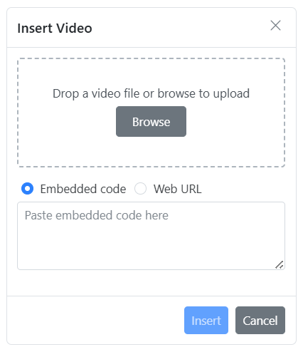
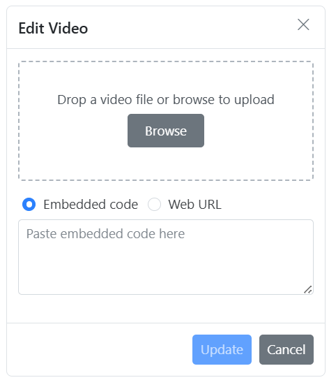
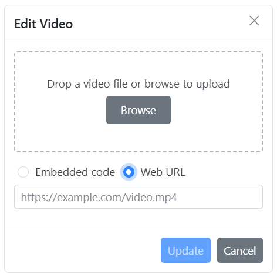
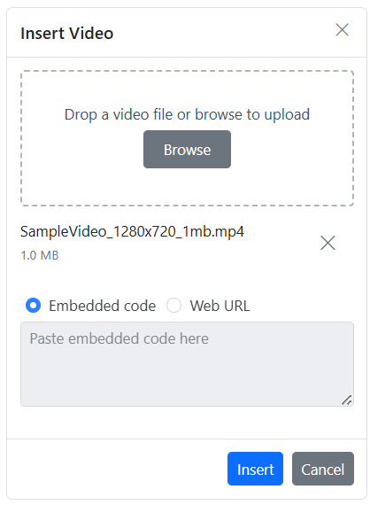
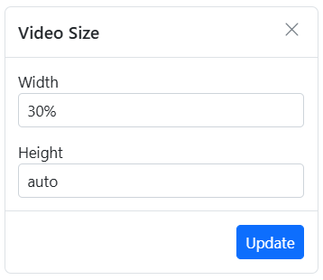
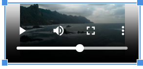

# Videos in the Vue Rich Text Editor Component

The Rich Text Editor allows you to insert videos from online sources and local computers into your content.  You can insert the video with the following list of options in the [insertVideoSettings](https://ej2.syncfusion.com/vue/documentation/api/rich-text-editor/#insertvideosettings) property.

## Configuring the video tool in the toolbar

You can add the `Video` tool in the Rich Text Editor toolbar using the `toolbarSettings` [items](https://ej2.syncfusion.com/vue/documentation/api/rich-text-editor/toolbarSettings/#items) property.

> To use Video feature, inject `Video` in the provider section.

To configure the `Video` toolbar item, refer to the below code.









        


## Video save formats

The video files can be saved as `Blob` or `Base64` URLs by using the [insertVideoSettings.saveFormat](https://ej2.syncfusion.com/vue/documentation/api/rich-text-editor/videoSettingsModel/#saveformat) property, which is of enum type, and the generated URL will be set to the `src` attribute of the `<source>` tag.

> The default `saveFormat` property is set to `Blob` format.

```HTML

<video>
    <source src="blob:http://ej2.syncfusion.com/3ab56a6e-ec0d-490f-85a5-f0aeb0ad8879" type="video/mp4" >
</video>

<video>
    <source src="data:video/mp4;base64,iVBORw0KGgoAAAANSUhEUgAAADAAAAAwCAYAAABXAvmHA" type="video/mp4" >
</video>

```

## Inserting video from web

You can insert a video from either a hosted link or your local machine by clicking the video button in the editor's toolbar. When you click the video button, a dialog opens, allowing you to insert a video using an Embedded code or Web URL.

### Inserting video from embed URL

The insert video dialog opens with the `Embedded code` option selected by default. This allows you to insert a video using embedded code.



### Inserting video from web URL

You can switch to the `Web URL` option by selecting the Web URL checkbox. Inserting a video using the Web URL option will add the video URL as the `src` attribute of the `<source>` tag.


## Uploading video from local machine

You can use the `browse` option on the video dialog to select the video from the local machine and insert it into the Rich Text Editor content.

If the path field is not specified in the [insertVideoSettings](https://ej2.syncfusion.com/vue/documentation/api/rich-text-editor/#insertvideosettings), the video will be converted into the `Blob` URL or `Base64` and inserted inside the Rich Text Editor.

## Saving video to the server

Upload the selected video to a specified destination using the controller action specified in [insertVideoSettings.saveUrl](https://ej2.syncfusion.com/vue/documentation/api/rich-text-editor/videoSettingsModel/#saveurl). Ensure to map this method name appropriately and provide the required destination path through the [insertVideoSettings.path](https://ej2.syncfusion.com/vue/documentation/api/rich-text-editor/videoSettingsModel/#path) properties.

Configure [insertVideoSettings.removeUrl](https://ej2.syncfusion.com/vue/documentation/api/rich-text-editor/videoSettingsModel/#removeurl) to point to the endpoint responsible for deleting video files.

Set the [insertVideoSettings.saveFormat](https://ej2.syncfusion.com/vue/documentation/api/rich-text-editor/videoSettingsModel/#saveformat) property to determine whether the video should be saved as Blob or Base64, aligning with your application's requirements.

> If you want to insert lower-sized video files in the editor and don’t require a specific physical location for saving the video, you can save the format as `Base64`.

In the following Vue code block, the video module has been injected and can insert video files saved in the specified path:

```ts

<template>
    <div>
        <div class="control-section">
            <div class="sample-container">
                <div class="default-section">
                    <ejs-richtexteditor ref="rteObj" :height="340" :toolbarSettings="toolbarSettings"
                        :insertVideoSettings="insertVideoSettings">
                    </ejs-richtexteditor>
                </div>
            </div>
        </div>
    </div>
</template>

<script setup>
import { provide } from 'vue';
import { RichTextEditorComponent as EjsRichtexteditor, Toolbar, Link, Video, HtmlEditor, QuickToolbar } from "@syncfusion/ej2-vue-richtexteditor";
const toolbarSettings = {
    items: ['Video']
};
const insertVideoSettings = {
    saveUrl: "[SERVICE_HOSTED_PATH]/api/uploadbox/SaveFiles",
    removeUrl: "[SERVICE_HOSTED_PATH]/api/uploadbox/RemoveFiles",
    saveFormat: 'Base64',
    path: "[SERVICE_HOSTED_PATH]/Files/"
};
provide('richtexteditor', [Toolbar, Link, Video, HtmlEditor, QuickToolbar]);
</script>

<style>
@import '../node_modules/@syncfusion/ej2-base/styles/material.css';  
@import '../node_modules/@syncfusion/ej2-buttons/styles/material.css';  
@import '../node_modules/@syncfusion/ej2-calendars/styles/material.css';  
@import '../node_modules/@syncfusion/ej2-dropdowns/styles/material.css';  
@import '../node_modules/@syncfusion/ej2-inputs/styles/material.css';
@import '../node_modules/@syncfusion/ej2-navigations/styles/material.css';
@import '../node_modules/@syncfusion/ej2-lists/styles/material.css';
@import '../node_modules/@syncfusion/ej2-layouts/styles/material.css';
@import '../node_modules/@syncfusion/ej2-popups/styles/material.css';
@import '../node_modules/@syncfusion/ej2-splitbuttons/styles/material.css';
@import '../node_modules/@syncfusion/ej2-grids/styles/material.css';
@import '../node_modules/@syncfusion/ej2-richtexteditor/styles/material.css';
@import '../node_modules/@syncfusion/ej2-treegrid/styles/material.css';
@import "../node_modules/@syncfusion/ej2-vue-gantt/styles/material.css";
</style>

```

```c#

using System;
using System.IO;
using FileUpload.Models;
using System.Diagnostics;
using System.Net.Http.Headers;
using Microsoft.AspNetCore.Mvc;
using Microsoft.AspNetCore.Http;
using System.Collections.Generic;
using Microsoft.AspNetCore.Hosting;

namespace FileUpload.Controllers
{
    public class HomeController : Controller
    {
        private IHostingEnvironment hostingEnv;

        public HomeController(IHostingEnvironment env)
        {
            hostingEnv = env;
        }

        public IActionResult Index()
        {
            return View();
        }

        [AcceptVerbs("Post")]
        public void SaveFiles(IList<IFormFile> UploadFiles)
        {
            try
            {
                foreach (IFormFile file in UploadFiles)
                {
                    if (UploadFiles != null)
                    {
                        string filename = ContentDispositionHeaderValue.Parse(file.ContentDisposition).FileName.Trim('"');
                        filename = hostingEnv.WebRootPath + "\\Files" + $@"\{filename}";

                        // Create a new directory, if it does not exists
                        if (!Directory.Exists(hostingEnv.WebRootPath + "\\Files"))
                        {
                            Directory.CreateDirectory(hostingEnv.WebRootPath + "\\Files");
                        }

                        if (!System.IO.File.Exists(filename))
                        {
                            using (FileStream fs = System.IO.File.Create(filename))
                            {
                                file.CopyTo(fs);
                                fs.Flush();
                            }
                            Response.StatusCode = 200;
                        }
                    }
                }
            }
            catch (Exception)
            {
                Response.StatusCode = 204;
            }
        }

        [ResponseCache(Duration = 0, Location = ResponseCacheLocation.None, NoStore = true)]
        public IActionResult Error()
        {
            return View(new ErrorViewModel { RequestId = Activity.Current?.Id ?? HttpContext.TraceIdentifier });
        }
    }
}

```

### Renaming video before inserting

You can use the [insertVideoSettings](https://ej2.syncfusion.com/vue/documentation/api/rich-text-editor/#insertvideosettings) property to specify the server handler to upload the selected video. Then, by binding the [fileUploadSuccess](https://ej2.syncfusion.com/vue/documentation/api/rich-text-editor/#fileuploadsuccess) event, you can receive the modified file name from the server and update it in the Rich Text Editor's insert video dialog.

```
<template>
    <div>
        <div class="control-section">
            <div class="sample-container">
                <div class="default-section">
                    <ejs-richtexteditor ref="rteObj" :height="340" :insertVideoSettings="insertVideoSettings"
                        :toolbarSettings="toolbarSettings" :value="rteValue" :fileUploadSuccess="onFileUploadSuccess">
                    </ejs-richtexteditor>
                </div>
            </div>
        </div>

    </div>
</template>

<script setup>
import { provide } from 'vue';
import { RichTextEditorComponent as EjsRichtexteditor, Toolbar, Link, Video, HtmlEditor, QuickToolbar } from "@syncfusion/ej2-vue-richtexteditor";

const rteValue = `<p>The Syncfudion Rich Text Editor, a WYSIWYG (what you see is what you get) editor, is a user interface that allows you to create, edit, and format rich text content. You can try out a demo of this editor here.</p><p><b>Key features:</b></p><ul><li><p>Provides &lt;IFRAME&gt; and &lt;DIV&gt; modes.</p></li><li><p>Bulleted and numbered lists.</p></li><li><p>Handles images, hyperlinks, videos, hyperlinks, uploads, etc.</p></li><li><p>Contains undo/redo manager. </p></li></ul><div style='display: inline-block; width: 60%; vertical-align: top; cursor: auto;'></div>`;
const toolbarSettings = {
    items: ['Video']
};
const insertVideoSettings = {
    saveUrl: "[SERVICE_HOSTED_PATH]/api/uploadbox/Rename",
    path: "[SERVICE_HOSTED_PATH]/Files/"
};
const onFileUploadSuccess = (args) => {
    alert("Get the new file name here");
    if (args.e.currentTarget.getResponseHeader('name') != null) {
        args.file.name = args.e.currentTarget.getResponseHeader('name');
        let filename = document.querySelectorAll(".e-file-name")[0];
        filename.innerHTML = args.file.name.replace(document.querySelectorAll(".e-file-type")[0].innerHTML, '');
        filename.title = args.file.name;
    }
}
provide('richtexteditor', [Toolbar, Link, Video, HtmlEditor, QuickToolbar]);
</script>
<style>
@import '../node_modules/@syncfusion/ej2-base/styles/material.css';  
@import '../node_modules/@syncfusion/ej2-buttons/styles/material.css';  
@import '../node_modules/@syncfusion/ej2-calendars/styles/material.css';  
@import '../node_modules/@syncfusion/ej2-dropdowns/styles/material.css';  
@import '../node_modules/@syncfusion/ej2-inputs/styles/material.css';
@import '../node_modules/@syncfusion/ej2-navigations/styles/material.css';
@import '../node_modules/@syncfusion/ej2-lists/styles/material.css';
@import '../node_modules/@syncfusion/ej2-layouts/styles/material.css';
@import '../node_modules/@syncfusion/ej2-popups/styles/material.css';
@import '../node_modules/@syncfusion/ej2-splitbuttons/styles/material.css';
@import '../node_modules/@syncfusion/ej2-grids/styles/material.css';
@import '../node_modules/@syncfusion/ej2-richtexteditor/styles/material.css';
@import '../node_modules/@syncfusion/ej2-treegrid/styles/material.css';
@import "../node_modules/@syncfusion/ej2-vue-gantt/styles/material.css";
</style>
```

To configure server-side handler, refer to the below code.

```c#
int x = 0;
string file;
[AcceptVerbs("Post")]
public void Rename()
{
    try
    {
        var httpPostedFile = System.Web.HttpContext.Current.Request.Files["UploadFiles"];
        fileName = httpPostedFile.FileName;
        if (httpPostedFile != null)
        {
            var fileSave = System.Web.HttpContext.Current.Server.MapPath("~/Files");
            if (!Directory.Exists(fileSave))
            {
                Directory.CreateDirectory(fileSave);
            }
            var fileName = Path.GetFileName(httpPostedFile.FileName);
            var fileSavePath = Path.Combine(fileSave, fileName);
            while (System.IO.File.Exists(fileSavePath))
            {
                fileName = "rteFiles" + x + "-" + fileName;
                fileSavePath = Path.Combine(fileSave, fileName);
                x++;
            }
            if (!System.IO.File.Exists(fileSavePath))
            {
                httpPostedFile.SaveAs(fileSavePath);
                HttpResponse Response = System.Web.HttpContext.Current.Response;
                Response.Clear();
                Response.Headers.Add("name", fileName);
                Response.ContentType = "application/json; charset=utf-8";
                Response.StatusDescription = "File uploaded succesfully";
                Response.End();
            }
        }
    }
    catch (Exception e)
    {
        HttpResponse Response = System.Web.HttpContext.Current.Response;
        Response.Clear();
        Response.ContentType = "application/json; charset=utf-8";
        Response.StatusCode = 204;
        Response.Status = "204 No Content";
        Response.StatusDescription = e.Message;
        Response.End();
    }
}

```

### Restricting video by size

You can restrict the video uploaded from the local machine when the uploaded video file size is greater than the allowed size by using the [fileUploading](https://ej2.syncfusion.com/vue/documentation/api/rich-text-editor/#fileuploading) event.

> The file size in the argument will be returned in `bytes`.

In the following example, the video size has been validated before uploading and determined whether the video has been uploaded or not.

```
<template>
    <div>
        <div class="control-section">
            <div class="sample-container">
                <div class="default-section">
                    <ejs-richtexteditor ref="rteObj" :height="340" :insertVideoSettings="insertVideoSettings"
                        :toolbarSettings="toolbarSettings" :fileUploading="onFileUpload">
                    </ejs-richtexteditor>
                </div>
            </div>
        </div>
    </div>
</template>

<script setup>
import { provide } from 'vue';
import { RichTextEditorComponent as EjsRichtexteditor, Toolbar, Link, Video, HtmlEditor, QuickToolbar } from "@syncfusion/ej2-vue-richtexteditor";

const toolbarSettings = {
    items: ['Video']
};
const insertVideoSettings = {
    saveUrl: 'https://ej2.syncfusion.com/services/api/uploadbox/Save',
    removeUrl: 'https://ej2.syncfusion.com/services/api/uploadbox/Remove'
};
const onFileUpload = (args) => {
    let sizeInBytes = args.fileData.size;
    let fileSize = 500000;
    if (fileSize < sizeInBytes) {
        args.cancel = true;
    }
};
provide('richtexteditor', [Toolbar, Link, Video, HtmlEditor, QuickToolbar]);
</script>

<style>
@import 'https://ej2.syncfusion.com/vue/documentation/node_modules/@syncfusion/ej2-base/styles/material.css';  
@import '../node_modules/@syncfusion/ej2-buttons/styles/material.css';  
@import '../node_modules/@syncfusion/ej2-calendars/styles/material.css';  
@import '../node_modules/@syncfusion/ej2-dropdowns/styles/material.css';  
@import '../node_modules/@syncfusion/ej2-inputs/styles/material.css';
@import '../node_modules/@syncfusion/ej2-navigations/styles/material.css';
@import '../node_modules/@syncfusion/ej2-lists/styles/material.css';
@import '../node_modules/@syncfusion/ej2-layouts/styles/material.css';
@import '../node_modules/@syncfusion/ej2-popups/styles/material.css';
@import '../node_modules/@syncfusion/ej2-splitbuttons/styles/material.css';
@import '../node_modules/@syncfusion/ej2-grids/styles/material.css';
@import '../node_modules/@syncfusion/ej2-richtexteditor/styles/material.css';
@import '../node_modules/@syncfusion/ej2-treegrid/styles/material.css';
@import "../node_modules/@syncfusion/ej2-vue-gantt/styles/material.css";
</style>

```

### Uploading video with authentication

You can add additional data with the video uploaded from the Rich Text Editor on the client side, which can even be received on the server side. By using the [fileUploading](https://ej2.syncfusion.com/vue/documentation/api/rich-text-editor/#fileuploading) event and its `customFormData` argument, you can pass parameters to the controller action. On the server side, you can fetch the custom headers by accessing the form collection from the current request, which retrieves the values sent using the POST method.

> By default, it doesn't support the `UseDefaultCredentials` property, you can manually append the default credentials with the upload request.

```
<template>
    <div>
        <div class="control-section">
            <div class="sample-container">
                <div class="default-section">
                    <ejs-richtexteditor ref="rteObj" :height="340" :insertVideoSettings="insertVideoSettings"
                        :toolbarSettings="toolbarSettings" :fileUploading="onFileUpload">
                    </ejs-richtexteditor>
                </div>
            </div>
        </div>
    </div>
</template>

<script setup>
import { provide } from 'vue';
import { RichTextEditorComponent as EjsRichtexteditor, Toolbar, Link, Video, HtmlEditor, QuickToolbar } from "@syncfusion/ej2-vue-richtexteditor";
const toolbarSettings = {
    items: ['Video']
};
const insertVideoSettings = {
    saveUrl: "[SERVICE_HOSTED_PATH]/api/uploadbox/SaveFiles",
    path: "[SERVICE_HOSTED_PATH]/Files/"
};
const onFileUpload = (args) => {
    alert("Get the new file name here");
    var accessToken = "Authorization_token";
    // adding custom Form Data
    args.customFormData = [{ 'Authorization': accessToken }];
};
provide('richtexteditor', [Toolbar, Link, Video, HtmlEditor, QuickToolbar]);
</script>

<style>
@import '../node_modules/@syncfusion/ej2-base/styles/material.css';  
@import '../node_modules/@syncfusion/ej2-buttons/styles/material.css';  
@import '../node_modules/@syncfusion/ej2-calendars/styles/material.css';  
@import '../node_modules/@syncfusion/ej2-dropdowns/styles/material.css';  
@import '../node_modules/@syncfusion/ej2-inputs/styles/material.css';
@import '../node_modules/@syncfusion/ej2-navigations/styles/material.css';
@import '../node_modules/@syncfusion/ej2-lists/styles/material.css';
@import '../node_modules/@syncfusion/ej2-layouts/styles/material.css';
@import '../node_modules/@syncfusion/ej2-popups/styles/material.css';
@import '../node_modules/@syncfusion/ej2-splitbuttons/styles/material.css';
@import '../node_modules/@syncfusion/ej2-grids/styles/material.css';
@import '../node_modules/@syncfusion/ej2-richtexteditor/styles/material.css';
@import '../node_modules/@syncfusion/ej2-treegrid/styles/material.css';
@import "../node_modules/@syncfusion/ej2-vue-gantt/styles/material.css";
</style>
```

```c#

public void SaveFiles(IList<IFormFile> UploadFiles)
{
    string currentPath = Request.Form["Authorization"].ToString();
}

```

## Video replacement functionality

Once a video file has been inserted, you can replace it using the Rich Text Editor [quickToolbarSettings](https://ej2.syncfusion.com/vue/documentation/api/rich-text-editor/quickToolbarSettings/#quicktoolbarsettings) `videoReplace` option. You can replace the video file either by using the embedded code or the web URL and the browse option in the video dialog.





## Deleting video

To remove a video from the Rich Text Editor content, select the video and click the `videoRemove` button from the quick toolbar. It will delete the video from the Rich Text Editor content as well as from the service location if the [insertVideoSettings.removeUrl](https://ej2.syncfusion.com/vue/documentation/api/rich-text-editor/videoSettingsModel/#removeurl) is given.

Once you select the video from the local machine, the URL for the video will be generated. You can remove the video from the service location by clicking the cross icon.



## Adjusting video dimensions

Set the default width, minWidth, height, and minHeight of the video element when it is inserted in the Rich Text Editor using the [width](https://ej2.syncfusion.com/vue/documentation/api/rich-text-editor/videoSettings/#width), [minWidth](https://ej2.syncfusion.com/vue/documentation/api/rich-text-editor/videoSettings/#minwidth), [height](https://ej2.syncfusion.com/vue/documentation/api/rich-text-editor/videoSettings/#height), [minHeight](https://ej2.syncfusion.com/vue/documentation/api/rich-text-editor/videoSettings/#minheight) properties.

Through the [quickToolbarSettings](https://ej2.syncfusion.com/vue/documentation/api/rich-text-editor/quickToolbarSettings/#quicktoolbarsettings), you can also change the width and height using the `Change Size` button. Once you click on the button, the video size dialog will open as below. In that, specify the width and height of the video in pixels.



## Configuring video display position

Sets the default display property for the video when it is inserted in the Rich Text Editor using the [insertVideoSettings.layoutOption](https://ej2.syncfusion.com/vue/documentation/api/rich-text-editor/videoSettings/#layoutOption) property. It has two possible options: `Inline` and `Break`. When updating the display positions, it updates the video elements’ layout position.

> The default `layoutOption` property is set to `Inline`.


```
<template>
    <div>
        <div class="control-section">
            <div class="sample-container">
                <div class="default-section">
                    <ejs-richtexteditor ref="rteObj" :height="340" :insertVideoSettings="insertVideoSettings"
                        :toolbarSettings="toolbarSettings">
                    </ejs-richtexteditor>
                </div>
            </div>
        </div>
    </div>
</template>

<script setup>
import { provide } from 'vue';
import { RichTextEditorComponent as EjsRichtexteditor, Toolbar, Link, Video, HtmlEditor, QuickToolbar } from "@syncfusion/ej2-vue-richtexteditor";
const toolbarSettings = {
    items: ['Video']
};
const insertVideoSettings = {
    layoutOption: 'Inline'
};
provide('richtexteditor', [Toolbar, Link, Video, HtmlEditor, QuickToolbar]);
</script>

<style>
@import 'https://ej2.syncfusion.com/vue/documentation/node_modules/@syncfusion/ej2-base/styles/material.css';  
@import '../node_modules/@syncfusion/ej2-buttons/styles/material.css';  
@import '../node_modules/@syncfusion/ej2-calendars/styles/material.css';  
@import '../node_modules/@syncfusion/ej2-dropdowns/styles/material.css';  
@import '../node_modules/@syncfusion/ej2-inputs/styles/material.css';
@import '../node_modules/@syncfusion/ej2-navigations/styles/material.css';
@import '../node_modules/@syncfusion/ej2-lists/styles/material.css';
@import '../node_modules/@syncfusion/ej2-layouts/styles/material.css';
@import '../node_modules/@syncfusion/ej2-popups/styles/material.css';
@import '../node_modules/@syncfusion/ej2-splitbuttons/styles/material.css';
@import '../node_modules/@syncfusion/ej2-grids/styles/material.css';
@import '../node_modules/@syncfusion/ej2-richtexteditor/styles/material.css';
@import '../node_modules/@syncfusion/ej2-treegrid/styles/material.css';
@import "../node_modules/@syncfusion/ej2-vue-gantt/styles/material.css";
</style>

```

## Video resizing

The Rich Text Editor has built-in video resizing support, which is enabled for the video elements added. The resize points will appear on each corner of the video when focusing, so users can easily resize the video using mouse points or thumb through the resize points. Also, the resize calculation will be done based on the aspect ratio.

You can disable the resize action by configuring `false` for the [insertVideoSettings.resize](https://ej2.syncfusion.com/vue/documentation/api/rich-text-editor/videoSettingsModel/#resize) property.

> If the [minWidth](https://ej2.syncfusion.com/vue/documentation/api/rich-text-editor/videoSettings/#minwidth) and [minHeight](https://ej2.syncfusion.com/vue/documentation/api/rich-text-editor/videoSettings/#minheight) properties are configured, the video resizing does not shrink below the specified values.



## See also

* [Video Quick Toolbar](./toolbar/quick-toolbar#video-quick-toolbar)
* [How to Use the Audio Editing Option in Toolbar Items](./audio)
* [How to Use the Image Editing Option in Toolbar Items](./insert-images)
