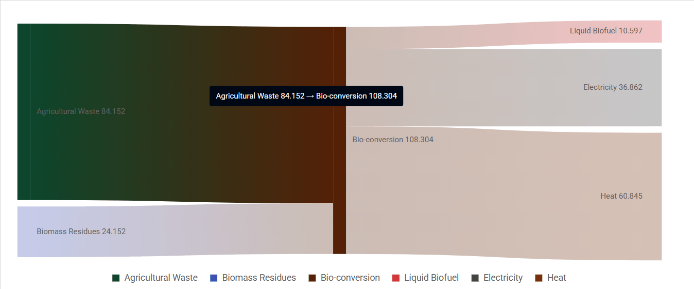

# Getting started with Vue Sankey chart component in Vue 3

This article provides a step-by-step guide for setting up a [Vite](https://vitejs.dev/) project with a JavaScript environment and integrating the Syncfusion<sup style="font-size:70%">&reg;</sup> Vue Sankey Chart component using the [Composition API](https://vuejs.org/guide/introduction.html#composition-api) / [Options API](https://vuejs.org/guide/introduction.html#options-api).

The **Composition API** groups related logic into reusable functions and is recommended for larger, composition-friendly code bases. The **Options API** uses `data`, `methods`, and life cycle options and may be preferable for smaller components or teams familiar with Vue 2 patterns. Choose the API that matches the project's style and maintainability goals.

## Prerequisites

[System requirements for Syncfusion<sup style="font-size:70%">&reg;</sup> Vue UI components](https://ej2.syncfusion.com/vue/documentation/system-requirements)

## Set up the Vite project

A recommended approach for beginning with Vue is to scaffold a project using [Vite](https://vitejs.dev). To create a new Vite project, use one of the commands that are specific to either NPM or Yarn.

```bash
npm create vite@latest
```

or

```bash
yarn create vite
```


Using one of the above commands starts an interactive setup. Follow these steps:

1. Define the project name. For this article use `my-project`.

```bash
? Project name: » my-project
```

2. Select `Vue` as the framework to create a Vue 3 project.

```bash
? Select a framework: » - Use arrow-keys. Return to submit.
Vanilla
> Vue
  React
  Preact
  Lit
  Svelte
  Others
```

3. Choose `JavaScript` as the project variant.

```bash
? Select a variant: » - Use arrow-keys. Return to submit.
> JavaScript
  TypeScript
  Customize with create-vue ↗
  Nuxt ↗
```

4. After creating the project, install dependencies by running:

```bash
cd my-project
npm install
```

or

```bash
cd my-project
yarn install
```

Now that `my-project` is ready with default settings, add Syncfusion<sup style="font-size:70%">&reg;</sup> Vue components to the project.

## Add Syncfusion<sup style="font-size:70%">&reg;</sup> Vue packages

Syncfusion<sup style="font-size:70%">&reg;</sup> Vue component packages are available at [npmjs.com](https://www.npmjs.com/search?q=ej2-vue). To use Syncfusion<sup style="font-size:70%">&reg;</sup> Vue components in the project, install the corresponding npm package.

This article uses the Vue Sankey Chart component as an example. Install the `@syncfusion/ej2-vue-charts` package with:

```bash
npm install @syncfusion/ej2-vue-charts
```

or

```bash
yarn add @syncfusion/ej2-vue-charts
```

> Note: npm v5+ saves packages to `dependencies` by default; `--save` is not required.

## Add Syncfusion<sup style="font-size:70%">&reg;</sup> Vue component

Follow the steps below to add the Vue Sankey Chart component using the `Composition API` or `Options API`:

1. Import and register the Sankey Chart component, its child directives, and required modules in the `script` section of **src/App.vue**.  
   **Important:** When using Composition API, also import `provide` from 'vue' and inject the modules — this is required or the series will not render.




<script setup>
import { provide } from "vue";
import {
  SankeyComponent as EjsSankey,
  SankeyNodesCollectionDirective as ESankeyNodesCollection,
  SankeyNodeDirective as ESankeyNode,
  SankeyLinksCollectionDirective as ESankeyLinksCollection,
  SankeyLinkDirective as ESankeyLink,
  SankeyTooltip
} from "@syncfusion/ej2-vue-charts";

provide("sankey", [SankeyTooltip]);
</script>



<script>
import {
  SankeyComponent as EjsSankey,
  SankeyNodesCollectionDirective as ESankeyNodesCollection,
  SankeyNodeDirective as ESankeyNode,
  SankeyLinksCollectionDirective as ESankeyLinksCollection,
  SankeyLinkDirective as ESankeyLink,
  SankeyTooltip
} from "@syncfusion/ej2-vue-charts";

export default {
  name: "App",
  components: {
    EjsSankey,
    ESankeyNodesCollection,
    ESankeyNode,
    ESankeyLinksCollection,
    ESankeyLink
  },
  provide: {
    sankey: [SankeyTooltip]
  }
};
</script>



2. In the `template` section, define the Sankey Chart component.




<template>
      <EjsSankey
        width="90%"
        height="450px"
        :tooltip="tooltip"
      >
        <ESankeyNodesCollection>
          <ESankeyNode id="Agricultural Waste" />
          <ESankeyNode id="Biomass Residues" />
          <ESankeyNode id="Bio-conversion" />
          <ESankeyNode id="Liquid Biofuel" />
          <ESankeyNode id="Electricity" />
          <ESankeyNode id="Heat" />
        </ESankeyNodesCollection>
        <ESankeyLinksCollection>
          <ESankeyLink sourceId="Agricultural Waste" targetId="Bio-conversion" :value="84.152" />
          <ESankeyLink sourceId="Biomass Residues"   targetId="Bio-conversion" :value="24.152" />
          <ESankeyLink sourceId="Bio-conversion"     targetId="Liquid Biofuel" :value="10.597" />
          <ESankeyLink sourceId="Bio-conversion"     targetId="Electricity"    :value="36.862" />
          <ESankeyLink sourceId="Bio-conversion"     targetId="Heat"           :value="60.845" />
        </ESankeyLinksCollection>
      </EjsSankey>
</template>




3. Declare the values for the `tooltip` property in the `script` section.




<script setup>
const tooltip = { enable: true };
</script>




<script>
export default {
  data() {
    return {
      tooltip: { enable: true }
    };
  }
};
</script>




Here is the summarized code for the above steps in the **src/App.vue** file:




<template>
      <EjsSankey
        width="90%"
        height="450px"
        :tooltip="tooltip"
      >
        <ESankeyNodesCollection>
          <ESankeyNode id="Agricultural Waste" />
          <ESankeyNode id="Biomass Residues" />
          <ESankeyNode id="Bio-conversion" />
          <ESankeyNode id="Liquid Biofuel" />
          <ESankeyNode id="Electricity" />
          <ESankeyNode id="Heat" />
        </ESankeyNodesCollection>
        <ESankeyLinksCollection>
          <ESankeyLink sourceId="Agricultural Waste" targetId="Bio-conversion" :value="84.152" />
          <ESankeyLink sourceId="Biomass Residues" targetId="Bio-conversion" :value="24.152" />
          <ESankeyLink sourceId="Bio-conversion" targetId="Liquid Biofuel" :value="10.597" />
          <ESankeyLink sourceId="Bio-conversion" targetId="Electricity" :value="36.862" />
          <ESankeyLink sourceId="Bio-conversion" targetId="Heat" :value="60.845" />
        </ESankeyLinksCollection>
      </EjsSankey>
</template>

<script setup>
import { provide } from "vue";
import {
  SankeyComponent as EjsSankey,
  SankeyNodesCollectionDirective as ESankeyNodesCollection,
  SankeyNodeDirective as ESankeyNode,
  SankeyLinksCollectionDirective as ESankeyLinksCollection,
  SankeyLinkDirective as ESankeyLink,
  SankeyTooltip,
  SankeyLegend
} from "@syncfusion/ej2-vue-charts";

const tooltip = { enable: true };

provide("sankey", [SankeyTooltip, SankeyLegend]);
</script>




<template>
      <ejs-sankey
        width="90%"
        height="450px"
        :tooltip="tooltip"
      >
        <e-sankey-nodes-collection>
          <e-sankey-node id="Agricultural Waste" />
          <e-sankey-node id="Biomass Residues" />
          <e-sankey-node id="Bio-conversion" />
          <e-sankey-node id="Liquid Biofuel" />
          <e-sankey-node id="Electricity" />
          <e-sankey-node id="Heat" />
        </e-sankey-nodes-collection>
        <e-sankey-links-collection>
          <e-sankey-link sourceId="Agricultural Waste" targetId="Bio-conversion" :value="84.152" />
          <e-sankey-link sourceId="Biomass Residues" targetId="Bio-conversion" :value="24.152" />
          <e-sankey-link sourceId="Bio-conversion" targetId="Liquid Biofuel" :value="10.597" />
          <e-sankey-link sourceId="Bio-conversion" targetId="Electricity" :value="36.862" />
          <e-sankey-link sourceId="Bio-conversion" targetId="Heat" :value="60.845" />
        </e-sankey-links-collection>
      </ejs-sankey>
</template>

<script>
import {
  SankeyComponent,
  SankeyNodesCollectionDirective,
  SankeyNodeDirective,
  SankeyLinksCollectionDirective,
  SankeyLinkDirective,
  SankeyTooltip,
  SankeyLegend
} from "@syncfusion/ej2-vue-charts";

export default {
  name: "App",
  data() {
    return {
      tooltip: { enable: true }
    };
  },
  components: {
    "ejs-sankey": SankeyComponent,
    "e-sankey-nodes-collection": SankeyNodesCollectionDirective,
    "e-sankey-node": SankeyNodeDirective,
    "e-sankey-links-collection": SankeyLinksCollectionDirective,
    "e-sankey-link": SankeyLinkDirective
  },
  provide: {
    sankey: [SankeyTooltip, SankeyLegend]
  }
};
</script>



## Run the project

To run the project, use the following command:

```bash
npm run dev
```

or

```bash
yarn run dev
```

The output will appear as follows:



## Verify the chart

After starting the development server, confirm the chart renders correctly:

- Start the development server with `npm run dev` or `yarn run dev`.
- Open the project URL shown in the terminal (commonly `http://localhost:5173`) and verify the chart displays.
- If the chart does not render, open the browser console and check for errors related to missing modules, incorrect imports, or incompatible Vue versions.

## Troubleshooting (common issues)

- Chart not rendering: ensure the Sankey modules and directives are registered in `provide` and that `sankeyLinks` contains valid data.
- Version mismatch: confirm `@syncfusion/ej2-vue-charts` is compatible with Vue version used in the project.

> **Sample**: `vue-3-sankey-chart-getting-started`.
For migrating from Vue 2 to Vue 3, refer to the `migration` documentation.

## See also

* [Getting Started with Vue UI Components using Composition API and TypeScript](../getting-started/vue-3-ts-composition.md)
* [Getting Started with Vue UI Components using Options API and TypeScript](../getting-started/vue-3-ts-options.md)