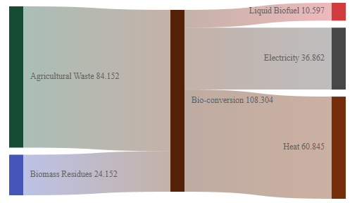

# Getting Started with the Vue Sankey Chart Component in Vue 3

This article provides a step-by-step guide to setting up a [`Vite`](https://vitejs.dev) project using JavaScript and integrating the Syncfusion<sup style="font-size:70%">&reg;</sup> Vue Sankey Chart component with either the [`Composition API`](https://vuejs.org/guide/introduction.html#composition-api) or the [`Options API`](https://vuejs.org/guide/introduction.html#options-api). The Sankey Chart visualizes the flow of values between source and target nodes, which is useful for representing energy, budget, or material transfers.

The **Composition API** groups related logic into reusable functions and is recommended for larger, composition-friendly code bases. The **Options API** uses `data`, `methods`, and life cycle options and may be preferable for smaller components or teams familiar with Vue 2 patterns. Choose the API that best fits your project's structure and long-term maintainability.

## Prerequisites

Ensure your development environment meets the following requirements as listed in [System requirements for Syncfusion<sup style="font-size:70%">&reg;</sup> Vue UI components](https://ej2.syncfusion.com/vue/documentation/system-requirements).

## Set Up the Vite Project

Create a Vite project using either npm or Yarn.

**npm**

```bash
npm create vite@latest my-app -- --template vue
```

**yarn**

```bash
yarn create vite my-app --template vue
```

If Vite prompts you to install dependencies and start the project immediately, select **No**. The Syncfusion package is installed in a later step.

Navigate to the project directory:

```bash
cd my-app
```

Install the project dependencies using either npm or Yarn.

**npm**

```bash
npm install
```

**yarn**

```bash
yarn install
```

Now that `my-app` is ready, add Syncfusion<sup style="font-size:70%">&reg;</sup> Vue components to the project. Remove the default `HelloWorld`/`App.vue` boilerplate before continuing, so that the file only contains the code shown in the next steps.

> **Note:** To create a TypeScript project, use `npm create vite@latest my-app -- --template vue-ts` or `yarn create vite my-app --template vue-ts`.

## Add Syncfusion<sup style="font-size:70%">&reg;</sup> Vue Packages

Syncfusion<sup style="font-size:70%">&reg;</sup> Vue component packages are available at [npmjs.com](https://www.npmjs.com/search?q=ej2-vue). To use Syncfusion<sup style="font-size:70%">&reg;</sup> Vue components in the project, install the corresponding npm package.

This article uses the [`Vue Sankey Chart component`](https://www.syncfusion.com/vue-components/vue-charts) as an example. To use the Vue Sankey Chart component in the project, install the `@syncfusion/ej2-vue-charts` package using either npm or Yarn. The package is compatible with Vue 3.0 and later versions.

**npm**

```bash
npm install @syncfusion/ej2-vue-charts
```

**yarn**

```bash
yarn add @syncfusion/ej2-vue-charts
```

> **Note:** For TypeScript support, refer to [Getting Started with Vue UI Components using Composition API and TypeScript](https://ej2.syncfusion.com/vue/documentation/getting-started/vue-3-ts-composition) or [Getting Started with Vue UI Components using Options API and TypeScript](https://ej2.syncfusion.com/vue/documentation/getting-started/vue-3-ts-options). 

## Add Syncfusion<sup style="font-size:70%">&reg;</sup> Vue Sankey Chart Component

Follow the steps below to add the Vue Sankey Chart component using the `Composition API` or `Options API`:

**Step 1:** First, import and register the Sankey Chart component and its child directives in the `script` section of **src/App.vue**. If using the `Composition API`, add the `setup` attribute to the `script` tag.




<script setup>
import {
  SankeyComponent as EjsSankey,
  SankeyNodesCollectionDirective as ESankeyNodesCollection,
  SankeyNodeDirective as ESankeyNode,
  SankeyLinksCollectionDirective as ESankeyLinksCollection,
  SankeyLinkDirective as ESankeyLink,
} from "@syncfusion/ej2-vue-charts";

</script>



<script>
import {
  SankeyComponent,
  SankeyNodesCollectionDirective,
  SankeyNodeDirective,
  SankeyLinksCollectionDirective,
  SankeyLinkDirective
} from "@syncfusion/ej2-vue-charts";

export default {
  name: "App",
  components: {
    EjsSankey,
    ESankeyNodesCollection,
    ESankeyNode,
    ESankeyLinksCollection,
    ESankeyLink
  },
};
</script>



**Step 2:** In the `template` section, define the Sankey Chart component with nodes and links:




<template>
      <EjsSankey
        width="90%"
        height="450px"
      >
        <ESankeyNodesCollection>
          <ESankeyNode id="Agricultural Waste" />
          <ESankeyNode id="Biomass Residues" />
          <ESankeyNode id="Bio-conversion" />
          <ESankeyNode id="Liquid Biofuel" />
          <ESankeyNode id="Electricity" />
          <ESankeyNode id="Heat" />
        </ESankeyNodesCollection>
        <ESankeyLinksCollection>
          <ESankeyLink sourceId="Agricultural Waste" targetId="Bio-conversion" :value="84.152" />
          <ESankeyLink sourceId="Biomass Residues"   targetId="Bio-conversion" :value="24.152" />
          <ESankeyLink sourceId="Bio-conversion"     targetId="Liquid Biofuel" :value="10.597" />
          <ESankeyLink sourceId="Bio-conversion"     targetId="Electricity"    :value="36.862" />
          <ESankeyLink sourceId="Bio-conversion"     targetId="Heat"           :value="60.845" />
        </ESankeyLinksCollection>
      </EjsSankey>
</template>




Here is the complete summarized code for the **src/App.vue** file:




<template>
      <EjsSankey
        width="90%"
        height="450px"
      >
        <ESankeyNodesCollection>
          <ESankeyNode id="Agricultural Waste" />
          <ESankeyNode id="Biomass Residues" />
          <ESankeyNode id="Bio-conversion" />
          <ESankeyNode id="Liquid Biofuel" />
          <ESankeyNode id="Electricity" />
          <ESankeyNode id="Heat" />
        </ESankeyNodesCollection>
        <ESankeyLinksCollection>
          <ESankeyLink sourceId="Agricultural Waste" targetId="Bio-conversion" :value="84.152" />
          <ESankeyLink sourceId="Biomass Residues" targetId="Bio-conversion" :value="24.152" />
          <ESankeyLink sourceId="Bio-conversion" targetId="Liquid Biofuel" :value="10.597" />
          <ESankeyLink sourceId="Bio-conversion" targetId="Electricity" :value="36.862" />
          <ESankeyLink sourceId="Bio-conversion" targetId="Heat" :value="60.845" />
        </ESankeyLinksCollection>
      </EjsSankey>
</template>

<script setup>
import {
  SankeyComponent as EjsSankey,
  SankeyNodesCollectionDirective as ESankeyNodesCollection,
  SankeyNodeDirective as ESankeyNode,
  SankeyLinksCollectionDirective as ESankeyLinksCollection,
  SankeyLinkDirective as ESankeyLink,
} from "@syncfusion/ej2-vue-charts";

</script>




<template>
      <ejs-sankey
        width="90%"
        height="450px"
      >
        <e-sankey-nodes-collection>
          <e-sankey-node id="Agricultural Waste" />
          <e-sankey-node id="Biomass Residues" />
          <e-sankey-node id="Bio-conversion" />
          <e-sankey-node id="Liquid Biofuel" />
          <e-sankey-node id="Electricity" />
          <e-sankey-node id="Heat" />
        </e-sankey-nodes-collection>
        <e-sankey-links-collection>
          <e-sankey-link sourceId="Agricultural Waste" targetId="Bio-conversion" :value="84.152" />
          <e-sankey-link sourceId="Biomass Residues" targetId="Bio-conversion" :value="24.152" />
          <e-sankey-link sourceId="Bio-conversion" targetId="Liquid Biofuel" :value="10.597" />
          <e-sankey-link sourceId="Bio-conversion" targetId="Electricity" :value="36.862" />
          <e-sankey-link sourceId="Bio-conversion" targetId="Heat" :value="60.845" />
        </e-sankey-links-collection>
      </ejs-sankey>
</template>

<script>
import {
  SankeyComponent,
  SankeyNodesCollectionDirective,
  SankeyNodeDirective,
  SankeyLinksCollectionDirective,
  SankeyLinkDirective,
} from "@syncfusion/ej2-vue-charts";

export default {
  name: "App",
  data() {
    return {
    };
  },
  components: {
    "ejs-sankey": SankeyComponent,
    "e-sankey-nodes-collection": SankeyNodesCollectionDirective,
    "e-sankey-node": SankeyNodeDirective,
    "e-sankey-links-collection": SankeyLinksCollectionDirective,
    "e-sankey-link": SankeyLinkDirective
  },
};
</script>




## Run the Project

To run the project, use the following command:

**npm**
```bash
npm run dev
```

**yarn**
```bash
yarn run dev
```

The development server will start and display a message with the port number (typically `http://localhost:5173`). Open your browser and navigate to this URL to view the Sankey Chart.

The output will appear as follows:



## Troubleshooting

The following are common issues and solutions when integrating the Sankey Chart component:

- **Chart not rendering**: Ensure that `SankeyComponent` and the node/link directives are imported and registered correctly. Verify that both nodes and links are defined with matching `id`, `sourceId`, and `targetId` values.

- **Module import errors**: Confirm that all required modules are imported from `@syncfusion/ej2-vue-charts` and that the component is registered correctly with proper directive naming.

- **Data not displaying**: Verify that the links data structure includes `sourceId`, `targetId`, and `value` properties. Each link must reference valid node IDs to display correctly.

- **Version mismatch**: Confirm that the `@syncfusion/ej2-vue-charts` package version is compatible with Vue 3.0+ used in your project. Install the latest compatible version if needed.

## See Also

* [Getting Started with Vue UI Components using Composition API and TypeScript](../getting-started/vue-3-ts-composition)
* [Getting Started with Vue UI Components using Options API and TypeScript](../getting-started/vue-3-ts-options)