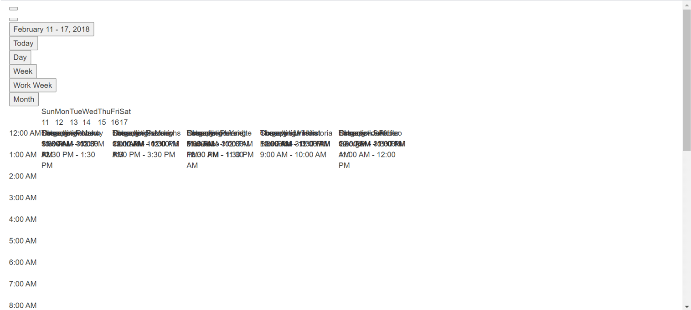

# Frequently asked questions in Vue Schedule component

In this article, you can find some frequently asked questions and corresponding solutions while getting hands-on experience with scheduler control.

## Maximum call stack size exceeded

**Error Image:**


**Solution:**

The above error occurs when using scheduler views that were not imported into the project. You can resolve this issue by importing the required view modules.

In the below code, `Day` option is used without injecting, So, it throws the above error. You can resolve this problem by simply injecting the day module in below code.

```
<template>
  <div>
    <div id="app">
      <div id="container">
        <ejs-schedule id="Schedule" width="100%" height="550px">
          <e-views>
            <e-view option="Day"></e-view>
            <e-view option="TimelineWeek"></e-view>
            <e-view option="TimelineMonth"></e-view>
            <e-view option="Agenda"></e-view>
          </e-views>
        </ejs-schedule>
      </div>
    </div>
  </div>
</template>

<script>
import Vue from "vue";
import {
  SchedulePlugin,
  TimelineViews,
  TimelineMonth,
  Agenda,
} from "@syncfusion/ej2-vue-schedule";
```

## Grouping with empty resources

Grouping without providing any resource data will throw the following problems.

* Normal(vertical) views are rendered, but you are not able to perform CRUD operations
* Timeline views not at all render and shows empty scheduler table

So, we suggest to avoid grouping with empty resources in the scheduler.

## Not providing e-field in editor template

**Error:** While using editor template, value of  `e-field` is missing in editor window.

**Solution:** `e-field` value is mandatory, we need to add it. Please refer [here](https://ej2.syncfusion.com/vue/documentation/schedule/editor-template/#customizing-event-editor-using-template) for more info.

## Missing CSS reference

**Error Image:**

  

**Solution:**

The above problem occurs when missing CSS references for the scheduler in a project. You can resolve this issue by providing proper CSS for the scheduler.

```

      <! –– scheduler CSS is referred from this link ––>
<link href="https://cdn.syncfusion.com/ej2/material.css" rel="stylesheet">
                      or
      <! –– From here ––>

<style>
@import "/node_modules/@syncfusion/ej2-base/styles/material.css";
@import "/node_modules/@syncfusion/ej2-buttons/styles/material.css";
@import "/node_modules/@syncfusion/ej2-calendars/styles/material.css";
@import "/node_modules/@syncfusion/ej2-dropdowns/styles/material.css";
@import "/node_modules/@syncfusion/ej2-inputs/styles/material.css";
@import "/node_modules/@syncfusion/ej2-navigations/styles/material.css";
@import "/node_modules/@syncfusion/ej2-popups/styles/material.css";
@import "/node_modules/@syncfusion/ej2-vue-schedule/styles/material.css";
</style>

```

## QuickInfoTemplate at bottom

When using the [`quickInfoTemplate`](https://ej2.syncfusion.com/vue/documentation/api/schedule#quickinfotemplates) in scheduler, sometimes quickinfo popup not shown fully at the bottom area of scheduler. You can resolve this by using [`cellClick`](https://ej2.syncfusion.com/vue/documentation/api/schedule#cellclick) and [`eventClick`](https://ej2.syncfusion.com/vue/documentation/api/schedule#eventclick) events and below code snippet.

```
<template>
    <ejs-schedule
          id="Schedule"
          width="100%"
          height="550px"
          :cellClick="onClick"
          :eventClick="onClick"
        >
    </ejs-schedule>
</template>
 .
 .
var eventAdded = false;

methods: {
  onClick: function () {
    if (!this.eventAdded) {
      let popupInstance = document.querySelector('.e-quick-popup-wrapper').ej2_instances[0];
      popupInstance.open = () => {
        popupInstance.refreshPosition();
      };
      this.eventAdded = true;
    }
  }
}
```

## Not importing culture files while using localization

**Error Image:**


 While using [`locale`](https://ej2.syncfusion.com/vue/documentation/schedule/localization/) in scheduler, not importing the required culture files properly throws the problem.

**Solution:** Properly add and import the culture files(numberingSystems, timeZoneNames, loadCldr, L10n etc.,) in your project will resolve the problem.

```javascript
import { loadCldr, L10n } from '@syncfusion/ej2-base';
import enNumberData from '@syncfusion/ej2-cldr-data/main/en-GB/numbers.json';
import entimeZoneData from '@syncfusion/ej2-cldr-data/main/en-GB/timeZoneNames.json';
import enGregorian from '@syncfusion/ej2-cldr-data/main/en-GB/ca-gregorian.json';
import enNumberingSystem from '@syncfusion/ej2-cldr-data/supplemental/numberingSystems.json';

loadCldr(frNumberData, frtimeZoneData, frGregorian, frNumberingSystem);

L10n.load({
  'en-GB': {
    schedule: {
      day: 'Day',
      week: 'Week',
      workWeek: 'Work Week',
      month: 'Month'
      }
    }
  });

```
