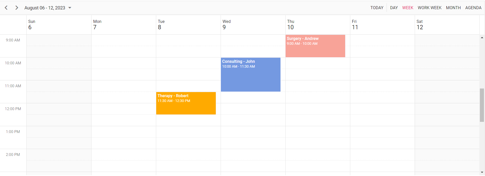

# Getting Started with the Vue Schedule Component in Vue 3

This article provides a step-by-step guide for setting up a [Vite](https://vitejs.dev) project with a JavaScript environment and integrating the Syncfusion<sup style="font-size:70%">&reg;</sup> Vue Scheduler component using the [Composition API](https://vuejs.org/guide/introduction.html#composition-api) / [Options API](https://vuejs.org/guide/introduction.html#options-api).


The `Composition API` is a new feature introduced in Vue.js 3 that provides an alternative way to organize and reuse component logic. It allows developers to write components as functions that use smaller, reusable functions called composition functions to manage their properties and behavior.

The `Options API` is the traditional way of writing Vue.js components, where the component logic is organized into a series of options that define the component's properties and behavior. These options include data, methods, computed properties, watchers, life cycle hooks, and more.

## Prerequisites

[System requirements for Syncfusion<sup style="font-size:70%">&reg;</sup> Vue UI components](https://ej2.syncfusion.com/vue/documentation/system-requirements)

## Set up the Vite project

A recommended approach for beginning with Vue is to scaffold a project using [Vite](https://vitejs.dev). To create a new Vite project, use one of the commands that are specific to either NPM or Yarn.

```bash
npm create vite@latest
```

or

```bash
yarn create vite
```

Using one of the above commands will lead you to set up additional configurations for the project as below:

1.Define the project name: We can specify the name of the project directly. Let's specify the name of the project as `my-project` for this article.

```bash
? Project name: » my-project
```

2.Select `Vue` as the framework. It will creates a Vue 3 project.

```bash
? Select a framework: » - Use arrow-keys. Return to submit.
Vanilla
> Vue
  React
  Preact
  Lit
  Svelte
  Others
```

3.Choose `JavaScript` as framework variant to build this Vite project using JavaScript and Vue.

```bash
? Select a variant: » - Use arrow-keys. Return to submit.
> JavaScript
  TypeScript
  Customize with create-vue ↗
  Nuxt ↗
```

4.Upon completing the aforementioned steps to create the `my-project`, run the following command to install its dependencies:

```bash
cd my-project
npm install
```

or

```bash
cd my-project
yarn install
```

Now that `my-project` is ready to run with default settings, let's add Syncfusion<sup style="font-size:70%">&reg;</sup> Scheduler component to the project.

## Adding Syncfusion<sup style="font-size:70%">&reg;</sup> Vue packages

Syncfusion<sup style="font-size:70%">&reg;</sup> Vue component packages are available at [npmjs.com](https://www.npmjs.com/search?q=ej2-vue). To use Syncfusion<sup style="font-size:70%">&reg;</sup> Vue components in the project, install the corresponding npm package.

This article uses the [Vue Scheduler component](https://www.syncfusion.com/vue-components/vue-scheduler) as an example. To use the `Vue Scheduler` component in the project, the `@syncfusion/ej2-vue-schedule` package needs to be installed using the following command

```bash
npm install @syncfusion/ej2-vue-schedule --save
```

or

```bash
yarn add @syncfusion/ej2-vue-schedule
```

## Import Syncfusion<sup style="font-size:70%">&reg;</sup> CSS styles

You can import themes for the Syncfusion<sup style="font-size:70%">&reg;</sup> Vue component in various ways, such as using CSS or SASS styles from npm packages, CDN, [CRG](https://ej2.syncfusion.com/javascript/documentation/common/custom-resource-generator) and [Theme Studio](https://ej2.syncfusion.com/vue/documentation/appearance/theme-studio). Refer to [themes topic](https://ej2.syncfusion.com/vue/documentation/appearance/theme) to know more about built-in themes and different ways to refer to themes in a Vue project.

In this article, `material3` theme is applied using CSS styles, which are available in installed packages. The necessary `material3` CSS styles for the Scheduler component and its dependents were imported into the `<style>` section of the **src/App.vue** file.

```html
<style>
  @import '../node_modules/@syncfusion/ej2-base/styles/material3.css';
  @import '../node_modules/@syncfusion/ej2-buttons/styles/material3.css';
  @import '../node_modules/@syncfusion/ej2-calendars/styles/material3.css';
  @import '../node_modules/@syncfusion/ej2-dropdowns/styles/material3.css';
  @import '../node_modules/@syncfusion/ej2-inputs/styles/material3.css';
  @import '../node_modules/@syncfusion/ej2-navigations/styles/material3.css';
  @import '../node_modules/@syncfusion/ej2-popups/styles/material3.css';
  @import '../node_modules/@syncfusion/ej2-vue-schedule/styles/material3.css';
</style>
```

> **Note**: Scheduler component use other Syncfusion<sup style="font-size:70%">&reg;</sup> components too, the dependent component's CSS references need to be added for using all the Scheduler functionalities.

## Add Syncfusion<sup style="font-size:70%">&reg;</sup> Vue component

Follow the below steps to add the Vue Scheduler component using `Composition API` or `Options API`:

1.First, import and register the Scheduler component and its child directives in the `script` section of the **src/App.vue** file. If you are using the `Composition API`, you should add the `setup` attribute to the `script` tag to indicate that Vue will be using the `Composition API`.



<script setup>
import { provide } from "vue";
import {
  ScheduleComponent as EjsSchedule, ViewsDirective as EViews, ViewDirective as EView,
  ResourcesDirective as EResources, ResourceDirective as EResource,
  Day, Week, WorkWeek, Month, Agenda
} from "@syncfusion/ej2-vue-schedule";

provide('schedule', [Day, Week, WorkWeek, Month, Agenda]);
</script>



<script>
import {
  Day,
  Week,
  WorkWeek,
  Month,
  Agenda,
  MonthAgenda,
  ScheduleComponent, ViewsDirective, ViewDirective
} from "@syncfusion/ej2-vue-schedule";

export default {
  name: "App",
  components: {
    'ejs-schedule' : ScheduleComponent,
    'e-views' : ViewsDirective,
    'e-view' : ViewDirective,
    'e-resources': ResourcesDirective,
    'e-resource': ResourceDirective
  }
}
</script>


   
2.In the `template` section, define the Scheduler component with the [selectedDate](https://ej2.syncfusion.com/vue/documentation/api/schedule#selecteddate), [eventSettings](https://ej2.syncfusion.com/vue/documentation/api/schedule#eventsettings) properties and [resources](https://ej2.syncfusion.com/vue/documentation/api/schedule#resources) definition with [dataSource](https://ej2.syncfusion.com/vue/documentation/api/schedule/resourcesModel#datasource) property.

```html
<template>
  <ejs-schedule height='550px' width='100%' :selectedDate='selectedDate' :eventSettings='eventSettings'>
    <e-views>
      <e-view option='Day'></e-view>
      <e-view option='Week'></e-view>
      <e-view option='WorkWeek'></e-view>
      <e-view option='Month'></e-view>
      <e-view option='Agenda'></e-view>
    </e-views>
    <e-resources>
      <e-resource field="OwnerId" title="Owner" name="Owners" :dataSource="ownerDataSource" textField="OwnerText"
        idField="Id" colorField="OwnerColor">
      </e-resource>
    </e-resources>
  </ejs-schedule>
</template>
```

3.Declare the values for the `selectedDate`, `eventSettings` and `resources` `dataSource` properties in the `script` section.



<script setup>
const selectedDate = new Date(2023, 7, 8);
const eventSettings = {
  dataSource: [
    {
      Id: 1,
      Subject: 'Surgery - Andrew',
      EventType: 'Confirmed',
      StartTime: new Date(2023, 7, 10, 9, 0),
      EndTime: new Date(2023, 7, 10, 10, 0),
      OwnerId: 2
    },
    {
      Id: 2,
      Subject: 'Consulting - John',
      EventType: 'Confirmed',
      StartTime: new Date(2023, 7, 9, 10, 0),
      EndTime: new Date(2023, 7, 9, 11, 30),
      OwnerId: 3
    },
    {
      Id: 3,
      Subject: 'Therapy - Robert',
      EventType: 'Requested',
      StartTime: new Date(2023, 7, 8, 11, 30),
      EndTime: new Date(2023, 7, 8, 12, 30),
      OwnerId: 1
    }
  ]
};
const ownerDataSource = [
  { OwnerText: "Nancy", Id: 1, OwnerColor: "#ffaa00" },
  { OwnerText: "Steven", Id: 2, OwnerColor: "#f8a398" },
  { OwnerText: "Michael", Id: 3, OwnerColor: "#7499e1" }
];
</script>




<script>
data: function () {
    return {
      selectedDate: new Date(2023, 7, 8),
      eventSettings: {
        dataSource: [
          {
            Id: 1,
            Subject: 'Surgery - Andrew',
            EventType: 'Confirmed',
            StartTime: new Date(2023, 7, 10, 9, 0),
            EndTime: new Date(2023, 7, 10, 10, 0),
            OwnerId: 2
          },
          {
            Id: 2,
            Subject: 'Consulting - John',
            EventType: 'Confirmed',
            StartTime: new Date(2023, 7, 9, 10, 0),
            EndTime: new Date(2023, 7, 9, 11, 30),
            OwnerId: 3
          },
          {
            Id: 3,
            Subject: 'Therapy - Robert',
            EventType: 'Requested',
            StartTime: new Date(2023, 7, 8, 11, 30),
            EndTime: new Date(2023, 7, 8, 12, 30),
            OwnerId: 1
          }
        ]
      },
      ownerDataSource: [
        { OwnerText: "Nancy", Id: 1, OwnerColor: "#ffaa00" },
        { OwnerText: "Steven", Id: 2, OwnerColor: "#f8a398" },
        { OwnerText: "Michael", Id: 3, OwnerColor: "#7499e1" }
      ]
    }
  },
</script>



Here is the summarized code for the above steps in the **src/App.vue** file:



<template>
  <ejs-schedule height='550px' width='100%' :selectedDate='selectedDate' :eventSettings='eventSettings'>
    <e-views>
      <e-view option='Day'></e-view>
      <e-view option='Week'></e-view>
      <e-view option='WorkWeek'></e-view>
      <e-view option='Month'></e-view>
      <e-view option='Agenda'></e-view>
    </e-views>
    <e-resources>
      <e-resource field="OwnerId" title="Owner" name="Owners" :dataSource="ownerDataSource" textField="OwnerText"
        idField="Id" colorField="OwnerColor">
      </e-resource>
    </e-resources>
  </ejs-schedule>
</template>

<script setup>
import { provide } from "vue";
import {
  ScheduleComponent as EjsSchedule, ViewsDirective as EViews, ViewDirective as EView,
  ResourcesDirective as EResources, ResourceDirective as EResource,
  Day, Week, WorkWeek, Month, Agenda
} from "@syncfusion/ej2-vue-schedule";

provide('schedule', [Day, Week, WorkWeek, Month, Agenda]);

const selectedDate = new Date(2023, 7, 8);
const eventSettings = {
  dataSource: [
    {
      Id: 1,
      Subject: 'Surgery - Andrew',
      EventType: 'Confirmed',
      StartTime: new Date(2023, 7, 10, 9, 0),
      EndTime: new Date(2023, 7, 10, 10, 0),
      OwnerId: 2
    },
    {
      Id: 2,
      Subject: 'Consulting - John',
      EventType: 'Confirmed',
      StartTime: new Date(2023, 7, 9, 10, 0),
      EndTime: new Date(2023, 7, 9, 11, 30),
      OwnerId: 3
    },
    {
      Id: 3,
      Subject: 'Therapy - Robert',
      EventType: 'Requested',
      StartTime: new Date(2023, 7, 8, 11, 30),
      EndTime: new Date(2023, 7, 8, 12, 30),
      OwnerId: 1
    }
  ]
};
const ownerDataSource = [
  { OwnerText: "Nancy", Id: 1, OwnerColor: "#ffaa00" },
  { OwnerText: "Steven", Id: 2, OwnerColor: "#f8a398" },
  { OwnerText: "Michael", Id: 3, OwnerColor: "#7499e1" }
];
</script>

<style>
@import '../node_modules/@syncfusion/ej2-base/styles/material3.css';
@import '../node_modules/@syncfusion/ej2-buttons/styles/material3.css';
@import '../node_modules/@syncfusion/ej2-calendars/styles/material3.css';
@import '../node_modules/@syncfusion/ej2-dropdowns/styles/material3.css';
@import '../node_modules/@syncfusion/ej2-inputs/styles/material3.css';
@import '../node_modules/@syncfusion/ej2-navigations/styles/material3.css';
@import '../node_modules/@syncfusion/ej2-popups/styles/material3.css';
@import '../node_modules/@syncfusion/ej2-vue-schedule/styles/material3.css';
</style>



<template>
  <ejs-schedule height='550px' width='100%' :selectedDate='selectedDate' :eventSettings='eventSettings'>
    <e-views>
      <e-view option='Day'></e-view>
      <e-view option='Week'></e-view>
      <e-view option='WorkWeek'></e-view>
      <e-view option='Month'></e-view>
      <e-view option='Agenda'></e-view>
    </e-views>
    <e-resources>
      <e-resource field="OwnerId" title="Owner" name="Owners" :dataSource="ownerDataSource" textField="OwnerText"
        idField="Id" colorField="OwnerColor">
      </e-resource>
    </e-resources>
  </ejs-schedule>
</template>

<script>
import {
  Day,
  Week,
  WorkWeek,
  Month,
  Agenda,
  MonthAgenda, ScheduleComponent, ViewsDirective, ViewDirective, ResourcesDirective, ResourceDirective
} from "@syncfusion/ej2-vue-schedule";

export default {
  name: "App",
  components: {
    'ejs-schedule': ScheduleComponent,
    'e-views': ViewsDirective,
    'e-view': ViewDirective,
    'e-resources': ResourcesDirective,
    'e-resource': ResourceDirective
  },
  data: function () {
    return {
      selectedDate: new Date(2023, 7, 8),
      eventSettings: {
        dataSource: [
          {
            Id: 1,
            Subject: 'Surgery - Andrew',
            EventType: 'Confirmed',
            StartTime: new Date(2023, 7, 10, 9, 0),
            EndTime: new Date(2023, 7, 10, 10, 0),
            OwnerId: 2
          },
          {
            Id: 2,
            Subject: 'Consulting - John',
            EventType: 'Confirmed',
            StartTime: new Date(2023, 7, 9, 10, 0),
            EndTime: new Date(2023, 7, 9, 11, 30),
            OwnerId: 3
          },
          {
            Id: 3,
            Subject: 'Therapy - Robert',
            EventType: 'Requested',
            StartTime: new Date(2023, 7, 8, 11, 30),
            EndTime: new Date(2023, 7, 8, 12, 30),
            OwnerId: 1
          }
        ]
      },
      ownerDataSource: [
        { OwnerText: "Nancy", Id: 1, OwnerColor: "#ffaa00" },
        { OwnerText: "Steven", Id: 2, OwnerColor: "#f8a398" },
        { OwnerText: "Michael", Id: 3, OwnerColor: "#7499e1" }
      ]
    }
  },
  provide: {
    schedule: [Day, Week, WorkWeek, Month, Agenda, MonthAgenda]
  }
};
</script>

<style>
@import '../node_modules/@syncfusion/ej2-base/styles/material3.css';
@import '../node_modules/@syncfusion/ej2-buttons/styles/material3.css';
@import '../node_modules/@syncfusion/ej2-calendars/styles/material3.css';
@import '../node_modules/@syncfusion/ej2-dropdowns/styles/material3.css';
@import '../node_modules/@syncfusion/ej2-inputs/styles/material3.css';
@import '../node_modules/@syncfusion/ej2-navigations/styles/material3.css';
@import '../node_modules/@syncfusion/ej2-popups/styles/material3.css';
@import '../node_modules/@syncfusion/ej2-vue-schedule/styles/material3.css';
</style>



## Run the project

To run the project, use the following command:

```bash
npm run dev
```

or

```bash
yarn run dev
```

The output will appear as follows:



Refer the sample [Vue 3 using Composition API Scheduler getting started](https://github.com/SyncfusionExamples/vue3-schedule-getting-started)

For migrating from Vue 2 to Vue 3, refer to the [`migration`](https://ej2.syncfusion.com/vue/documentation/getting-started/vue-3-vue-cli#migration-from-vue-2-to-vue-3) documentation.

## See also

* [Getting Started with Vue UI Components using Composition API and TypeScript](https://ej2.syncfusion.com/vue/documentation/getting-started/vue-3-ts-composition)
* [Getting Started with Vue UI Components using Options API and TypeScript](https://ej2.syncfusion.com/vue/documentation/getting-started/vue-3-ts-options)