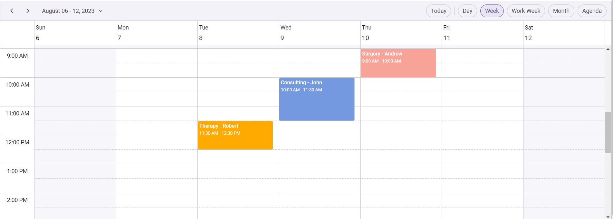

# Getting Started with Vue Schedule Component in the Quasar Framework

This article provides a step-by-step guide for setting up a [Quasar](https://quasar.dev) project and integrating the Syncfusion<sup style="font-size:70%">&reg;</sup> Vue Schedule component using the [Composition API](https://vuejs.org/guide/introduction.html#composition-api).

Quasar is a Vue.js–based open-source framework designed to build high‑performance, responsive applications for web, mobile, and desktop platforms from a single code base.

## Prerequisites

[System requirements for Syncfusion<sup style="font-size:70%">&reg;</sup> Vue UI components](../system-requirements)

## Set up the Quasar project

To initiate the creation of a new [Quasar](https://quasar.dev/start/quick-start) project, use the following commands:

```bash
npm init quasar
```

This command prompts additional configurations. Follow the steps outlined in the images below:


This generates the necessary files and prompts for project dependency installation. Respond with 'yes' to proceed with npm install, as shown in the image below:


Navigate to your project directory:

```bash
cd quasar-project
```

Now that `quasar-project` is ready to run with default settings, let's add Syncfusion<sup style="font-size:70%">&reg;</sup> components to the project.

## Add the Syncfusion<sup style="font-size:70%">&reg;</sup> Vue packages

Syncfusion<sup style="font-size:70%">&reg;</sup> Vue component packages are available at [npmjs.com](https://www.npmjs.com/search?q=ej2-vue). To use Syncfusion<sup style="font-size:70%">&reg;</sup> Vue components in the project, install the corresponding npm package.

This article uses the [Vue Schedule component](https://www.syncfusion.com/vue-components/vue-scheduler) as an example. To use the Vue Schedule component in the project, the `@syncfusion/ej2-vue-schedule` package needs to be installed using the following command:

```bash
npm install @syncfusion/ej2-vue-schedule --save
```

## Import Syncfusion<sup style="font-size:70%">&reg;</sup> CSS styles

You can import themes for the Syncfusion<sup style="font-size:70%">&reg;</sup> Vue component in various ways, such as using CSS or SASS styles from npm packages, CDN, CRG and [Theme Studio](https://ej2.syncfusion.com/vue/documentation/appearance/theme-studio). Refer to the [themes topic](https://ej2.syncfusion.com/vue/documentation/appearance/theme) to learn more about built-in themes and different ways to refer to themes in a Vue project.

In this article, the `Tailwind3` theme is applied using CSS styles, which are available in installed packages. The necessary `Tailwind3` CSS styles for the Schedule component and its dependents were imported into the `<style>` section of the **src/app.vue** file.




<style>
@import '../node_modules/@syncfusion/ej2-base/styles/tailwind3.css';
@import '../node_modules/@syncfusion/ej2-buttons/styles/tailwind3.css';
@import '../node_modules/@syncfusion/ej2-calendars/styles/tailwind3.css';
@import '../node_modules/@syncfusion/ej2-dropdowns/styles/tailwind3.css';
@import '../node_modules/@syncfusion/ej2-inputs/styles/tailwind3.css';
@import '../node_modules/@syncfusion/ej2-navigations/styles/tailwind3.css';
@import '../node_modules/@syncfusion/ej2-popups/styles/tailwind3.css';
@import '../node_modules/@syncfusion/ej2-vue-schedule/styles/tailwind3.css';
</style>




> The order of importing CSS styles should be in line with their dependency graph.

## Add the Syncfusion<sup style="font-size:70%">&reg;</sup> component

Follow the below steps to add the Vue Schedule component:

1\. First, add the `setup` attribute to the `script` tag to indicate that Vue will be using the `Composition API`. And import the Schedule component and its child directives in the `script` section of the **src/app.vue** file.




<script setup>
import { provide } from "vue";
import {
  ScheduleComponent as EjsSchedule, ViewsDirective as EViews, ViewDirective as EView,
  ResourcesDirective as EResources, ResourceDirective as EResource,
  Day, Week, WorkWeek, Month, Agenda
} from "@syncfusion/ej2-vue-schedule";

provide('schedule', [Day, Week, WorkWeek, Month, Agenda]);
</script>




<script>
import { ScheduleComponent, ViewsDirective, ViewDirective, ResourcesDirective, ResourceDirective, Day, Week, WorkWeek, Month, Agenda } from "@syncfusion/ej2-vue-schedule";

export default {
  name: "App",
  components: {
    'ejs-schedule': ScheduleComponent,
    "e-views": ViewsDirective,
    "e-view": ViewDirective,
    "e-resources": ResourcesDirective,
    "e-resource": ResourceDirective
  },
  provide: {
    schedule: [Day, Week, WorkWeek, Month, Agenda]
  }
}
</script>




2\. Then, define the Schedule component in the **src/app.vue** file, as shown below:




<template>
  <ejs-schedule height='550px' width='100%' :selectedDate='selectedDate' :eventSettings='eventSettings'>
    <e-views>
      <e-view option='Day'></e-view>
      <e-view option='Week'></e-view>
      <e-view option='WorkWeek'></e-view>
      <e-view option='Month'></e-view>
      <e-view option='Agenda'></e-view>
    </e-views>
    <e-resources>
      <e-resource field="OwnerId" title="Owner" name="Owners" :dataSource="ownerDataSource" textField="OwnerText"
        idField="Id" colorField="OwnerColor">
      </e-resource>
    </e-resources>
  </ejs-schedule>
</template>




3\. Declare the values for the `selectedDate`, `eventSettings` and `dataSource` properties in the `script` section.




<script setup>
const selectedDate = new Date(2023, 7, 8);
const eventSettings = {
  dataSource: [
    {
      Id: 1,
      Subject: 'Surgery - Andrew',
      EventType: 'Confirmed',
      StartTime: new Date(2023, 7, 10, 9, 0),
      EndTime: new Date(2023, 7, 10, 10, 0),
      OwnerId: 2
    },
    {
      Id: 2,
      Subject: 'Consulting - John',
      EventType: 'Confirmed',
      StartTime: new Date(2023, 7, 9, 10, 0),
      EndTime: new Date(2023, 7, 9, 11, 30),
      OwnerId: 3
    },
    {
      Id: 3,
      Subject: 'Therapy - Robert',
      EventType: 'Requested',
      StartTime: new Date(2023, 7, 8, 11, 30),
      EndTime: new Date(2023, 7, 8, 12, 30),
      OwnerId: 1
    }
  ]
};
const ownerDataSource = [
  { OwnerText: "Nancy", Id: 1, OwnerColor: "#ffaa00" },
  { OwnerText: "Steven", Id: 2, OwnerColor: "#f8a398" },
  { OwnerText: "Michael", Id: 3, OwnerColor: "#7499e1" }
];
</script>




<script>

export default {
  data() {
    return {
      selectedDate: new Date(2023, 7, 8),
      eventSettings: {
        dataSource: [
          {
            Id: 1,
            Subject: 'Surgery - Andrew',
            EventType: 'Confirmed',
            StartTime: new Date(2023, 7, 10, 9, 0),
            EndTime: new Date(2023, 7, 10, 10, 0),
            OwnerId: 2
          },
          {
            Id: 2,
            Subject: 'Consulting - John',
            EventType: 'Confirmed',
            StartTime: new Date(2023, 7, 9, 10, 0),
            EndTime: new Date(2023, 7, 9, 11, 30),
            OwnerId: 3
          },
          {
            Id: 3,
            Subject: 'Therapy - Robert',
            EventType: 'Requested',
            StartTime: new Date(2023, 7, 8, 11, 30),
            EndTime: new Date(2023, 7, 8, 12, 30),
            OwnerId: 1
          }
        ]
      },
      ownerDataSource: [
        { OwnerText: "Nancy", Id: 1, OwnerColor: "#ffaa00" },
        { OwnerText: "Steven", Id: 2, OwnerColor: "#f8a398" },
        { OwnerText: "Michael", Id: 3, OwnerColor: "#7499e1" }
      ]
    }
  }
}
</script>




Here is the summarized code for the above steps in the **src/app.vue** file:




<template>
  <ejs-schedule height='550px' width='100%' :selectedDate='selectedDate' :eventSettings='eventSettings'>
    <e-views>
      <e-view option='Day'></e-view>
      <e-view option='Week'></e-view>
      <e-view option='WorkWeek'></e-view>
      <e-view option='Month'></e-view>
      <e-view option='Agenda'></e-view>
    </e-views>
    <e-resources>
      <e-resource field="OwnerId" title="Owner" name="Owners" :dataSource="ownerDataSource" textField="OwnerText"
        idField="Id" colorField="OwnerColor">
      </e-resource>
    </e-resources>
  </ejs-schedule>
</template>

<script setup>
import { provide } from "vue";
import {
  ScheduleComponent as EjsSchedule, ViewsDirective as EViews, ViewDirective as EView,
  ResourcesDirective as EResources, ResourceDirective as EResource,
  Day, Week, WorkWeek, Month, Agenda
} from "@syncfusion/ej2-vue-schedule";

provide('schedule', [Day, Week, WorkWeek, Month, Agenda]);

const selectedDate = new Date(2023, 7, 8);
const eventSettings = {
  dataSource: [
    {
      Id: 1,
      Subject: 'Surgery - Andrew',
      EventType: 'Confirmed',
      StartTime: new Date(2023, 7, 10, 9, 0),
      EndTime: new Date(2023, 7, 10, 10, 0),
      OwnerId: 2
    },
    {
      Id: 2,
      Subject: 'Consulting - John',
      EventType: 'Confirmed',
      StartTime: new Date(2023, 7, 9, 10, 0),
      EndTime: new Date(2023, 7, 9, 11, 30),
      OwnerId: 3
    },
    {
      Id: 3,
      Subject: 'Therapy - Robert',
      EventType: 'Requested',
      StartTime: new Date(2023, 7, 8, 11, 30),
      EndTime: new Date(2023, 7, 8, 12, 30),
      OwnerId: 1
    }
  ]
};
const ownerDataSource = [
  { OwnerText: "Nancy", Id: 1, OwnerColor: "#ffaa00" },
  { OwnerText: "Steven", Id: 2, OwnerColor: "#f8a398" },
  { OwnerText: "Michael", Id: 3, OwnerColor: "#7499e1" }
];
</script>

<style>
@import '../node_modules/@syncfusion/ej2-base/styles/tailwind3.css';
@import '../node_modules/@syncfusion/ej2-buttons/styles/tailwind3.css';
@import '../node_modules/@syncfusion/ej2-calendars/styles/tailwind3.css';
@import '../node_modules/@syncfusion/ej2-dropdowns/styles/tailwind3.css';
@import '../node_modules/@syncfusion/ej2-inputs/styles/tailwind3.css';
@import '../node_modules/@syncfusion/ej2-navigations/styles/tailwind3.css';
@import '../node_modules/@syncfusion/ej2-popups/styles/tailwind3.css';
@import '../node_modules/@syncfusion/ej2-vue-schedule/styles/tailwind3.css';
</style>




<template>
  <ejs-schedule height='550px' width='100%' :selectedDate='selectedDate' :eventSettings='eventSettings'>
    <e-views>
      <e-view option='Day'></e-view>
      <e-view option='Week'></e-view>
      <e-view option='WorkWeek'></e-view>
      <e-view option='Month'></e-view>
      <e-view option='Agenda'></e-view>
    </e-views>
    <e-resources>
      <e-resource field="OwnerId" title="Owner" name="Owners" :dataSource="ownerDataSource" textField="OwnerText"
        idField="Id" colorField="OwnerColor">
      </e-resource>
    </e-resources>
  </ejs-schedule>
</template>

<script>
import { ScheduleComponent, ViewsDirective, ViewDirective, ResourcesDirective, ResourceDirective, Day, Week, WorkWeek, Month, Agenda } from "@syncfusion/ej2-vue-schedule";

export default {
  name: "App",
  components: {
    'ejs-schedule': ScheduleComponent,
    "e-views": ViewsDirective,
    "e-view": ViewDirective,
    "e-resources": ResourcesDirective,
    "e-resource": ResourceDirective
  },
  data() {
    return {
      selectedDate: new Date(2023, 7, 8),
      eventSettings: {
        dataSource: [
          {
            Id: 1,
            Subject: 'Surgery - Andrew',
            EventType: 'Confirmed',
            StartTime: new Date(2023, 7, 10, 9, 0),
            EndTime: new Date(2023, 7, 10, 10, 0),
            OwnerId: 2
          },
          {
            Id: 2,
            Subject: 'Consulting - John',
            EventType: 'Confirmed',
            StartTime: new Date(2023, 7, 9, 10, 0),
            EndTime: new Date(2023, 7, 9, 11, 30),
            OwnerId: 3
          },
          {
            Id: 3,
            Subject: 'Therapy - Robert',
            EventType: 'Requested',
            StartTime: new Date(2023, 7, 8, 11, 30),
            EndTime: new Date(2023, 7, 8, 12, 30),
            OwnerId: 1
          }
        ]
      },
      ownerDataSource: [
        { OwnerText: "Nancy", Id: 1, OwnerColor: "#ffaa00" },
        { OwnerText: "Steven", Id: 2, OwnerColor: "#f8a398" },
        { OwnerText: "Michael", Id: 3, OwnerColor: "#7499e1" }
      ]
    }
  },
  provide: {
    schedule: [Day, Week, WorkWeek, Month, Agenda]
  }
}
</script>

<style>
@import '../node_modules/@syncfusion/ej2-base/styles/tailwind3.css';
@import '../node_modules/@syncfusion/ej2-buttons/styles/tailwind3.css';
@import '../node_modules/@syncfusion/ej2-calendars/styles/tailwind3.css';
@import '../node_modules/@syncfusion/ej2-dropdowns/styles/tailwind3.css';
@import '../node_modules/@syncfusion/ej2-inputs/styles/tailwind3.css';
@import '../node_modules/@syncfusion/ej2-navigations/styles/tailwind3.css';
@import '../node_modules/@syncfusion/ej2-popups/styles/tailwind3.css';
@import '../node_modules/@syncfusion/ej2-vue-schedule/styles/tailwind3.css';
</style>




## Run the project

To run the project, use the following command:

```bash
npm run dev
```

The application launches and displays the Vue Schedule component as shown below:

