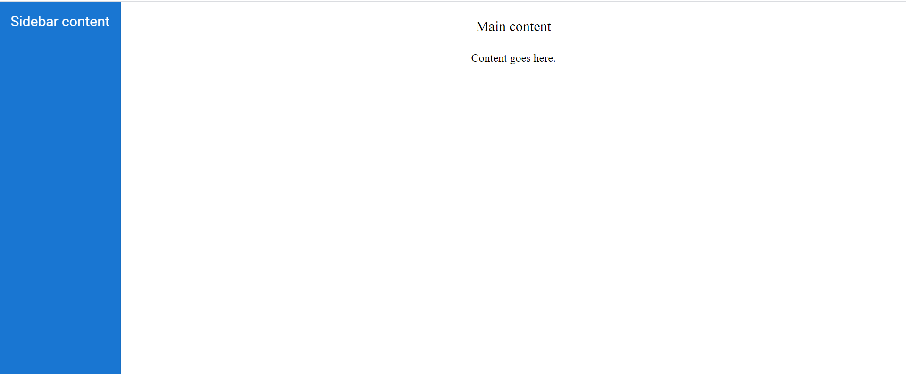
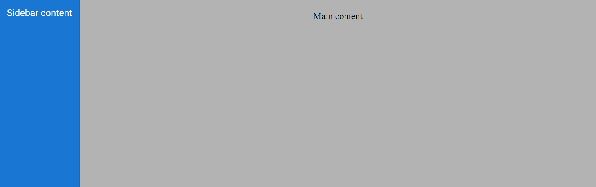
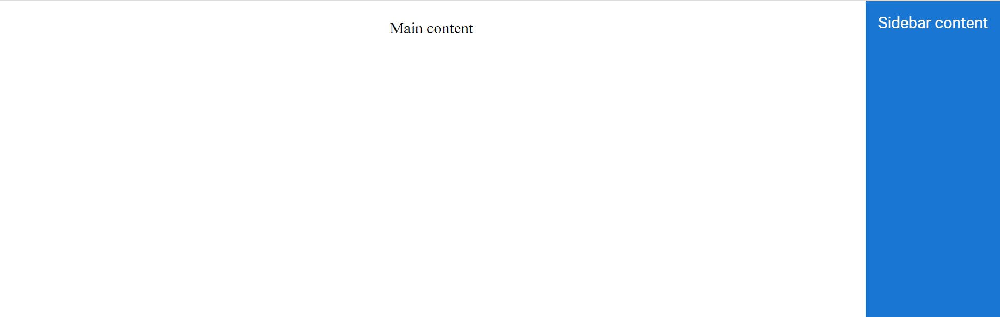
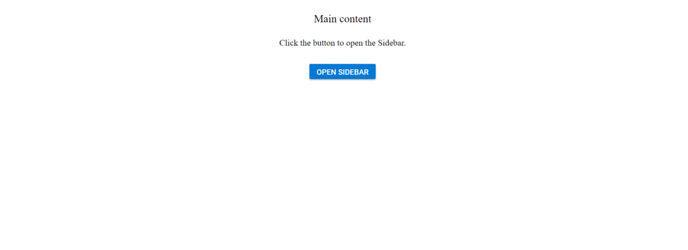
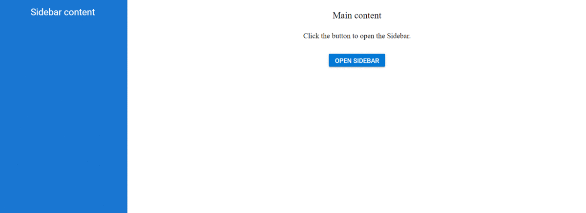
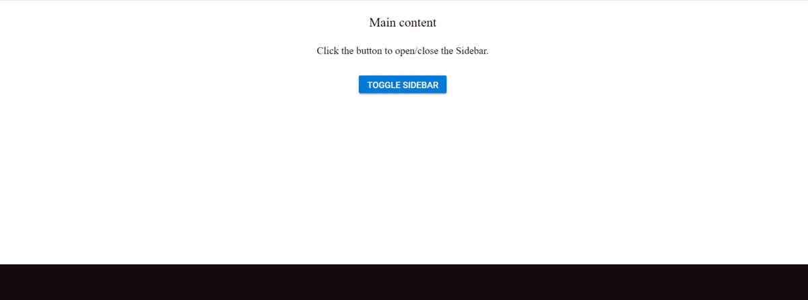

# Getting Started with the Vue Sidebar Component in Vue 3

This article provides a step-by-step guide for setting up a [Vite](https://vitejs.dev/) project with a JavaScript environment and integrating the Syncfusion Vue Sidebar component using the [Composition API](https://vuejs.org/guide/introduction.html#composition-api) / [Options API](https://vuejs.org/guide/introduction.html#options-api).

The `Composition API` is a new feature introduced in Vue.js 3 that provides an alternative way to organize and reuse component logic. It allows developers to write components as functions that use smaller, reusable functions called composition functions to manage their properties and behavior.

The `Options API` is the traditional way of writing Vue.js components, where the component logic is organized into a series of options that define the component's properties and behavior. These options include data, methods, computed properties, watchers, lifecycle hooks, and more.

## Prerequisites

[System requirements for Syncfusion Vue UI components](https://ej2.syncfusion.com/vue/documentation/system-requirements)

## Set up the Vite project

A recommended approach for beginning with Vue is to scaffold a project using [Vite](https://vitejs.dev/). To create a new Vite project, use one of the commands that are specific to either NPM or Yarn.

```bash
npm create vite@latest
```

or

```bash
yarn create vite
```

Using one of the above commands will lead you to set up additional configurations for the project as below:

1.Define the project name: We can specify the name of the project directly. Let's specify the name of the project as `my-project` for this article.

```bash
? Project name: » my-project
```

2.Select `Vue` as the framework. It will create a Vue 3 project.

```bash
? Select a framework: » - Use arrow-keys. Return to submit.
Vanilla
> Vue
  React
  Preact
  Lit
  Svelte
  Others
```

3.Choose `JavaScript` as the framework variant to build this Vite project using JavaScript and Vue.

```bash
? Select a variant: » - Use arrow-keys. Return to submit.
> JavaScript
  TypeScript
  Customize with create-vue ↗
  Nuxt ↗
```

4.Upon completing the aforementioned steps to create the `my-project`, run the following command to install its dependencies:

```bash
cd my-project
npm install
```

or

```bash
cd my-project
yarn install
```

Now that `my-project` is ready to run with default settings, let's add Syncfusion components to the project.

## Add Syncfusion Vue packages

Syncfusion Vue component packages are available at [npmjs.com](https://www.npmjs.com/search?q=ej2-vue). To use Syncfusion Vue components in the project, install the corresponding npm package.

This article uses the [Vue Sidebar component](https://www.syncfusion.com/vue-components/vue-sidebar) as an example. To use the Vue Sidebar component in the project, the `@syncfusion/ej2-vue-navigations` package needs to be installed using the following command:

```bash
npm install @syncfusion/ej2-vue-navigations --save
```

or

```bash
yarn add @syncfusion/ej2-vue-navigations
```

## Import Syncfusion CSS styles

You can import themes for the Syncfusion Vue component in various ways, such as using CSS or SASS styles from npm packages, CDN, [CRG](https://crg.syncfusion.com/) and [Theme Studio](https://ej2.syncfusion.com/vue/documentation/appearance/theme-studio). Refer to [themes topic](https://ej2.syncfusion.com/vue/documentation/appearance/theme) to know more about built-in themes and different ways to refer to themes in a Vue project.

In this article, `Material` theme is applied using CSS styles, which are available in installed packages. The necessary `Material` CSS styles for the Sidebar component and its dependents were imported into the `<style>` section of **src/App.vue** file.




<style>
  @import "../node_modules/@syncfusion/ej2-base/styles/material.css";
  @import "../node_modules/@syncfusion/ej2-vue-navigations/styles/material.css";
</style>




## Add Syncfusion Vue component

Follow the below steps to add the Vue Sidebar component using `Composition API` or `Options API`:

1.First, import and register the Sidebar component in the `script` section of the **src/App.vue** file. If you are using the `Composition API`, you should add the `setup` attribute to the `script` tag to indicate that Vue will be using the `Composition API`.




<script setup>
  import { SidebarComponent as EjsSidebar } from '@syncfusion/ej2-vue-navigations';
</script>




<script>
import { SidebarComponent } from '@syncfusion/ej2-vue-navigations';
//Component registration
export default {
  name: "App",
  components: {
    "ejs-sidebar": SidebarComponent
  }
}
</script>



   
2.Add the component definition in template section.




<template>
  <div id="app">
    <ejs-sidebar id="default-sidebar">
      <div class="title"> Sidebar content</div>
    </ejs-sidebar>
    <div>
      <div class="title">Main content</div>
      <div class="sub-title">Content goes here.</div>
    </div>
  </div>
</template>




Here is the summarized code for the above steps in the **src/App.vue** file:




<template>
  <div id="app">
    <ejs-sidebar id="default-sidebar">
      <div class="title"> Sidebar content</div>
    </ejs-sidebar>
    <div>
      <div class="title">Main content</div>
      <div class="sub-title">Content goes here.</div>
    </div>
  </div>
</template>

<script setup>
  import { SidebarComponent as EjsSidebar } from '@syncfusion/ej2-vue-navigations';
</script>

<style>
  @import "../node_modules/@syncfusion/ej2-base/styles/material.css";
  @import "../node_modules/@syncfusion/ej2-vue-navigations/styles/material.css";

  #default-sidebar {
    background-color: rgb(25, 118, 210);
    color: #ffffff;
  }
  .title {
    text-align: center;
    font-size: 20px;
    padding: 15px;
  }

  .sub-title {
    text-align: center;
    font-size: 16px;
    padding: 10px;
  }
</style>




<template>
  <div id="app">
    <ejs-sidebar id="default-sidebar">
      <div class="title"> Sidebar content</div>
    </ejs-sidebar>
    <div>
      <div class="title">Main content</div>
      <div class="sub-title">Content goes here.</div>
    </div>
  </div>
</template>

<script>
import { SidebarComponent } from '@syncfusion/ej2-vue-navigations';
//Component registration
export default {
  name: "App",
  components: {
    "ejs-sidebar": SidebarComponent
  }
}
</script>

<style>
  @import "../node_modules/@syncfusion/ej2-base/styles/material.css";
  @import "../node_modules/@syncfusion/ej2-vue-navigations/styles/material.css";

  #default-sidebar {
    background-color: rgb(25, 118, 210);
    color: #ffffff;
  }
  .title {
    text-align: center;
    font-size: 20px;
    padding: 15px;
  }

  .sub-title {
    text-align: center;
    font-size: 16px;
    padding: 10px;
  }
</style>




## Run the project

To run the project, use the following command:

```bash
npm run dev
```

or

```bash
yarn run dev
```

The output will appear as follows:



## Enable backdrop

Enabling the [showBackdrop](https://ej2.syncfusion.com/vue/documentation/api/sidebar/#showbackdrop) in the Sidebar component will prevent the main content from user interactions, when it is in expanded state. Here, the DOM elements will not get changed. It only closes the main content by covering with a black backdrop overlay and focuses the Sidebar in the screen. Sidebar can be rendered with specific width by setting `width` property.

N> To achieve a proper **backdrop**, we suggest that you create a wrapper parent container for the div block in which you intend to enable the backdrop. Set the class name of this parent container as the [**target**](https://helpej2.syncfusion.com/vue/documentation/api/sidebar/#target) for the Sidebar. Alternatively, you can place an empty div container after the target container.

In the following example, the `showBackdrop` and `closeOnDocumentClick` properties are enabled.




<template>
  <div id="app">
    <div class="wrapper">
        <ejs-sidebar id="default-sidebar" :showBackdrop="showBackdrop" :closeOnDocumentClick="closeOnDocumentClick">
          <div class="title"> Sidebar content</div>
        </ejs-sidebar>
        <div>
            <div class="title">Main content</div>
        </div>
    </div>
  </div>
</template>

<script setup>
  import { SidebarComponent as EjsSidebar } from '@syncfusion/ej2-vue-navigations';

  const showBackdrop= true;
  const closeOnDocumentClick= true;
</script>

<style>
  @import "../node_modules/@syncfusion/ej2-base/styles/material.css";
  @import "../node_modules/@syncfusion/ej2-vue-navigations/styles/material.css";

  .title {
    text-align: center;
    font-size: 20px;
    padding: 15px;
  }

  #default-sidebar {
    background-color: rgb(25, 118, 210);
    color: #ffffff;
  }
</style>




<template>
  <div id="app">
    <div class="wrapper">
        <ejs-sidebar id="default-sidebar" :showBackdrop="showBackdrop" :closeOnDocumentClick="closeOnDocumentClick">
          <div class="title"> Sidebar content</div>
        </ejs-sidebar>
        <div>
            <div class="title">Main content</div>
        </div>
    </div>
  </div>
</template>

<script>
import { SidebarComponent } from '@syncfusion/ej2-vue-navigations';
//Component registration
export default {
  name: "App",
  components: {
    "ejs-sidebar": SidebarComponent
  },
  data() {
    return {
        showBackdrop: true,
        closeOnDocumentClick: true,
    }
  }
}
</script>

<style>
  @import "../node_modules/@syncfusion/ej2-base/styles/material.css";
  @import "../node_modules/@syncfusion/ej2-vue-navigations/styles/material.css";

  .title {
    text-align: center;
    font-size: 20px;
    padding: 15px;
  }

  #default-sidebar {
    background-color: rgb(25, 118, 210);
    color: #ffffff;
  }
</style>






## Position

Positioning the Sidebar to the right or left of the main content can be achieved by using the [position](https://ej2.syncfusion.com/vue/documentation/api/sidebar/#position) property. If the position is not set, the Sidebar will expand from the left to the body element. [`enablePersistence`](https://ej2.syncfusion.com/vue/documentation/api/sidebar/#enablepersistence) will persist the component's state between page reloads. [`change`](https://ej2.syncfusion.com/vue/documentation/api/sidebar/#change) event will be triggered when the state(expand/collapse) of the component is changed.

In the following example, the `position` property is set as `Right`.




<template>
  <div id="app">
    <div class="wrapper">
        <ejs-sidebar id="default-sidebar" :position="position">
          <div class="title"> Sidebar content</div>
        </ejs-sidebar>
        <div>
          <div class="title">Main content</div>
        </div>
    </div>
  </div>
</template>

<script setup>
  import { SidebarComponent as EjsSidebar } from '@syncfusion/ej2-vue-navigations';

  const position= 'Right';
</script>

<style>
  @import "../node_modules/@syncfusion/ej2-base/styles/material.css";
  @import "../node_modules/@syncfusion/ej2-vue-navigations/styles/material.css";

  .title {
    text-align: center;
    font-size: 20px;
    padding: 15px;
  }

  #default-sidebar {
    background-color: rgb(25, 118, 210);
    color: #ffffff;
  }
</style>




<template>
  <div id="app">
    <div class="wrapper">
        <ejs-sidebar id="default-sidebar" :position="position">
          <div class="title"> Sidebar content</div>
        </ejs-sidebar>
        <div>
            <div class="title">Main content</div>
        </div>
    </div>
  </div>
</template>

<script>
import { SidebarComponent } from '@syncfusion/ej2-vue-navigations';
//Component registration
export default {
  name: "App",
  components: {
    "ejs-sidebar": SidebarComponent
  },
  data() {
    return {
        position: 'Right',
    }
  }
}
</script>

<style>
  @import "../node_modules/@syncfusion/ej2-base/styles/material.css";
  @import "../node_modules/@syncfusion/ej2-vue-navigations/styles/material.css";

  .title {
    text-align: center;
    font-size: 20px;
    padding: 15px;
  }

  #default-sidebar {
    background-color: rgb(25, 118, 210);
    color: #ffffff;
  }
</style>






## Animate

Animation transitions can be set while expanding or collapsing the Sidebar using the [`animate`](https://ej2.syncfusion.com/vue/documentation/api/sidebar/#animate) property. By default, [`animate`](https://ej2.syncfusion.com/vue/documentation/api/sidebar/#animate) property is set to true. [`enableRTL`](https://ej2.syncfusion.com/vue/documentation/api/sidebar/#enablertl) will display the sidebar in the right-to-left direction.

In the following example, the `animate` property is disabled.




<template>
  <div id="app">
    <div class="wrapper">
      <ejs-sidebar id="default-sidebar" ref="sidebar" :type="type" :width="width" :animate="animate" :enableRtl="enableRtl">
        <div class="title"> Sidebar content</div>
          <div class="sub-title">
            Click the button to close the Sidebar
          </div>
          <div class="center-align">
            <ejs-button  id="close" v-on:click="closeClick"  class="e-btn close-btn">Close Sidebar</ejs-button>
          </div>
      </ejs-sidebar>
      <div>
          <div class="title">Main content</div>
          <div class="sub-title"> Click the button to open/close the Sidebar.</div>
          <div style="padding:20px" class="center-align">
            <ejs-button id="toggle"  class="e-btn e-info" v-on:click="toggleClick" >Toggle Sidebar</ejs-button>
          </div>
      </div>
  </div>
  </div>
</template>

<script setup>
  import { SidebarComponent as EjsSidebar } from '@syncfusion/ej2-vue-navigations';
  import { ButtonComponent as EjsButton } from '@syncfusion/ej2-vue-buttons';
  import { ref } from "vue";

  const type = 'Push';
  const width = '280px';
  const animate = false;
  const enableRtl = true;
  const sidebar = ref(null);

  const closeClick = () => {
    sidebar.value.hide();
  }
  const toggleClick = () => {
    sidebar.value.toggle();
  }
</script>

<style>
  @import "../node_modules/@syncfusion/ej2-base/styles/material.css";
  @import "../node_modules/@syncfusion/ej2-vue-navigations/styles/material.css";
  @import "../node_modules/@syncfusion/ej2-buttons/styles/material.css";

  .center-align {
    text-align: center;
    padding: 20px;
  }

  .title {
    text-align: center;
    font-size: 20px;
    padding: 15px;
  }

  .sub-title {
    text-align: center;
    font-size: 16px;
    padding: 10px;
  }

  .center {
    text-align: center;
    display: none;
    font-size: 13px;
    font-weight: 400;
    margin-top: 20px;
  }

  #default-sidebar {
    background-color: rgb(25, 118, 210);
    color: #ffffff;
  }

  .close-btn:hover {
    color: #fafafa;
  }
</style>




<template>
  <div id="app">
    <div class="wrapper">
      <ejs-sidebar id="default-sidebar" ref="sidebar" :type="type" :width="width" :animate="animate" :enableRtl="enableRtl">
        <div class="title"> Sidebar content</div>
          <div class="sub-title">
            Click the button to close the Sidebar
          </div>
          <div class="center-align">
            <ejs-button  id="close" v-on:click="closeClick"  class="e-btn close-btn">Close Sidebar</ejs-button>
          </div>
      </ejs-sidebar>
      <div>
          <div class="title">Main content</div>
          <div class="sub-title"> Click the button to open/close the Sidebar.</div>
          <div style="padding:20px" class="center-align">
            <ejs-button id="toggle"  class="e-btn e-info" v-on:click="toggleClick" >Toggle Sidebar</ejs-button>
          </div>
      </div>
  </div>
  </div>
</template>

<script>
import { SidebarComponent } from '@syncfusion/ej2-vue-navigations';
import { ButtonComponent } from '@syncfusion/ej2-vue-buttons';
//Component registration
export default {
  name: "App",
  components: {
    "ejs-sidebar": SidebarComponent,
    "ejs-button": ButtonComponent
  },
  data() {
    return {
      type: 'Push',
      width: '280px',
      animate: false,
      enableRtl: true,
    }
  },
  methods: {
    toggleClick: function () {
        this.$refs.sidebar.toggle();
    },
    closeClick: function () {
        this.$refs.sidebar.hide();
    }
  }
}
</script>

<style>
  @import "../node_modules/@syncfusion/ej2-base/styles/material.css";
  @import "../node_modules/@syncfusion/ej2-vue-navigations/styles/material.css";
  @import "../node_modules/@syncfusion/ej2-buttons/styles/material.css";

  .center-align {
    text-align: center;
    padding: 20px;
  }

  .title {
    text-align: center;
    font-size: 20px;
    padding: 15px;
  }

  .sub-title {
    text-align: center;
    font-size: 16px;
    padding: 10px;
  }

  .center {
    text-align: center;
    display: none;
    font-size: 13px;
    font-weight: 400;
    margin-top: 20px;
  }

  #default-sidebar {
    background-color: rgb(25, 118, 210);
    color: #ffffff;
  }

  .close-btn:hover {
    color: #fafafa;
  }
</style>






## Close on document click

Sidebar can be closed on document click by setting [`closeOnDocumentClick`](https://ej2.syncfusion.com/vue/documentation/api/sidebar/#closeondocumentclick) to true. If this property is not set, the Sidebar will not close on document click since its default value is false. Sidebar can be kept opened during rendering using [`isOpen`](https://ej2.syncfusion.com/vue/documentation/api/sidebar/#isopen) property.

In the following example, the `closeOnDocumentClick` property is enabled..




<template>
  <div id="app">
    <div class="wrapper">
      <ejs-sidebar id="default-sidebar" ref="sidebar" :width="width" :type="type" :isOpen="isOpen" :closeOnDocumentClick="closeOnDocumentClick">
      <div class="title"> Sidebar content</div>
      </ejs-sidebar>
      <div>
        <div class="title">Main content</div>
        <div class="sub-title"> Click the button to open the Sidebar.</div>
        <div style="padding:20px" class="center-align">
          <ejs-button id="toggle"  class="e-btn e-info" v-on:click="toggleClick" >Open Sidebar</ejs-button>
        </div>
      </div>
  </div>
  </div>
</template>

<script setup>
  import { SidebarComponent as EjsSidebar } from '@syncfusion/ej2-vue-navigations';
  import { ButtonComponent as EjsButton } from '@syncfusion/ej2-vue-buttons';
  import { ref } from "vue";

  const type = 'Push';
  const width = '280px';
  const closeOnDocumentClick = true;
  const isOpen = true;
  const sidebar = ref(null);

  const toggleClick = () => {
    sidebar.value.toggle();
  }
</script>

<style>
  @import "../node_modules/@syncfusion/ej2-base/styles/material.css";
  @import "../node_modules/@syncfusion/ej2-vue-navigations/styles/material.css";
  @import "../node_modules/@syncfusion/ej2-buttons/styles/material.css";

  .center-align {
    text-align: center;
    padding: 20px;
  }

  .title {
    text-align: center;
    font-size: 20px;
    padding: 15px;
  }

  .sub-title {
    text-align: center;
    font-size: 16px;
    padding: 10px;
  }

  .center {
    text-align: center;
    display: none;
    font-size: 13px;
    font-weight: 400;
    margin-top: 20px;
  }

  #default-sidebar {
    background-color: rgb(25, 118, 210);
    color: #ffffff;
  }

  .close-btn:hover {
        color: #fafafa;
  }
</style>




<template>
  <div id="app">
    <div class="wrapper">
      <ejs-sidebar id="default-sidebar" ref="sidebar" :width="width" :type="type" :isOpen="isOpen" :closeOnDocumentClick="closeOnDocumentClick">
      <div class="title"> Sidebar content</div>
      </ejs-sidebar>
      <div>
        <div class="title">Main content</div>
        <div class="sub-title"> Click the button to open the Sidebar.</div>
        <div style="padding:20px" class="center-align">
          <ejs-button id="toggle"  class="e-btn e-info" v-on:click="toggleClick" >Open Sidebar</ejs-button>
        </div>
      </div>
  </div>
  </div>
</template>

<script>
import { SidebarComponent } from '@syncfusion/ej2-vue-navigations';
import { ButtonComponent } from '@syncfusion/ej2-vue-buttons';
//Component registration
export default {
  name: "App",
  components: {
    "ejs-sidebar": SidebarComponent,
    "ejs-button": ButtonComponent
  },
  data() {
    return {
      type: 'Push',
      width: '280px',
      isOpen: false,
      closeOnDocumentClick: true,
    }
  },
  methods: {
    toggleClick: function () {
        this.$refs.sidebar.toggle();
    }
  }
}
</script>

<style>
  @import "../node_modules/@syncfusion/ej2-base/styles/material.css";
  @import "../node_modules/@syncfusion/ej2-vue-navigations/styles/material.css";
  @import "../node_modules/@syncfusion/ej2-buttons/styles/material.css";

  .center-align {
    text-align: center;
    padding: 20px;
  }

  .title {
    text-align: center;
    font-size: 20px;
    padding: 15px;
  }

  .sub-title {
    text-align: center;
    font-size: 16px;
    padding: 10px;
  }

  .center {
    text-align: center;
    display: none;
    font-size: 13px;
    font-weight: 400;
    margin-top: 20px;
  }

  #default-sidebar {
    background-color: rgb(25, 118, 210);
    color: #ffffff;
  }

  .close-btn:hover {
    color: #fafafa;
  }
</style>






## Enable gestures

Expand or collapse the Sidebar while swiping in touch devices using [`enableGestures`](https://helpej2.syncfusion.com/vue/documentation/api/sidebar/#enablegestures) property. By default, `enableGestures` is set to true.

In the following example, the `enableGestures` property is enabled.




<template>
  <div id="app">
    <div class="wrapper">
      <ejs-sidebar id="default-sidebar" ref="sidebar" :width="width" :type="type" :enableGestures="enableGestures">
        <div class="title"> Sidebar content</div>
          <div class="sub-title">
            Click the button to close the Sidebar.
          </div>
          <div class="center-align">
            <ejs-button  id="close" v-on:click="closeClick"  class="e-btn close-btn">Close Sidebar</ejs-button>
          </div>
      </ejs-sidebar>
      <div>
          <div class="title">Main content</div>
          <div class="sub-title"> Click the button to open/close the Sidebar.</div>
          <div style="padding:20px" class="center-align">
            <ejs-button ejs-button id="toggle"  class="e-btn e-info" v-on:click="toggleClick" >Toggle Sidebar</ejs-button>
          </div>
      </div>
  </div>
  </div>
</template>

<script setup>
  import { SidebarComponent as EjsSidebar } from '@syncfusion/ej2-vue-navigations';
  import { ButtonComponent as EjsButton } from '@syncfusion/ej2-vue-buttons';
  import { ref } from "vue";

  const type = 'Push';
  const width = '280px';
  const enableGestures = false;
  const sidebar = ref(null);

  const closeClick = () => {
    sidebar.value.hide();
  }
  const toggleClick = () => {
    sidebar.value.toggle();
  }
</script>

<style>
  @import "../node_modules/@syncfusion/ej2-base/styles/material.css";
  @import "../node_modules/@syncfusion/ej2-vue-navigations/styles/material.css";
  @import "../node_modules/@syncfusion/ej2-buttons/styles/material.css";

    .center-align {
    text-align: center;
    padding: 20px;
  }

  .title {
    text-align: center;
    font-size: 20px;
    padding: 15px;
  }

  .sub-title {
    text-align: center;
    font-size: 16px;
    padding: 10px;
  }

  .center {
    text-align: center;
    display: none;
    font-size: 13px;
    font-weight: 400;
    margin-top: 20px;
  }

  #default-sidebar {
    background-color: rgb(25, 118, 210);
    color: #ffffff;
  }

  .close-btn:hover {
    color: #fafafa;
  }
</style>




<template>
  <div id="app">
    <div class="wrapper">
      <ejs-sidebar id="default-sidebar" ref="sidebar" :width="width" :type="type" :enableGestures="enableGestures">
        <div class="title"> Sidebar content</div>
          <div class="sub-title">
            Click the button to close the Sidebar.
          </div>
          <div class="center-align">
            <ejs-button  id="close" v-on:click="closeClick"  class="e-btn close-btn">Close Sidebar</ejs-button>
          </div>
      </ejs-sidebar>
      <div>
          <div class="title">Main content</div>
          <div class="sub-title"> Click the button to open/close the Sidebar.</div>
          <div style="padding:20px" class="center-align">
            <ejs-button ejs-button id="toggle"  class="e-btn e-info" v-on:click="toggleClick" >Toggle Sidebar</ejs-button>
          </div>
      </div>
  </div>
  </div>
</template>

<script>
import { SidebarComponent } from '@syncfusion/ej2-vue-navigations';
import { ButtonComponent } from '@syncfusion/ej2-vue-buttons';
//Component registration
export default {
  name: "App",
  components: {
    "ejs-sidebar": SidebarComponent,
    "ejs-button": ButtonComponent
  },
  data() {
    return {
      type: 'Push',
      width: '280px',
      enableGestures: false,
    }
  },
  methods: {
    toggleClick: function () {
        this.$refs.sidebar.toggle();
    },
    closeClick: function () {
      this.$refs.sidebar.hide();;
    },
  }
}
</script>

<style>
  @import "../node_modules/@syncfusion/ej2-base/styles/material.css";
  @import "../node_modules/@syncfusion/ej2-vue-navigations/styles/material.css";
  @import "../node_modules/@syncfusion/ej2-buttons/styles/material.css";

  .center-align {
    text-align: center;
    padding: 20px;
  }

  .title {
    text-align: center;
    font-size: 20px;
    padding: 15px;
  }

  .sub-title {
    text-align: center;
    font-size: 16px;
    padding: 10px;
  }

  .center {
    text-align: center;
    display: none;
    font-size: 13px;
    font-weight: 400;
    margin-top: 20px;
  }

  #default-sidebar {
    background-color: rgb(25, 118, 210);
    color: #ffffff;
  }

  .close-btn:hover {
    color: #fafafa;
  }
</style>






For migrating from Vue 2 to Vue 3, refer to the [`migration`](https://ej2.syncfusion.com/vue/documentation/getting-started/vue3-tutorial/#migration-from-vue-2-to-vue-3) documentation.

## See also

* [Getting Started with Vue UI Components using Composition API and TypeScript](https://ej2.syncfusion.com/vue/documentation/getting-started/vue-3-ts-composition)
* [Getting Started with Vue UI Components using Options API and TypeScript](https://ej2.syncfusion.com/vue/documentation/getting-started/vue-3-ts-options)
