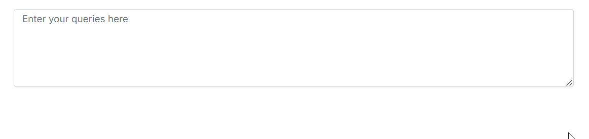
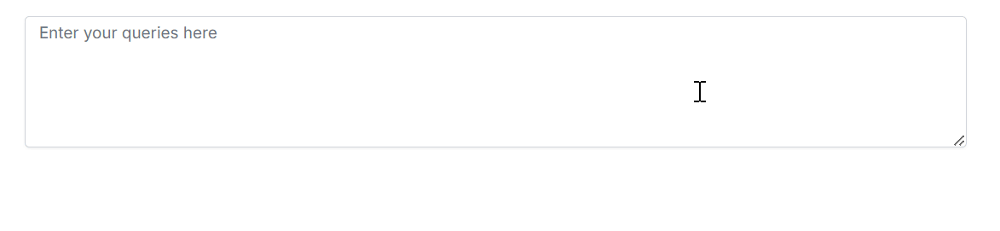

# Customizing Appearance of Suggestions 

The [ShowSuggestionOnPopup](https://ej2.syncfusion.com/vue/documentation/api/smart-textarea/#showsuggestiononpopup) property in Syncfusion<sup style="font-size:70%">&reg;</sup> JavaScript Smart TextArea allows you to control how text suggestions are displayed to the users.

* If `ShowSuggestionOnPopup` is `Enable`, suggestions displayed in the pop-up window

```js
<template>
    <ejs-smarttextarea
      id="smart-textarea"
      placeholder="Enter your queries here"
      :rows="3"
      :cols="35"
      userRole="Employee communicating with internal team"
      :aiSuggestionHandler="serverAIRequest"
      showSuggestionOnPopup="Enable"
    ></ejs-smarttextarea>
</template>
```



* If `ShowSuggestionOnPopup` is `Disable`, suggestions displayed inline.

```js
<template>
    <ejs-smarttextarea
      id="smart-textarea"
      placeholder="Enter your queries here"
      :rows="3"
      :cols="35"
      userRole="Employee communicating with internal team"
      :aiSuggestionHandler="serverAIRequest"
      showSuggestionOnPopup="Disable"
    ></ejs-smarttextarea>
</template>
```



By default `showSuggestionOnPopup` is `None`.

## See also

* [Getting Started with Syncfusion<sup style="font-size:70%">&reg;</sup> Vue Smart TextArea](./vue-3-getting-started)