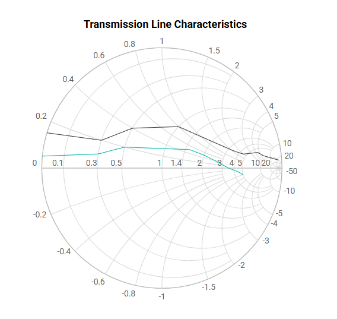

# Getting Started with the Vue Smith Chart Component in Vue 3

This article provides a step-by-step guide to creating a [Vite](https://vite.dev/) JavaScript project and integrating the Syncfusion<sup>®</sup> Vue Smith Chart component using either the [Composition API](https://vuejs.org/guide/introduction.html#composition-api) or the [Options API](https://vuejs.org/guide/introduction.html#options-api).

The **Composition API** groups related logic into reusable functions. The **Options API** organizes component logic with options such as `data`, `methods`, and life cycle hooks. Choose the API that best fits the application's structure.

## Prerequisites

Ensure that the development environment meets the [system requirements for Syncfusion<sup style="font-size:70%">&reg;</sup> Vue UI components](https://ej2.syncfusion.com/vue/documentation/system-requirements).

## Set Up the Vite Project

Create a Vite project using either npm or yarn.

**npm**

```bash
npm create vite@latest my-app -- --template vue
```

**yarn**

```bash
yarn create vite my-app --template vue
```

If Vite prompts you to install dependencies and start the project immediately, select **No**. The Syncfusion package is installed in a later step.

Navigate to the project directory:

```bash
cd my-app
```

Install the project dependencies.

**npm**

```bash
npm install
```

**yarn**

```bash
yarn install
```

> **Note:** To create a TypeScript project, use `npm create vite@latest my-app -- --template vue-ts` or `yarn create vite my-app --template vue-ts`.

## Add the Syncfusion<sup style="font-size:70%">&reg;</sup> Vue Package

Syncfusion<sup style="font-size:70%">&reg;</sup> Vue packages are available on [npm](https://www.npmjs.com/search?q=ej2-vue).

Install the `@syncfusion/ej2-vue-charts` package. Use a package release compatible with Vue 3 and the Node.js version used by the project.

**npm**

```bash
npm install @syncfusion/ej2-vue-charts --save
```

**yarn**

```bash
yarn add @syncfusion/ej2-vue-charts
```

> **Note:** For TypeScript projects, refer to [Vue 3 with the Composition API and TypeScript](https://ej2.syncfusion.com/vue/documentation/getting-started/vue-3-ts-composition) or [Vue 3 with the Options API and TypeScript](https://ej2.syncfusion.com/vue/documentation/getting-started/vue-3-ts-options).

## Add the Syncfusion<sup style="font-size:70%">&reg;</sup> Vue Smith Chart Component

Follow these steps to add the Vue Smith Chart component using the Composition API or Options API.

**Step 1:** Import and Register the Component

Import the Smith Chart component, and its series directives used by the example in **src/App.vue**.

In the Composition API example, alias the component and directive imports to names that match the custom elements used in the template. Components imported in `<script setup>` are available directly in the template.




<script setup>
import {
  SmithchartComponent as EjsSmithchart,
  SeriesCollectionDirective as ESeriesCollection,
  SeriesDirective as ESeries
} from '@syncfusion/ej2-vue-charts';

</script>




<script>
import {
  SmithchartComponent,
  SeriesCollectionDirective,
  SeriesDirective
} from '@syncfusion/ej2-vue-charts';

export default {
  name: 'App',
  components: {
    'ejs-smithchart': SmithchartComponent,
    'e-seriesCollection': SeriesCollectionDirective,
    'e-series': SeriesDirective
  }
};
</script>




> **Note:** The module injection key must be `smithchart`. Register only the modules required by the features used in the application.

**Step 2:** Declare the Data and Configuration

Define the series data and Smith Chart configuration values in the `script` section.

The first series uses `dataSource` with field mappings. The second series uses `points`, which accepts resistance and reactance objects directly.




<script setup>
const dataSource = [
  { resistance: 10, reactance: 25 },
  { resistance: 8, reactance: 6 },
  { resistance: 6, reactance: 4.5 },
  { resistance: 4.5, reactance: 2 },
  { resistance: 3.5, reactance: 1.6 },
  { resistance: 2.5, reactance: 1.3 },
  { resistance: 1.5, reactance: 1 },
  { resistance: 0.5, reactance: 0.4 }
];

const points = [
  { resistance: 0, reactance: 0.15 },
  { resistance: 0.3, reactance: 0.2 },
  { resistance: 0.5, reactance: 0.4 },
  { resistance: 1, reactance: 0.8 },
  { resistance: 2.5, reactance: 1.3 },
  { resistance: 4.5, reactance: 2 },
  { resistance: 8, reactance: 6 }
];

const resistance = 'resistance';
const reactance = 'reactance';
const firstSeriesName = 'Transmission 1';
const secondSeriesName = 'Transmission 2';
const title = {
  visible: true,
  text: 'Transmission Line Characteristics'
};
</script>




<script>
export default {
  data() {
    return {
      dataSource: [
        { resistance: 10, reactance: 25 },
        { resistance: 8, reactance: 6 },
        { resistance: 6, reactance: 4.5 },
        { resistance: 4.5, reactance: 2 },
        { resistance: 3.5, reactance: 1.6 },
        { resistance: 2.5, reactance: 1.3 },
        { resistance: 1.5, reactance: 1 },
        { resistance: 0.5, reactance: 0.4 }
      ],
      points: [
        { resistance: 0, reactance: 0.15 },
        { resistance: 0.3, reactance: 0.2 },
        { resistance: 0.5, reactance: 0.4 },
        { resistance: 1, reactance: 0.8 },
        { resistance: 2.5, reactance: 1.3 },
        { resistance: 4.5, reactance: 2 },
        { resistance: 8, reactance: 6 }
      ],
      resistance: 'resistance',
      reactance: 'reactance',
      firstSeriesName: 'Transmission 1',
      secondSeriesName: 'Transmission 2',
      title: {
        visible: true,
        text: 'Transmission Line Characteristics'
      }
    };
  }
};
</script>




**Step 3:** Define the Smith Chart in the Template

Add the Smith Chart and its series directives to the `template` section of **src/App.vue**.

The example uses the following properties:

- [`dataSource`](https://ej2.syncfusion.com/vue/documentation/api/smithchart/smithchartseriesmodel#datasource) binds an array of data objects to a series.
- [`points`](https://ej2.syncfusion.com/vue/documentation/api/smithchart/smithchartseriesmodel#points) assigns resistance and reactance points directly to a series.
- [`resistance`](https://ej2.syncfusion.com/vue/documentation/api/smithchart/smithchartseriesmodel#resistance) maps the resistance field in `dataSource`.
- [`reactance`](https://ej2.syncfusion.com/vue/documentation/api/smithchart/smithchartseriesmodel#reactance) maps the reactance field in `dataSource`.
- [`name`](https://ej2.syncfusion.com/vue/documentation/api/smithchart/smithchartseriesmodel#name) specifies the series name used by the legend.
- [`title`](https://ej2.syncfusion.com/vue/documentation/api/smithchart/titlemodel) configures the chart title.




<template>
  <div id="app">
    <ejs-smithchart id="smithchart" :title="title">
      <e-seriesCollection>
        <e-series :dataSource="dataSource" :resistance="resistance" :reactance="reactance" :name="firstSeriesName"></e-series>
        <e-series :points="points" :name="secondSeriesName"
        ></e-series>
      </e-seriesCollection>
    </ejs-smithchart>
  </div>
</template>




Each `dataSource` object must contain numeric fields mapped by `resistance` and `reactance`. Each object supplied through `points` must contain numeric `resistance` and `reactance` properties.

Here is the summarized code for the above steps.Replace the contents of **src/App.vue** with either the Composition API or Options API example.




<template>
  <div id="app">
    <ejs-smithchart id="smithchart" :title="title">
      <e-seriesCollection>
        <e-series
          :dataSource="dataSource"
          :resistance="resistance"
          :reactance="reactance"
          :name="firstSeriesName"
        ></e-series>
        <e-series
          :points="points"
          :name="secondSeriesName"
        ></e-series>
      </e-seriesCollection>
    </ejs-smithchart>
  </div>
</template>

<script setup>
import {
  SmithchartComponent as EjsSmithchart,
  SeriesCollectionDirective as ESeriesCollection,
  SeriesDirective as ESeries
} from '@syncfusion/ej2-vue-charts';

const dataSource = [
  { resistance: 10, reactance: 25 },
  { resistance: 8, reactance: 6 },
  { resistance: 6, reactance: 4.5 },
  { resistance: 4.5, reactance: 2 },
  { resistance: 3.5, reactance: 1.6 },
  { resistance: 2.5, reactance: 1.3 },
  { resistance: 1.5, reactance: 1 },
  { resistance: 0.5, reactance: 0.4 }
];

const points = [
  { resistance: 0, reactance: 0.15 },
  { resistance: 0.3, reactance: 0.2 },
  { resistance: 0.5, reactance: 0.4 },
  { resistance: 1, reactance: 0.8 },
  { resistance: 2.5, reactance: 1.3 },
  { resistance: 4.5, reactance: 2 },
  { resistance: 8, reactance: 6 }
];

const resistance = 'resistance';
const reactance = 'reactance';
const firstSeriesName = 'Transmission 1';
const secondSeriesName = 'Transmission 2';
const title = {
  visible: true,
  text: 'Transmission Line Characteristics'
};

</script>




<template>
  <div id="app">
    <ejs-smithchart id="smithchart" :title="title">
      <e-seriesCollection>
        <e-series
          :dataSource="dataSource"
          :resistance="resistance"
          :reactance="reactance"
          :name="firstSeriesName"
        ></e-series>
        <e-series
          :points="points"
          :name="secondSeriesName"
        ></e-series>
      </e-seriesCollection>
    </ejs-smithchart>
  </div>
</template>

<script>
import {
  SmithchartComponent,
  SeriesCollectionDirective,
  SeriesDirective
} from '@syncfusion/ej2-vue-charts';

export default {
  name: 'App',
  components: {
    'ejs-smithchart': SmithchartComponent,
    'e-seriesCollection': SeriesCollectionDirective,
    'e-series': SeriesDirective
  },
  data() {
    return {
      dataSource: [
        { resistance: 10, reactance: 25 },
        { resistance: 8, reactance: 6 },
        { resistance: 6, reactance: 4.5 },
        { resistance: 4.5, reactance: 2 },
        { resistance: 3.5, reactance: 1.6 },
        { resistance: 2.5, reactance: 1.3 },
        { resistance: 1.5, reactance: 1 },
        { resistance: 0.5, reactance: 0.4 }
      ],
      points: [
        { resistance: 0, reactance: 0.15 },
        { resistance: 0.3, reactance: 0.2 },
        { resistance: 0.5, reactance: 0.4 },
        { resistance: 1, reactance: 0.8 },
        { resistance: 2.5, reactance: 1.3 },
        { resistance: 4.5, reactance: 2 },
        { resistance: 8, reactance: 6 }
      ],
      resistance: 'resistance',
      reactance: 'reactance',
      firstSeriesName: 'Transmission 1',
      secondSeriesName: 'Transmission 2',
      title: {
        visible: true,
        text: 'Transmission Line Characteristics'
      }
    };
  }
};
</script>




## Run the Project

Save **src/App.vue**, and then start the development server using either npm or yarn.

**npm**

```bash
npm run dev
```

**yarn**

```bash
yarn run dev
```

Open the local URL displayed in the terminal, commonly `http://localhost:5173`, and verify that the Smith Chart displays two transmission-line series, and a title.



> **Sample:** Explore the [Vite-based Vue Smith Chart getting-started sample](https://github.com/SyncfusionExamples/getting-started-with-the-vue-smith-chart-component).

For information about migrating an application from Vue 2 to Vue 3, see the [Vue 3 Migration Guide](https://v3-migration.vuejs.org/).

## Troubleshooting

- **The Smith Chart is not rendered.** Verify that the component import is aliased correctly in the Composition API or registered in `components` in the Options API.
- **The series are not displayed.** Verify that `SeriesCollectionDirective` and `SeriesDirective` are imported and exposed or registered and that the series are declared inside `e-seriesCollection`.
- **No data is displayed.** Verify that `dataSource` contains records, the `resistance` and `reactance` mappings match fields in every data object, and both fields contain numeric values.
- **An import or runtime error is displayed.** Verify that `@syncfusion/ej2-vue-charts` is installed and that its version supports the project's Vue and Node.js versions.

For additional assistance, refer to the [Vue Smith Chart API documentation](https://ej2.syncfusion.com/vue/documentation/api/smithchart).

## See Also

- [Vue 3 Smith Chart getting-started documentation](https://ej2.syncfusion.com/vue/documentation/smithchart/vue-3-getting-started)
- [Vue Smith Chart series](https://ej2.syncfusion.com/vue/documentation/smithchart/smithchart-series)
- [Vue Smith Chart examples](https://ej2.syncfusion.com/vue/demos/#/material3/smith-chart/default.html)
- [Vue Smith Chart video tutorials](https://www.syncfusion.com/tutorial-videos/vue/smith-chart)
- [Getting Started with Vue UI Components using the Composition API and TypeScript](https://ej2.syncfusion.com/vue/documentation/getting-started/vue-3-ts-composition)
- [Getting Started with Vue UI Components using the Options API and TypeScript](https://ej2.syncfusion.com/vue/documentation/getting-started/vue-3-ts-options)
