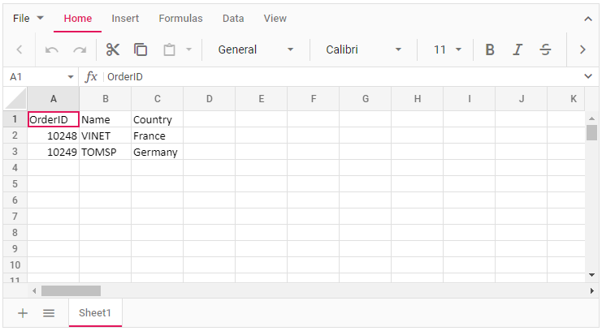

# Overview

This section explains how to use Syncfusion Vue Spreadsheet component in Vue 3 application.

## Prerequisites

[System requirements for Syncfusion Vue UI components](https://ej2.syncfusion.com/vue/documentation/system-requirements/)

## Getting Started with Spreadsheet Components and Vue CLI

You can use [`Vue CLI`](https://github.com/vuejs/vue-cli) to setup your Vue applications.
At first it is mostly recommended to uninstall the old Vue CLI package from your system. Vue CLI versions above `4.5.0` are mandatory for creating applications using Vue 3.

```bash
npm uninstall vue-cli -g
```

Then install Vue CLI 3, using the following commands.

```bash
npm install -g @vue/cli
npm install -g @vue/cli-init
```

Start a new project using the following Vue CLI command.

```bash
vue create quickstart

cd quickstart
npm install

```

Initiating a new project prompts us to choose the type of project to be used for the current application. Select the option `Default (Vue 3)` from the menu.


## Adding Syncfusion Packages

Syncfusion Vue packages are maintained in the [`npmjs.com`](https://www.npmjs.com/~syncfusionorg) registry. The Spreadsheet component will be used in this example. To install it, use the following command.

```bash
npm install @syncfusion/ej2-vue-spreadsheet --save
```

## Adding CSS Reference

Import components CSS as given below in **style** section of the **App.vue** file. Here Material theme is used for this sample.

```
<style>
  @import '../node_modules/@syncfusion/ej2-base/styles/material.css';  
  @import '../node_modules/@syncfusion/ej2-buttons/styles/material.css';  
  @import '../node_modules/@syncfusion/ej2-dropdowns/styles/material.css';  
  @import '../node_modules/@syncfusion/ej2-inputs/styles/material.css';  
  @import '../node_modules/@syncfusion/ej2-navigations/styles/material.css';
  @import '../node_modules/@syncfusion/ej2-popups/styles/material.css';
  @import '../node_modules/@syncfusion/ej2-splitbuttons/styles/material.css';
  @import '../node_modules/@syncfusion/ej2-grids/styles/material.css';
  @import "../node_modules/@syncfusion/ej2-vue-spreadsheet/styles/material.css";
</style>
```

## Adding Spreadsheet Component

You have completed all the necessary configurations needed for rendering the Syncfusion Vue Spreadsheet component. Now, you are going to add the Spreadsheet component using the following steps.

Import the Spreadsheet component in the `<script>` section of the `src/App.vue` file.

```
<script>
  import { SpreadsheetComponent, RangesDirective, RangeDirective, SheetsDirective, SheetDirective } from "@syncfusion/ej2-vue-spreadsheet";
</script>
```

Register the Spreadsheet component along with the required child directives which are used in this example.

```js
import { SpreadsheetComponent, RangesDirective, RangeDirective, SheetsDirective, SheetDirective } from "@syncfusion/ej2-vue-spreadsheet";

export default {
  name: "App",
  // Declaring component and its directives
  components: {
    "ejs-spreadsheet": SpreadsheetComponent,
    "e-sheets": SheetsDirective,
    "e-sheet": SheetDirective,
    "e-ranges": RangesDirective,
    "e-range": RangeDirective,
  }
}
```

In the above code snippet, you have registered the Spreadsheet with sheets directives. Sheet directives are used to define the sheet definition for the Spreadsheet component.

Add the component definition in the template section.

```
<template>
  <ejs-spreadsheet>
    <e-sheets>
      <e-sheet>
        <e-ranges>
          <e-range :dataSource="data"></e-range>
        </e-ranges>
      </e-sheet>
    </e-sheets>
  </ejs-spreadsheet>
</template>
 ```

Define the collection `data` which is bound for the `dataSource` property in the `script` section.

```js
data() {
  return {
    data: [
      {
        OrderID: 10248,
        Name: "VINET",
        Country: "France",
      },
      {
        OrderID: 10249,
        Name: "TOMSP",
        Country: "Germany",
      },
    ]
  };
}
```

## Running the Application

Below is the Summarized view of the Spreadsheet component in the `src/App.vue` file.

```
<template>
  <ejs-spreadsheet>
    <e-sheets>
      <e-sheet>
        <e-ranges>
          <e-range :dataSource="data"></e-range>
        </e-ranges>
      </e-sheet>
    </e-sheets>
  </ejs-spreadsheet>
</template>

<script>
  import { SpreadsheetComponent, RangesDirective, RangeDirective, SheetsDirective, SheetDirective } from "@syncfusion/ej2-vue-spreadsheet";

  export default {
    name: "App",
    // Declaring component and its directives
    components: {
      "ejs-spreadsheet": SpreadsheetComponent,
      "e-sheets": SheetsDirective,
      "e-sheet": SheetDirective,
      "e-ranges": RangesDirective,
      "e-range": RangeDirective,
    },
    // Bound properties declarations
    data() {
      return {
        data: [
          {
            OrderID: 10248,
            Name: "VINET",
            Country: "France",
          },
          {
            OrderID: 10249,
            Name: "TOMSP",
            Country: "Germany",
          },
        ],
      };
    },
  };
</script>

<style>
  @import "../node_modules/@syncfusion/ej2-base/styles/material.css";
  @import "../node_modules/@syncfusion/ej2-buttons/styles/material.css";
  @import "../node_modules/@syncfusion/ej2-dropdowns/styles/material.css";
  @import "../node_modules/@syncfusion/ej2-inputs/styles/material.css";
  @import "../node_modules/@syncfusion/ej2-navigations/styles/material.css";
  @import "../node_modules/@syncfusion/ej2-popups/styles/material.css";
  @import "../node_modules/@syncfusion/ej2-splitbuttons/styles/material.css";
  @import "../node_modules/@syncfusion/ej2-grids/styles/material.css";
  @import "../node_modules/@syncfusion/ej2-vue-spreadsheet/styles/material.css";
</style>
```

Run the application using the following command.

```bash
npm run serve
```

Web server will be initiated. Open the quick start app in the browser at port [`localhost:8080`](http://localhost:8080/).



Refer the following sample, [vue3-spreadsheet-getting-started](https://github.com/SyncfusionExamples/vue3-spreadsheet-getting-started).

For Migrating from Vue 2 to Vue 3 refer the Migration [`documentation`](https://ej2.syncfusion.com/vue/documentation/getting-started/vue3-tutorial/#migration-from-vue-2-to-vue-3)