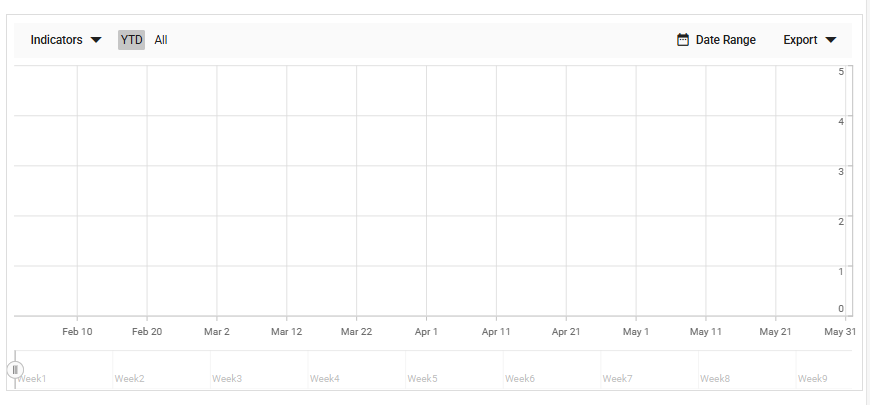

# Getting Started with the Vue Stock Chart Component in Vue 2

This article provides a step-by-step guide for setting up a Vue 2 project using [Vue-CLI](https://cli.vuejs.org) and integrating the Syncfusion<sup style="font-size:70%">&reg;</sup> Vue Stock Chart component.

## Prerequisites

Ensure that the development environment meets the required criteria listed in [System requirements for Syncfusion<sup style="font-size:70%">&reg;</sup> Vue UI components](https://ej2.syncfusion.com/vue/documentation/system-requirements).

## Dependencies

The list of minimum dependencies required to use the Stock Chart is as follows:
```
|-- @syncfusion/ej2-charts
    |-- @syncfusion/ej2-base
    |-- @syncfusion/ej2-data
    |-- @syncfusion/ej2-pdf-export
    |-- @syncfusion/ej2-file-utils
    |-- @syncfusion/ej2-compression
    |-- @syncfusion/ej2-svg-base
```

## Setup the Vue 2 Project

To generate a Vue 2 project using Vue-CLI, use the [vue create](https://cli.vuejs.org#getting-started) command. You can install Vue CLI using either npm or Yarn:

### Using npm

```bash
npm install -g @vue/cli
vue create quickstart
cd quickstart
npm run serve
```

### Using Yarn

```bash
yarn global add @vue/cli
vue create quickstart
cd quickstart
yarn run serve
```

When creating a new project, choose the option `Default ([Vue 2] babel, eslint)` from the menu.


Once the `quickstart` project is set up with default settings, proceed to add Syncfusion<sup style="font-size:70%">&reg;</sup> components to the project.

## Add Syncfusion<sup style="font-size:70%">&reg;</sup> Vue Packages

Syncfusion<sup style="font-size:70%">&reg;</sup> packages are available at [npmjs.com](https://www.npmjs.com/search?q=ej2-vue). To use Vue components, install the required npm package.

This article uses the [Vue Stock Chart component](https://www.syncfusion.com/vue-components/vue-stock-chart) as an example. Install the `@syncfusion/ej2-vue-charts` package by using either npm or Yarn:

### Using npm

```bash
npm install @syncfusion/ej2-vue-charts --save
```

### Using Yarn

```bash
yarn add @syncfusion/ej2-vue-charts
```

> The **--save** will instruct NPM to include the chart package inside of the `dependencies` section of the `package.json`.

## Add Syncfusion<sup style="font-size:70%">&reg;</sup> Vue Stock Chart Component

Follow the steps below to add the Vue Stock Chart component:

**Step 1:** First, import and register the Stock Chart component in the `script` section of the **src/App.vue** file.




<script>
import { StockChartComponent } from '@syncfusion/ej2-vue-charts';
export default {
  components: {
    'ejs-stockchart': StockChartComponent
  }
}
</script>




**Step 2:** In the `template` section, define the Stock Chart component.




<template>
  <div id="app">
      <ejs-stockchart></ejs-stockchart>
  </div>
</template>




## Run the Project

To run the project, use either npm or Yarn:

### Using npm

```bash
npm run serve
```

### Using Yarn

```bash
yarn run serve
```

The output will appear as follows:



## Module Injection

To create a Stock Chart with additional features, inject the required modules. The following modules extend the Stock Chart's basic functionality.

- `CandleSeries` — Inject this module to use candle series.
- `DateTime` — Inject this module to use date time axis.
- `RangeTooltip` — Inject this module to show the tooltip.

Inject these modules in the `provide` section as shown below.
 ```javascript
<script>
import { StockChartComponent, CandleSeries, DateTime, RangeTooltip } from "@syncfusion/ej2-vue-charts";

export default {
  components: {
    'ejs-stockchart': StockChartComponent
  },
  provide: {
    stockChart: [CandleSeries, DateTime, RangeTooltip]
  }
};
</script>
 ```

## Populate Stock Chart with Data

This section demonstrates how to bind JSON data to the Stock Chart. The data includes DateTime values for the x-axis.

```javascript
export default {
  data() {
    return {
      data: [{
        x: new Date('2012-04-02'),
        open: 85.9757,
        high: 90.6657,
        low: 85.7685,
        close: 90.5257,
        volume: 660187068
      },
      {
        x: new Date('2012-04-09'),
        open: 89.4471,
        high: 92,
        low: 86.2157,
        close: 86.4614,
        volume: 912634864
      },
      {
        x: new Date('2012-04-16'),
        open: 87.1514,
        high: 88.6071,
        low: 81.4885,
        close: 81.8543,
        volume: 1221746066
      },
      {
        x: new Date('2012-04-23'),
        open: 81.5157,
        high: 88.2857,
        low: 79.2857,
        close: 86.1428,
        volume: 965935749
      },
      {
        x: new Date('2012-04-30'),
        open: 85.4,
        high: 85.4857,
        low: 80.7385,
        close: 80.75,
        volume: 615249365
      }]
    };
  }
};
```

Add a `series` object to the Stock Chart using the [`series`](https://ej2.syncfusion.com/vue/documentation/api/stock-chart#series) property and set the JSON array to the `dataSource` property.






        


> You can refer to our [Vue Stock Chart](https://www.syncfusion.com/vue-ui-components/vue-stock-chart) feature tour page for its groundbreaking feature representations. You can also explore our [Vue Stock Chart example](https://ej2.syncfusion.com/vue/demos/#material3/stock-chart/default.html) that shows you how to present and manipulate data.

## See Also

* [Getting Started with Vue 3 Stock Chart](./vue-3-getting-started)
* [Getting Started with Vue 3 using Composition API and TypeScript](https://ej2.syncfusion.com/vue/documentation/getting-started/vue-3-ts-composition)
* [Getting Started with Vue 3 using Options API and TypeScript](https://ej2.syncfusion.com/vue/documentation/getting-started/vue-3-ts-options)