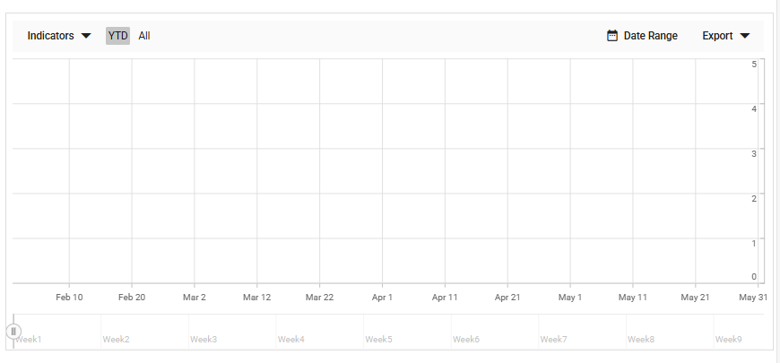

# Getting Started with the Vue Stock Chart Component in Vue 2

This article provides a step-by-step guide for setting up a Vue 2 project using [Vue-CLI](https://cli.vuejs.org) and integrating the Syncfusion<sup style="font-size:70%">&reg;</sup> Vue Stock Chart component.

## Prerequisites

Ensure that the development environment meets the required criteria listed in [System requirements for Syncfusion<sup style="font-size:70%">&reg;</sup> Vue UI components](https://ej2.syncfusion.com/vue/documentation/system-requirements).

## Dependencies

The list of minimum dependencies required to use the Stock Chart is as follows:
```
|-- @syncfusion/ej2-charts
    |-- @syncfusion/ej2-base
    |-- @syncfusion/ej2-data
    |-- @syncfusion/ej2-pdf-export
    |-- @syncfusion/ej2-file-utils
    |-- @syncfusion/ej2-compression
    |-- @syncfusion/ej2-svg-base
    |-- @syncfusion/ej2-navigations
    |-- @syncfusion/ej2-calendars
    |-- @syncfusion/ej2-popups
    |-- @syncfusion/ej2-lists
    |-- @syncfusion/ej2-inputs
    |-- @syncfusion/ej2-buttons
    |-- @syncfusion/ej2-splitbuttons
```

## Set Up the Vue 2 Project

To generate a Vue 2 project using Vue CLI, use the [vue create](https://cli.vuejs.org#getting-started) command. You can install Vue CLI using either npm or Yarn:

**npm**

```bash
npm install -g @vue/cli
vue create quickstart
```

**yarn**

```bash
yarn global add @vue/cli
vue create quickstart
```

Select **Default ([Vue 2] babel, eslint)** when prompted.


Once the `quickstart` project is set up with default settings, navigate to the project directory:

```bash
cd quickstart
```

All subsequent commands should be run from the `quickstart` directory. Now, proceed to add Syncfusion<sup style="font-size:70%">&reg;</sup> packages to the project.

## Add Syncfusion<sup style="font-size:70%">&reg;</sup> Vue Packages

Syncfusion<sup style="font-size:70%">&reg;</sup> packages are available at [npmjs.com](https://www.npmjs.com/search?q=ej2-vue). To use Vue components, install the required npm package.

This article uses the [Vue Stock Chart component](https://www.syncfusion.com/vue-components/vue-stock-chart) as an example. Install the `@syncfusion/ej2-vue-charts` package using either npm or Yarn:

**npm**

```bash
npm install @syncfusion/ej2-vue-charts
```

**yarn**

```bash
yarn add @syncfusion/ej2-vue-charts
```

> **Note:** npm v5+ saves packages to `dependencies` by default; `--save` is not required.

## Import Syncfusion<sup style="font-size:70%">&reg;</sup> CSS styles

Syncfusion<sup style="font-size:70%">&reg;</sup> Vue Stock Chart component themes can be applied using CSS or SASS from [npm theme packages](https://ej2.syncfusion.com/vue/documentation/appearance/theme#theme-packages), CDN, CRG or [Theme Studio](https://ej2.syncfusion.com/vue/documentation/appearance/theme-studio).

This example uses the `Material 3` theme for the Stock Chart component. To install the [Material 3](https://www.npmjs.com/package/@syncfusion/ej2-material3-theme) theme package, use the following command:




npm install @syncfusion/ej2-material3-theme --save




yarn add @syncfusion/@syncfusion/ej2-material3-theme




The necessary CSS styles for the Stock Chart component were imported into the `<style>` section of **src/App.vue** file. Vite app generates a default `styles.css` file which we do not need for this example. Before running the sample, delete the content of `src/style.css` or remove the file if it's unused.




<style>
  @import "../node_modules/@syncfusion/ej2-material3-theme/styles/stock-chart/index.css";
</style>




## Add Syncfusion<sup style="font-size:70%">&reg;</sup> Vue Stock Chart Component

Follow the steps below to add the Vue Stock Chart component:

**Step 1:** First, import and register the Stock Chart component in the `script` section of the **src/App.vue** file.




<script>
import { StockChartComponent } from '@syncfusion/ej2-vue-charts';
export default {
  components: {
    'ejs-stockchart': StockChartComponent
  }
}
</script>




**Step 2:** In the `template` section, define the Stock Chart component.




<template>
  <div id="app">
      <ejs-stockchart></ejs-stockchart>
  </div>
</template>




## Run the Project

To run the project, use either npm or Yarn:

**npm**

```bash
npm run serve
```

**yarn**

```bash
yarn run serve
```

Open your browser and navigate to `http://localhost:8080`.

The output will appear as follows:



## Module Injection

To create a Stock Chart with additional features, inject the required modules. The following modules extend the Stock Chart's basic functionality:

* `CandleSeries` — Inject this module to use candle series.
* `DateTime` — Inject this module to use date time axis.
* `RangeTooltip` — Inject this module to show tooltip.

Register these modules in the `provide` option as shown below:

```vue
<script>
import { StockChartComponent, CandleSeries, DateTime, RangeTooltip } from "@syncfusion/ej2-vue-charts";

export default {
  components: {
    'ejs-stockchart': StockChartComponent
  },
  provide: {
    stockChart: [CandleSeries, DateTime, RangeTooltip]
  }
};
</script>
```

## Populate Stock Chart with Data

This section demonstrates how to bind JSON data to the Stock Chart. The data includes DateTime values for the x-axis and OHLC (Open, High, Low, Close) values.

The stock chart data requires fields for date (`x`), opening price (`open`), high price (`high`), low price (`low`), closing price (`close`), and trading volume (`volume`):

```javascript
export default {
  data() {
    return {
      data: [{
        x: new Date('2012-04-02'),
        open: 85.9757,
        high: 90.6657,
        low: 85.7685,
        close: 90.5257,
        volume: 660187068
      },
      {
        x: new Date('2012-04-09'),
        open: 89.4471,
        high: 92,
        low: 86.2157,
        close: 86.4614,
        volume: 912634864
      },
      {
        x: new Date('2012-04-16'),
        open: 87.1514,
        high: 88.6071,
        low: 81.4885,
        close: 81.8543,
        volume: 1221746066
      },
      {
        x: new Date('2012-04-23'),
        open: 81.5157,
        high: 88.2857,
        low: 79.2857,
        close: 86.1428,
        volume: 965935749
      },
      {
        x: new Date('2012-04-30'),
        open: 85.4,
        high: 85.4857,
        low: 80.7385,
        close: 80.75,
        volume: 615249365
      }]
    };
  }
};
```

Add a `series` object to the Stock Chart using the [`series`](https://ej2.syncfusion.com/vue/documentation/api/stock-chart#series) property and set the JSON array to the `dataSource` property.






        


## Troubleshooting

The following are common issues and solutions when integrating the Stock Chart component:

- **Chart not rendering**: Ensure that all required modules (`CandleSeries`, `DateTime`, `RangeTooltip`) are injected using the `provide` option and that `chartData` is defined as a valid array of data objects with `x`, `open`, `high`, `low`, and `close` properties.

- **Undefined chart data**: Verify that `chartData` is defined in the `data()` function with the correct structure and that the series configuration includes proper field mappings (`xName`, `open`, `high`, `low`, `close`).

- **Module import errors**: Confirm that all required modules are imported from `@syncfusion/ej2-vue-charts` and that component directives are registered correctly.

- **Incorrect date formatting**: Verify that date values in the data are created using `new Date()` constructor to avoid parsing errors.

> You can refer to our [Vue Stock Chart](https://www.syncfusion.com/vue-ui-components/vue-stock-chart) feature tour page for its groundbreaking feature representations. You can also explore our [Vue Stock Chart example](https://ej2.syncfusion.com/vue/demos/#material3/stock-chart/default.html) that shows you how to present and manipulate data.

## See Also

* [Getting Started with Vue 3 Stock Chart](./vue-3-getting-started)
* [Getting Started with Vue 3 using Composition API and TypeScript](https://ej2.syncfusion.com/vue/documentation/getting-started/vue-3-ts-composition)
* [Getting Started with Vue 3 using Options API and TypeScript](https://ej2.syncfusion.com/vue/documentation/getting-started/vue-3-ts-options)