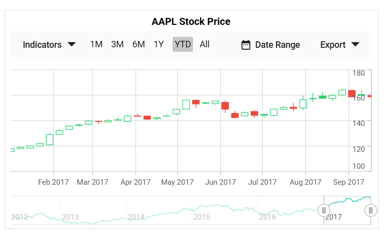

# Getting Started with the Vue Stock Chart Component in Vue 3

This article provides a step-by-step guide for setting up a [Vite](https://vitejs.dev/) project with a JavaScript environment and integrating the Syncfusion<sup style="font-size:70%">&reg;</sup> Vue Stock Chart component using the [Composition API](https://vuejs.org/guide/introduction.html#composition-api) / [Options API](https://vuejs.org/guide/introduction.html#options-api).

The `Composition API` is a new feature introduced in Vue.js 3 that provides an alternative way to organize and reuse component logic. It allows developers to write components as functions that use smaller, reusable functions called composition functions to manage their properties and behavior.

The `Options API` is the traditional way of writing Vue.js components, where the component logic is organized into a series of options that define the component's properties and behavior. These options include data, methods, computed properties, watchers, life cycle hooks, and more.

## Prerequisites

Ensure that the development environment meets the required criteria listed in [System requirements for Syncfusion<sup style="font-size:70%">&reg;</sup> Vue UI components](https://ej2.syncfusion.com/vue/documentation/system-requirements).

## Set Up the Vite Project

The recommended way to start a Vue 3 project is by scaffolding it with [Vite](https://vitejs.dev/). To create a new Vite project, use one of the commands that are specific to either NPM or Yarn.

### Using npm
```bash
npm create vite@latest
```

### Using Yarn

```bash
yarn create vite
```

Using one of the above commands will lead you through a short interactive setup:

**Step 1:** Define the project name: We can specify the name of the project directly. Let's specify the name of the project as `my-project` for this article.
```bash
? Project name: » my-project
```

**Step 2:** Select `Vue` as the framework. It will create a Vue 3 project.

```bash
? Select a framework: » - Use arrow-keys. Return to submit.
Vanilla
> Vue
  React
  Preact
  Lit
  Svelte
  Others
```

**Step 3:** Choose `JavaScript` as the framework variant to build this Vite project using JavaScript and Vue.

```bash
? Select a variant: » - Use arrow-keys. Return to submit.
> JavaScript
  TypeScript
  Customize with create-vue ↗
  Nuxt ↗
```

**Step 4:** Upon completing the aforementioned steps to create the `my-project`, run the following command to install its dependencies:

Once the project is created, navigate to the project directory:

```bash
cd my-project
```

Install the project dependencies using either npm or Yarn:

### Using npm

```bash
npm install
```

### Using Yarn

```bash
yarn install
```

Now that `my-project` is ready to run with default settings, let's add Syncfusion<sup style="font-size:70%">&reg;</sup> components to the project.

## Add Syncfusion<sup style="font-size:70%">&reg;</sup> Vue Stock Chart Packages

Syncfusion<sup style="font-size:70%">&reg;</sup> Vue component packages are available at [npmjs.com](https://www.npmjs.com/search?q=ej2-vue). To use Syncfusion<sup style="font-size:70%">&reg;</sup> Vue components in the project, install the corresponding npm package.

This article uses the [Vue Stock Chart component](https://www.syncfusion.com/vue-components/vue-stock-chart) as an example. To use the Vue Stock Chart component in the project, the `@syncfusion/ej2-vue-charts` package needs to be installed using either npm or Yarn:

### Using npm

```bash
npm install @syncfusion/ej2-vue-charts --save
```

### Using Yarn

```bash
yarn add @syncfusion/ej2-vue-charts
```

> The **--save** will instruct NPM to include the chart package inside of the `dependencies` section of the `package.json`.

## Add Syncfusion<sup style="font-size:70%">&reg;</sup> Vue Stock Chart Component

Follow the below steps to add the Vue Stock Chart component using `Composition API` or `Options API`:

**Step 1:** First, import and register the Stock Chart component and its child directives in the `script` section of the **src/App.vue** file. If you are using the `Composition API`, you should add the `setup` attribute to the `script` tag to indicate that Vue will be using the `Composition API`.




<script setup>
import { StockChartComponent as EjsStockchart, StockChartSeriesCollectionDirective as EStockchartSeriesCollection, StockChartSeriesDirective as EStockchartSeries, DateTime, CandleSeries } from "@syncfusion/ej2-vue-charts";
</script>




<script>
import { StockChartComponent, StockChartSeriesCollectionDirective, StockChartSeriesDirective, DateTime, CandleSeries } from "@syncfusion/ej2-vue-charts";
//Component registration
export default {
  name: "App",
  components: {
    "ejs-stockchart": StockChartComponent,
    "e-stockchart-series-collection": StockChartSeriesCollectionDirective,
    "e-stockchart-series": StockChartSeriesDirective
  }
}
</script>




**Step 2:** Declare the values for the `dataSource` property in the `script` section.




<script setup>
const seriesData = [
        {
            date: new Date('2012-04-02'),
            open: 85.9757,
            high: 90.6657,
            low: 85.7685,
            close: 90.5257,
            volume: 660187068
        },
        {
            date: new Date('2012-04-09'),
            open: 89.4471,
            high: 92,
            low: 86.2157,
            close: 86.4614,
            volume: 912634864
        },
        // Additional data points...
];
</script>




<script>
export default {
  data() {
    return {
        seriesData: [
            {
                date: new Date('2012-04-02'),
                open: 85.9757,
                high: 90.6657,
                low: 85.7685,
                close: 90.5257,
                volume: 660187068
            },
            {
                date: new Date('2012-04-09'),
                open: 89.4471,
                high: 92,
                low: 86.2157,
                close: 86.4614,
                volume: 912634864
            },
            // Additional data points...
        ],
    };
  }
};
</script>




Note: Register feature modules using `provide('stockChart', [...])` (Composition API) or the `provide` option (Options API).

**Step 3:** In the `template` section, define the Stock Chart component with the [dataSource](https://ej2.syncfusion.com/vue/documentation/api/stock-chart#datasource) property.




<template>
    <ejs-stockchart>
        <e-stockchart-series-collection>
            <e-stockchart-series :dataSource="seriesData" type="Candle" volume="volume" xName="date" low="low" high="high" open="open" close="close">
            </e-stockchart-series>
        </e-stockchart-series-collection>
    </ejs-stockchart>
</template>




Here is the summarized code for the above steps in the **src/App.vue** file:




<template>
    <ejs-stockchart>
        <e-stockchart-series-collection>
            <e-stockchart-series :dataSource="seriesData" type="Candle" volume="volume" xName="date" low="low" high="high" open="open" close="close">
            </e-stockchart-series>
        </e-stockchart-series-collection>
    </ejs-stockchart>
</template>

<script setup>
import { provide } from 'vue';
import { StockChartComponent as EjsStockchart, StockChartSeriesCollectionDirective as EStockchartSeriesCollection, StockChartSeriesDirective as EStockchartSeries, DateTime, CandleSeries } from "@syncfusion/ej2-vue-charts";

const seriesData = [
        {
            date: new Date('2012-04-02'),
            open: 85.9757,
            high: 90.6657,
            low: 85.7685,
            close: 90.5257,
            volume: 660187068
        },
        {
            date: new Date('2012-04-09'),
            open: 89.4471,
            high: 92,
            low: 86.2157,
            close: 86.4614,
            volume: 912634864
        },
        // Additional data points...
];
const stockChart = [ DateTime, CandleSeries ];
provide('stockChart', stockChart);
</script>




<template>
    <ejs-stockchart>
        <e-stockchart-series-collection>
            <e-stockchart-series :dataSource="seriesData" type="Candle" volume="volume" xName="date" low="low" high="high" open="open" close="close">
            </e-stockchart-series>
        </e-stockchart-series-collection>
    </ejs-stockchart>
</template>

<script>
import { StockChartComponent, StockChartSeriesCollectionDirective, StockChartSeriesDirective, DateTime, CandleSeries } from "@syncfusion/ej2-vue-charts";
//Component registration
export default {
  name: "App",
  components: {
    "ejs-stockchart": StockChartComponent,
    "e-stockchart-series-collection": StockChartSeriesCollectionDirective,
    "e-stockchart-series": StockChartSeriesDirective
  },
  data() {
    return {
        seriesData: [
            {
                date: new Date('2012-04-02'),
                open: 85.9757,
                high: 90.6657,
                low: 85.7685,
                close: 90.5257,
                volume: 660187068
            },
            {
                date: new Date('2012-04-09'),
                open: 89.4471,
                high: 92,
                low: 86.2157,
                close: 86.4614,
                volume: 912634864
            },
            // Additional data points...
        ],
    };
  },
  provide: {
    stockChart: [ DateTime, CandleSeries ]
  }
};
</script>




## Run the Project

To run the project, use either npm or Yarn:

### Using npm

```bash
npm run dev
```

### Using Yarn

```bash
yarn run dev
```

The output will appear as follows:



> **Sample**: You can explore the complete sample project in the [vue-3-stock-chart-getting-started](https://github.com/SyncfusionExamples/vue3-stock-chart-getting-started) repository.

## See Also

* [Getting Started with Vue UI Components using Composition API and TypeScript](https://ej2.syncfusion.com/vue/documentation/getting-started/vue-3-ts-composition)
* [Getting Started with Vue UI Components using Options API and TypeScript](https://ej2.syncfusion.com/vue/documentation/getting-started/vue-3-ts-options)