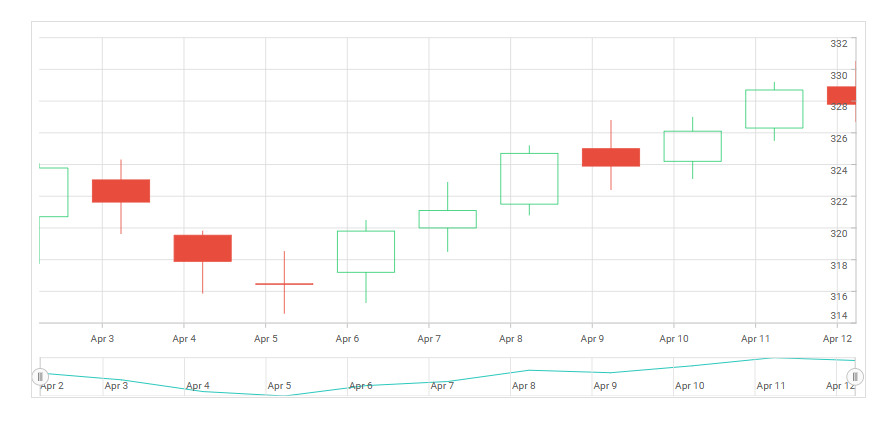

# Getting Started with the Vue Stock Chart Component in Vue 3

This article provides a step-by-step guide for setting up a [Vite](https://vitejs.dev/) project with a JavaScript environment and integrating the Syncfusion<sup style="font-size:70%">&reg;</sup> Vue Stock Chart component using the [Composition API](https://vuejs.org/guide/introduction.html#composition-api) / [Options API](https://vuejs.org/guide/introduction.html#options-api).

The `Composition API` is a new feature introduced in Vue.js 3 that provides an alternative way to organize and reuse component logic. It allows developers to write components as functions that use smaller, reusable functions called composition functions to manage their properties and behavior.

The `Options API` is the traditional way of writing Vue.js components, where the component logic is organized into a series of options that define the component's properties and behavior. These options include data, methods, computed properties, watchers, life cycle hooks, and more.

## Prerequisites

Ensure that the development environment meets the required criteria listed in [System requirements for Syncfusion<sup style="font-size:70%">&reg;</sup> Vue UI components](https://ej2.syncfusion.com/vue/documentation/system-requirements).

## Set Up the Vite Project

Create a Vite project using either npm or Yarn.

**npm**

```bash
npm create vite@latest my-app -- --template vue
```

**yarn**

```bash
yarn create vite my-app --template vue
```

If Vite prompts you to install dependencies and start the project immediately, select **No**. The Syncfusion package is installed in a later step.

Navigate to the project directory:

```bash
cd my-app
```

Install the project dependencies using either npm or Yarn.

**npm**

```bash
npm install
```

**yarn**

```bash
yarn install
```

Now that `my-app` is set up, let's add Syncfusion<sup style="font-size:70%">&reg;</sup> components to the project.

> **Note:** To create a TypeScript project, use `npm create vite@latest my-app -- --template vue-ts` or `yarn create vite my-app --template vue-ts`.

## Add Syncfusion<sup style="font-size:70%">&reg;</sup> Vue Stock Chart Packages

Syncfusion<sup style="font-size:70%">&reg;</sup> Vue component packages are available at [npmjs.com](https://www.npmjs.com/search?q=ej2-vue). To use Syncfusion<sup style="font-size:70%">&reg;</sup> Vue components in the project, install the corresponding npm package.

This article uses the [Vue Stock Chart component](https://www.syncfusion.com/vue-components/vue-stock-chart) as an example. To use the Vue Stock Chart component in the project, the `@syncfusion/ej2-vue-charts` package needs to be installed using either npm or Yarn:

**npm**

```bash
npm install @syncfusion/ej2-vue-charts
```

**yarn**

```bash
yarn add @syncfusion/ej2-vue-charts
```

> **Note:** npm v5+ saves packages to `dependencies` by default; `--save` is not required.

## Import Syncfusion<sup style="font-size:70%">&reg;</sup> CSS styles

Syncfusion<sup style="font-size:70%">&reg;</sup> Vue Stock Chart component themes can be applied using CSS or SASS from [npm theme packages](https://ej2.syncfusion.com/vue/documentation/appearance/theme#theme-packages), CDN, CRG or [Theme Studio](https://ej2.syncfusion.com/vue/documentation/appearance/theme-studio).

This example uses the `Material 3` theme for the Stock Chart component. To install the [Material 3](https://www.npmjs.com/package/@syncfusion/ej2-material3-theme) theme package, use the following command:




npm install @syncfusion/ej2-material3-theme




yarn add @syncfusion/ej2-material3-theme




The necessary CSS styles for the Stock Chart component were imported into the `<style>` section of **src/App.vue** file. Vite app generates a default `styles.css` file which we do not need for this example. Before running the sample, delete the content of `src/style.css` or remove the file if it's unused.




<style>
  @import "../node_modules/@syncfusion/ej2-material3-theme/styles/stock-chart/index.css";
</style>




## Add Syncfusion<sup style="font-size:70%">&reg;</sup> Vue Stock Chart Component

Follow the below steps to add the Vue Stock Chart component using `Composition API` or `Options API`:

**Step 1:** First, import and register the Stock Chart component and its child directives in the `script` section of the **src/App.vue** file. If you are using the `Composition API`, you should add the `setup` attribute to the `script` tag to indicate that Vue will be using the `Composition API`.




<script setup>
import { StockChartComponent as EjsStockchart, StockChartSeriesCollectionDirective as EStockchartSeriesCollection, StockChartSeriesDirective as EStockchartSeries, DateTime, CandleSeries } from "@syncfusion/ej2-vue-charts";
</script>




<script>
import { StockChartComponent, StockChartSeriesCollectionDirective, StockChartSeriesDirective, DateTime, CandleSeries } from "@syncfusion/ej2-vue-charts";
//Component registration
export default {
  name: "App",
  components: {
    "ejs-stockchart": StockChartComponent,
    "e-stockchart-series-collection": StockChartSeriesCollectionDirective,
    "e-stockchart-series": StockChartSeriesDirective
  }
}
</script>




**Step 2:** Declare the values for the `dataSource` property in the `script` section.

To hide the period selector and display only the Stock Chart, set [`enablePeriodSelector`](https://ej2.syncfusion.com/vue/documentation/api/stock-chart/index-default#enableperiodselector) to `false`.




<script setup>
const seriesData = [
        { date: new Date('2012-04-02'), open: 320.71, high: 324.07, low: 317.74, close: 323.78, volume: 45638000 },
        { date: new Date('2012-04-03'), open: 323.03, high: 324.30, low: 319.64, close: 321.63, volume: 40857000 },
        { date: new Date('2012-04-04'), open: 319.54, high: 319.82, low: 315.87, close: 317.89, volume: 32519000 },
        { date: new Date('2012-04-05'), open: 316.44, high: 318.53, low: 314.60, close: 316.48, volume: 46327000 },
        { date: new Date('2012-04-06'), open: 317.20, high: 320.50, low: 315.30, close: 319.80, volume: 38200000 },
        { date: new Date('2012-04-07'), open: 320.00, high: 322.90, low: 318.50, close: 321.10, volume: 35500000 },
        { date: new Date('2012-04-08'), open: 321.50, high: 325.20, low: 320.80, close: 324.70, volume: 41200000 },
        { date: new Date('2012-04-09'), open: 325.00, high: 326.80, low: 322.40, close: 323.90, volume: 39800000 },
        { date: new Date('2012-04-10'), open: 324.20, high: 327.00, low: 323.10, close: 326.10, volume: 42100000 },
        { date: new Date('2012-04-11'), open: 326.30, high: 329.20, low: 325.50, close: 328.70, volume: 44500000 },
        { date: new Date('2012-04-12'), open: 328.90, high: 330.50, low: 326.70, close: 327.80, volume: 36700000 }
];

const enablePeriodSelector = false;
</script>




<script>
export default {
  data() {
    return {
        seriesData: [
            { date: new Date('2012-04-02'), open: 320.71, high: 324.07, low: 317.74, close: 323.78, volume: 45638000 },
            { date: new Date('2012-04-03'), open: 323.03, high: 324.30, low: 319.64, close: 321.63, volume: 40857000 },
            { date: new Date('2012-04-04'), open: 319.54, high: 319.82, low: 315.87, close: 317.89, volume: 32519000 },
            { date: new Date('2012-04-05'), open: 316.44, high: 318.53, low: 314.60, close: 316.48, volume: 46327000 },
            { date: new Date('2012-04-06'), open: 317.20, high: 320.50, low: 315.30, close: 319.80, volume: 38200000 },
            { date: new Date('2012-04-07'), open: 320.00, high: 322.90, low: 318.50, close: 321.10, volume: 35500000 },
            { date: new Date('2012-04-08'), open: 321.50, high: 325.20, low: 320.80, close: 324.70, volume: 41200000 },
            { date: new Date('2012-04-09'), open: 325.00, high: 326.80, low: 322.40, close: 323.90, volume: 39800000 },
            { date: new Date('2012-04-10'), open: 324.20, high: 327.00, low: 323.10, close: 326.10, volume: 42100000 },
            { date: new Date('2012-04-11'), open: 326.30, high: 329.20, low: 325.50, close: 328.70, volume: 44500000 },
            { date: new Date('2012-04-12'), open: 328.90, high: 330.50, low: 326.70, close: 327.80, volume: 36700000 }
        ],
        enablePeriodSelector: false
    };
  }
};
</script>




**Note:** Register the feature modules using `provide('stockChart', [...])` (Composition API) or the `provide` option (Options API). This step is essential for the Stock Chart to function properly with the required series types and axes.

> **Note:** If you skip module registration, the chart will not render correctly and you may encounter errors like "Module is not injected" in the browser console.

**Step 3:** In the `template` section, define the Stock Chart component with the [dataSource](https://ej2.syncfusion.com/vue/documentation/api/stock-chart/stockseriesmodel#datasource) property.




<template>
        <ejs-stockchart :enablePeriodSelector="enablePeriodSelector">
            <e-stockchart-series-collection>
                <e-stockchart-series :dataSource="seriesData" type="Candle" volume="volume" xName="date" low="low" high="high" open="open" close="close">
                </e-stockchart-series>
            </e-stockchart-series-collection>
        </ejs-stockchart>
</template>




Here is the complete summarized code for the **src/App.vue** file:




<template>
        <ejs-stockchart :enablePeriodSelector="enablePeriodSelector">
            <e-stockchart-series-collection>
                <e-stockchart-series :dataSource="seriesData" type="Candle" volume="volume" xName="date" low="low" high="high" open="open" close="close">
                </e-stockchart-series>
            </e-stockchart-series-collection>
        </ejs-stockchart>
</template>

<script setup>
import { provide } from 'vue';
import { StockChartComponent as EjsStockchart, StockChartSeriesCollectionDirective as EStockchartSeriesCollection, StockChartSeriesDirective as EStockchartSeries, DateTime, CandleSeries } from "@syncfusion/ej2-vue-charts";

const seriesData = [
        { date: new Date('2012-04-02'), open: 320.71, high: 324.07, low: 317.74, close: 323.78, volume: 45638000 },
        { date: new Date('2012-04-03'), open: 323.03, high: 324.30, low: 319.64, close: 321.63, volume: 40857000 },
        { date: new Date('2012-04-04'), open: 319.54, high: 319.82, low: 315.87, close: 317.89, volume: 32519000 },
        { date: new Date('2012-04-05'), open: 316.44, high: 318.53, low: 314.60, close: 316.48, volume: 46327000 },
        { date: new Date('2012-04-06'), open: 317.20, high: 320.50, low: 315.30, close: 319.80, volume: 38200000 },
        { date: new Date('2012-04-07'), open: 320.00, high: 322.90, low: 318.50, close: 321.10, volume: 35500000 },
        { date: new Date('2012-04-08'), open: 321.50, high: 325.20, low: 320.80, close: 324.70, volume: 41200000 },
        { date: new Date('2012-04-09'), open: 325.00, high: 326.80, low: 322.40, close: 323.90, volume: 39800000 },
        { date: new Date('2012-04-10'), open: 324.20, high: 327.00, low: 323.10, close: 326.10, volume: 42100000 },
        { date: new Date('2012-04-11'), open: 326.30, high: 329.20, low: 325.50, close: 328.70, volume: 44500000 },
        { date: new Date('2012-04-12'), open: 328.90, high: 330.50, low: 326.70, close: 327.80, volume: 36700000 }
];
const stockChart = [ DateTime, CandleSeries ];
const enablePeriodSelector = false;
provide('stockChart', stockChart);
</script>

<style>
  @import "../node_modules/@syncfusion/ej2-material3-theme/styles/stock-chart/index.css";
</style>




<template>
        <ejs-stockchart :enablePeriodSelector="enablePeriodSelector">
            <e-stockchart-series-collection>
                <e-stockchart-series :dataSource="seriesData" type="Candle" volume="volume" xName="date" low="low" high="high" open="open" close="close">
                </e-stockchart-series>
            </e-stockchart-series-collection>
        </ejs-stockchart>
</template>

<script>
import { StockChartComponent, StockChartSeriesCollectionDirective, StockChartSeriesDirective, DateTime, CandleSeries } from "@syncfusion/ej2-vue-charts";
//Component registration
export default {
  name: "App",
  components: {
    "ejs-stockchart": StockChartComponent,
    "e-stockchart-series-collection": StockChartSeriesCollectionDirective,
    "e-stockchart-series": StockChartSeriesDirective
  },
  data() {
    return {
        seriesData: [
            { date: new Date('2012-04-02'), open: 320.71, high: 324.07, low: 317.74, close: 323.78, volume: 45638000 },
            { date: new Date('2012-04-03'), open: 323.03, high: 324.30, low: 319.64, close: 321.63, volume: 40857000 },
            { date: new Date('2012-04-04'), open: 319.54, high: 319.82, low: 315.87, close: 317.89, volume: 32519000 },
            { date: new Date('2012-04-05'), open: 316.44, high: 318.53, low: 314.60, close: 316.48, volume: 46327000 },
            { date: new Date('2012-04-06'), open: 317.20, high: 320.50, low: 315.30, close: 319.80, volume: 38200000 },
            { date: new Date('2012-04-07'), open: 320.00, high: 322.90, low: 318.50, close: 321.10, volume: 35500000 },
            { date: new Date('2012-04-08'), open: 321.50, high: 325.20, low: 320.80, close: 324.70, volume: 41200000 },
            { date: new Date('2012-04-09'), open: 325.00, high: 326.80, low: 322.40, close: 323.90, volume: 39800000 },
            { date: new Date('2012-04-10'), open: 324.20, high: 327.00, low: 323.10, close: 326.10, volume: 42100000 },
            { date: new Date('2012-04-11'), open: 326.30, high: 329.20, low: 325.50, close: 328.70, volume: 44500000 },
            { date: new Date('2012-04-12'), open: 328.90, high: 330.50, low: 326.70, close: 327.80, volume: 36700000 }
        ],
        enablePeriodSelector: false
    };
  },
  provide: {
    stockChart: [ DateTime, CandleSeries ]
  }
};
</script>

<style>
  @import "../node_modules/@syncfusion/ej2-material3-theme/styles/stock-chart/index.css";
</style>




## Run the Project

To run the project, use either npm or Yarn:

**npm**

```bash
npm run dev
```

**yarn**

```bash
yarn run dev
```

The development server will start and display a message indicating the port number (typically http://localhost:5173). Open your browser and navigate to `http://localhost:5173` to view the Stock Chart.

The output will appear as follows:



> **Sample**: You can explore the complete sample project in the [vue-3-stock-chart-getting-started](https://github.com/SyncfusionExamples/vue3-stock-chart-getting-started) repository.

## Troubleshooting

The following are common issues and solutions when integrating the Stock Chart component:

- **Chart not rendering**: Ensure that all required modules (`DateTime`, `CandleSeries`) are provided using `provide('stockChart', [...])` (Composition API) or the `provide` option (Options API). Verify that the template includes the chart component with proper directives.

- **Module not injected error**: This error occurs when feature modules are not registered. Confirm that the `provide` function or option includes all necessary modules: `DateTime` for date-time axis and `CandleSeries` for candle series type.

- **Incorrect data display**: Verify that the data object properties match the series configuration attributes (`xName="date"`, `open="open"`, `high="high"`, `low="low"`, `close="close"`). Ensure date values are created using `new Date()`.

- **OHLC data format issues**: Stock Chart expects data with `open`, `high`, `low`, and `close` properties for candle series. Verify your data structure matches this format and that all required fields are present.

## See Also

* [Getting Started with Vue UI Components using Composition API and TypeScript](https://ej2.syncfusion.com/vue/documentation/getting-started/vue-3-ts-composition)
* [Getting Started with Vue UI Components using Options API and TypeScript](https://ej2.syncfusion.com/vue/documentation/getting-started/vue-3-ts-options)