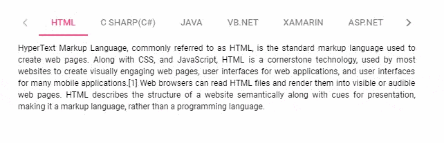

# Adaptive in Vue Tabs

The following section explains how to render the Tab when its width exceeds the viewable area or a specified width. The available
modes are as follows:

* Scrollable
* Popup

## Scrollable

The default overflow mode is Scrollable. In this mode, the Tab header items are displayed in a single line with horizontal
scrolling enabled when the items overflow the available space.

* The right and left navigation arrows are added at the start and end of the Tab header through which the user can navigate towards overflowed
items of the Tab header.
* You can also view the overflowed items using touch and swipe actions on the header and content section.
* By default, the navigation icon in the left direction is disabled; you can see the overflowed items by moving in the right direction.
* By clicking the arrow or by holding the arrow continuously, you can view the overflowed items.

* On devices, the navigation icons are not available. You can touch and swipe to see the overflowed items of the Tab header.









        


## Popup

Popup is another type of `overflowMode` in which the Tab container holds the items that can be placed within the available space.
The rest of the overflowing items, for which there is no space to fit within the viewing area, are moved to the overflow popup container.

* The items placed in the popup can be viewed by opening the popup with the help of a drop-down icon at the end of the Tab header.

* If the popup height exceeds the height of the visible area, you can scroll through the popup items and select one.









        


## See also

* [How to prevent content swipe selection](./how-to/prevent-content-swipe-selection)
* [Collapsible Tab](./how-to/create-collapsible-tabs)