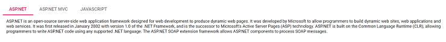

# Getting Started with Syncfusion Tab Component in Vue 3

This section explains how to use Tab component in Vue 3 application.

## Prerequisites

[System requirements for Syncfusion Vue UI components](https://ej2.syncfusion.com/vue/documentation/system-requirements/)

## Creating Vue application using Vue CLI

The easiest way to create a Vue application is to use the [`Vue CLI`](https://github.com/vuejs/vue-cli). Vue CLI versions above [`4.5.0`](https://v3.vuejs.org/guide/migration/introduction.html#vue-cli) are mandatory for creating applications using Vue 3. Use the following command to uninstall older versions of the Vue CLI.

```bash
npm uninstall vue-cli -g
```

Use the following commands to install the latest version of Vue CLI.

```bash
npm install -g @vue/cli
npm install -g @vue/cli-init
```

Create a new project using the command below.

```bash
vue create quickstart
cd quickstart

```

Initiating a new project prompts us to choose the type of project to be used for the current application. Select the option `Default (Vue 3)` from the menu.


## Adding Syncfusion Tab package in the application

All the available Essential JS 2 packages are published in [`npmjs.com`](https://www.npmjs.com/~syncfusionorg) registry.

Install the `Tab` component by using the below npm command.

```bash
npm install @syncfusion/ej2-vue-navigations --save
```

## Adding CSS reference for Syncfusion Vue Tab component

Import the needed CSS styles for the Tab component along with dependency styles in the `<style>` section of the `src/App.vue` file as follows.

```
<style>
  @import "../node_modules/@syncfusion/ej2-base/styles/material.css";
  @import "../node_modules/@syncfusion/ej2-buttons/styles/material.css";
  @import "../node_modules/@syncfusion/ej2-popups/styles/material.css";
  @import "../node_modules/@syncfusion/ej2-vue-navigations/styles/material.css";
</style>
```

## Adding Syncfusion Vue Tab in the application

You have completed all the necessary configurations needed for rendering the Syncfusion Vue component. Now, you are going to add the Tab component using following steps.

1. Import the Tab component in the `<script>` section of the `src/App.vue` file.

     ```
     <script>
       import { TabComponent, TabItemsDirective, TabItemDirective } from "@syncfusion/ej2-vue-navigations";
      </script>
     ```

2. Register the Tab component along with the required child directives which are used in this example. Find the list of child directives and the tag names that can be used in the Tab component in the following table.
  
   | Directive Name   | Tag Name    |
   |------------------|-------------|
   | `TabComponent` | `ejs-tab` |
   | `TabItemsDirective`  | `e-tabitems`  |
   | `TabItemDirective`  | `e-tabitem`  |

   ```js
     import { TabComponent, TabItemsDirective, TabItemDirective } from "@syncfusion/ej2-vue-navigations";
     //Component registeration
     export default {
         name: "App",
         components: {
           "ejs-tab": TabComponent,
           "e-tabitems": TabItemsDirective,
           "e-tabitem": TabItemDirective
        }
     }
   ```

   In the above code snippet, you have registered Tab and its child directives. TabItem Directive is  used for defining the Tab item.

3. Add the component definition in template section.

    ```
    <template>
      <ejs-tab id="tab">
      <e-tabitems>
          <e-tabitem :header="headerText0" :content="content0"></e-tabitem>
          <e-tabitem :header="headerText1" :content="content1"></e-tabitem>
          <e-tabitem :header="headerText2" :content="content2"></e-tabitem>
      </e-tabitems>
      </ejs-tab>
    </template>
    ```

4. Declare the properties for Tab component

      ```js
        data() {
        return {

          headerText0: { text: "ASP.NET" },
          headerText1: { text: "ASP.NET MVC" },
          headerText2: { text: "JavaScript" },
          content0:
            "ASP.NET is an open-source server-side web application framework designed for web development to produce " +
            "dynamic web pages. It was developed by Microsoft to allow programmers to build dynamic web sites, web applications " +
            "and web services. It was first released in January 2002 with version 1.0 of the .NET Framework, and is the successor " +
            "to Microsoft's Active Server Pages (ASP) technology. ASP.NET is built on the Common Language Runtime (CLR), allowing " +
            "programmers to write ASP.NET code using any supported .NET language. The ASP.NET SOAP extension framework allows " +
            "ASP.NET components to process SOAP messages.",

          content1:
            "The ASP.NET MVC is a web application framework developed by Microsoft, which implements the " +
            "model–view–controller (MVC) pattern. It is open-source software, apart from the ASP.NET Web Forms component which is " +
            "proprietary. In the later versions of ASP.NET, ASP.NET MVC, ASP.NET Web API, and ASP.NET Web Pages (a platform using " +
            "only Razor pages) will merge into a unified MVC 6.The project is called ASP.NET vNext.",

          content2:
            "JavaScript (JS) is an interpreted computer programming language. It was originally implemented as " +
            "part of web browsers so that client-side scripts could interact with the user, control the browser, communicate " +
            "asynchronously, and alter the document content that was displayed.[5] More recently, however, it has become common in " +
            "both game development and the creation of desktop applications."
        }
      }
    ```

5. Summarizing the above steps, update the `src/App.vue` file with following code.

    ```
    <template>
      <ejs-tab id="tab">
      <e-tabitems>
          <e-tabitem :header="headerText0" :content="content0"></e-tabitem>
          <e-tabitem :header="headerText1" :content="content1"></e-tabitem>
          <e-tabitem :header="headerText2" :content="content2"></e-tabitem>
      </e-tabitems>
      </ejs-tab>
    </template>

    <script>
    import { TabComponent, TabItemsDirective, TabItemDirective } from "@syncfusion/ej2-vue-navigations";
    //Component registeration
    export default {
      name: "App",
      components: {
        "ejs-tab": TabComponent,
        "e-tabitems": TabItemsDirective,
        "e-tabitem": TabItemDirective
      },
      data() {
        return {

          headerText0: { text: "ASP.NET" },
          headerText1: { text: "ASP.NET MVC" },
          headerText2: { text: "JavaScript" },
          content0:
            "ASP.NET is an open-source server-side web application framework designed for web development to produce " +
            "dynamic web pages. It was developed by Microsoft to allow programmers to build dynamic web sites, web applications " +
            "and web services. It was first released in January 2002 with version 1.0 of the .NET Framework, and is the successor " +
            "to Microsoft's Active Server Pages (ASP) technology. ASP.NET is built on the Common Language Runtime (CLR), allowing " +
            "programmers to write ASP.NET code using any supported .NET language. The ASP.NET SOAP extension framework allows " +
            "ASP.NET components to process SOAP messages.",

          content1:
            "The ASP.NET MVC is a web application framework developed by Microsoft, which implements the " +
            "model–view–controller (MVC) pattern. It is open-source software, apart from the ASP.NET Web Forms component which is " +
            "proprietary. In the later versions of ASP.NET, ASP.NET MVC, ASP.NET Web API, and ASP.NET Web Pages (a platform using " +
            "only Razor pages) will merge into a unified MVC 6.The project is called ASP.NET vNext.",

          content2:
            "JavaScript (JS) is an interpreted computer programming language. It was originally implemented as " +
            "part of web browsers so that client-side scripts could interact with the user, control the browser, communicate " +
            "asynchronously, and alter the document content that was displayed.[5] More recently, however, it has become common in " +
            "both game development and the creation of desktop applications."
        }
      }
    }
    </script>
    <style>
      @import "../node_modules/@syncfusion/ej2-base/styles/material.css";
      @import "../node_modules/@syncfusion/ej2-buttons/styles/material.css";
      @import "../node_modules/@syncfusion/ej2-popups/styles/material.css";
      @import "../node_modules/@syncfusion/ej2-vue-navigations/styles/material.css";
      .e-tab .e-content .e-item {
        padding: 10px;
        text-align: justify;
        font-size: 12px;
      }
    </style>
    ```

## Running the application

Run the application using the following command.

```bash

npm run serve

```

Web server will be initiated, Open the quick start app in the browser at port [`localhost:8080`](http://localhost:8080/).



Refer the sample [Vue 3 tab getting started](https://github.com/SyncfusionExamples/vue3-tab-getting-started)
