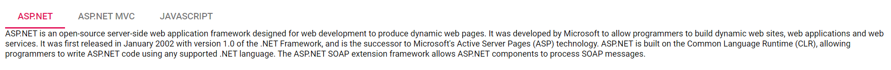

# Getting Started with Syncfusion Tab Component in Vue 3 using Composition API

This article provides a step-by-step guide for setting up a [Vite](https://vitejs.dev/) project with a JavaScript environment and integrating the Syncfusion Vue Tab component using the [Composition API](https://vuejs.org/guide/introduction.html#composition-api).

The `Composition API` is a new feature introduced in Vue.js 3 that provides an alternative way to organize and reuse component logic. It allows developers to write components as functions that use smaller, reusable functions called composition functions to manage their properties and behavior.

## Prerequisites

[System requirements for Syncfusion Vue UI components](https://ej2.syncfusion.com/vue/documentation/system-requirements/)

## Set up the Vite project

A recommended approach for beginning with Vue is to scaffold a project using [Vite](https://vitejs.dev/). To create a new Vite project, use the below command.

```bash
npm create vite@latest
```

Using the above command will lead you to set up additional configurations for the project as below:

1.Define the project name: We can specify the name of the project directly. Let's specify the name of the project as `my-project` for this article.

```bash
? Project name: » my-project
```

2.Select `Vue` as the framework. It will creates a Vue 3 project.

```bash
? Select a framework: » - Use arrow-keys. Return to submit.
Vanilla
> Vue
  React
  Preact
  Lit
  Svelte
  Others
```

3.Choose `JavaScript` as framework variant to build this Vite project using JavaScript and Vue.

```bash
? Select a variant: » - Use arrow-keys. Return to submit.
> JavaScript
  TypeScript
  Customize with create-vue ↗
  Nuxt ↗
```

4.Upon completing the aforementioned steps to create the `my-project`, run the following command to install its dependencies:

```bash
cd my-project
npm install
```
Now that `my-project` is ready to run with default settings, let's add Syncfusion Tab component to the project.

## Adding Syncfusion Vue Tab package in the application

All the available Essential JS 2 packages are published in [`npmjs.com`](https://www.npmjs.com/~syncfusionorg) registry.

Install the `Tab` component by using the below npm command.

```bash
npm install @syncfusion/ej2-vue-navigations --save
```

## Adding CSS reference for Syncfusion Vue Tab component

Import the needed css styles for the Tab component along with dependency styles in the `<style>` section of the `src/App.vue` file as follows.

```html
<style>
@import "../node_modules/@syncfusion/ej2-base/styles/material.css";
@import "../node_modules/@syncfusion/ej2-buttons/styles/material.css";
@import "../node_modules/@syncfusion/ej2-popups/styles/material.css";
@import "../node_modules/@syncfusion/ej2-vue-navigations/styles/material.css";
</style>
```

## Adding Syncfusion Vue Tab component in the application

Follow the below steps to add the Vue Tab component using `Composition API`:

1.First, add the `setup` attribute to the `script` tag to indicate that Vue will be using the `Composition API`. And import the Tab component in the `script` section of the **src/App.vue** file.

```html
<script setup>
import {
  TabComponent as EjsTab, TabItemsDirective as ETabitems, TabItemDirective as ETabitem
} from "@syncfusion/ej2-vue-navigations";
</script>
```
   
2.Add the component definition in template section.

```html
<template>
  <ejs-tab id="tab">
    <e-tabitems>
      <e-tabitem :header="headerText0" :content="content0"></e-tabitem>
      <e-tabitem :header="headerText1" :content="content1"></e-tabitem>
      <e-tabitem :header="headerText2" :content="content2"></e-tabitem>
    </e-tabitems>
  </ejs-tab>
</template>
```

3.Declare the properties for Tab component.

```js
<script setup>
const headerText0 = { text: "ASP.NET" };
const headerText1 = { text: "ASP.NET MVC" };
const headerText2 = { text: "JavaScript" };
const content0 =
  "ASP.NET is an open-source server-side web application framework designed for web development to produce " +
  "dynamic web pages. It was developed by Microsoft to allow programmers to build dynamic web sites, web applications " +
  "and web services. It was first released in January 2002 with version 1.0 of the .NET Framework, and is the successor " +
  "to Microsoft's Active Server Pages (ASP) technology. ASP.NET is built on the Common Language Runtime (CLR), allowing " +
  "programmers to write ASP.NET code using any supported .NET language. The ASP.NET SOAP extension framework allows " +
  "ASP.NET components to process SOAP messages.";

const content1 =
  "The ASP.NET MVC is a web application framework developed by Microsoft, which implements the " +
  "model–view–controller (MVC) pattern. It is open-source software, apart from the ASP.NET Web Forms component which is " +
  "proprietary. In the later versions of ASP.NET, ASP.NET MVC, ASP.NET Web API, and ASP.NET Web Pages (a platform using " +
  "only Razor pages) will merge into a unified MVC 6.The project is called ASP.NET vNext.";

const content2 =
  "JavaScript (JS) is an interpreted computer programming language. It was originally implemented as " +
  "part of web browsers so that client-side scripts could interact with the user, control the browser, communicate " +
  "asynchronously, and alter the document content that was displayed.[5] More recently, however, it has become common in " +
  "both game development and the creation of desktop applications.";
</script>
```

Here is the summarized code for the above steps in the **src/App.vue** file:

```html
<template>
  <ejs-tab id="tab">
    <e-tabitems>
      <e-tabitem :header="headerText0" :content="content0"></e-tabitem>
      <e-tabitem :header="headerText1" :content="content1"></e-tabitem>
      <e-tabitem :header="headerText2" :content="content2"></e-tabitem>
    </e-tabitems>
  </ejs-tab>
</template>

<script setup>
import {
  TabComponent as EjsTab, TabItemsDirective as ETabitems, TabItemDirective as ETabitem
} from "@syncfusion/ej2-vue-navigations";

const headerText0 = { text: "ASP.NET" };
const headerText1 = { text: "ASP.NET MVC" };
const headerText2 = { text: "JavaScript" };
const content0 =
  "ASP.NET is an open-source server-side web application framework designed for web development to produce " +
  "dynamic web pages. It was developed by Microsoft to allow programmers to build dynamic web sites, web applications " +
  "and web services. It was first released in January 2002 with version 1.0 of the .NET Framework, and is the successor " +
  "to Microsoft's Active Server Pages (ASP) technology. ASP.NET is built on the Common Language Runtime (CLR), allowing " +
  "programmers to write ASP.NET code using any supported .NET language. The ASP.NET SOAP extension framework allows " +
  "ASP.NET components to process SOAP messages.";

const content1 =
  "The ASP.NET MVC is a web application framework developed by Microsoft, which implements the " +
  "model–view–controller (MVC) pattern. It is open-source software, apart from the ASP.NET Web Forms component which is " +
  "proprietary. In the later versions of ASP.NET, ASP.NET MVC, ASP.NET Web API, and ASP.NET Web Pages (a platform using " +
  "only Razor pages) will merge into a unified MVC 6.The project is called ASP.NET vNext.";

const content2 =
  "JavaScript (JS) is an interpreted computer programming language. It was originally implemented as " +
  "part of web browsers so that client-side scripts could interact with the user, control the browser, communicate " +
  "asynchronously, and alter the document content that was displayed.[5] More recently, however, it has become common in " +
  "both game development and the creation of desktop applications.";
</script>

<style>
@import "../node_modules/@syncfusion/ej2-base/styles/material.css";
@import "../node_modules/@syncfusion/ej2-buttons/styles/material.css";
@import "../node_modules/@syncfusion/ej2-popups/styles/material.css";
@import "../node_modules/@syncfusion/ej2-vue-navigations/styles/material.css";
</style>
```

## Run the project

To run the project, use the following command:

```bash
npm run dev
```

The output will appear as follows:



Refer the sample [Vue 3 using Composition API Tab getting started](https://github.com/SyncfusionExamples/vue3-schedule-getting-started)