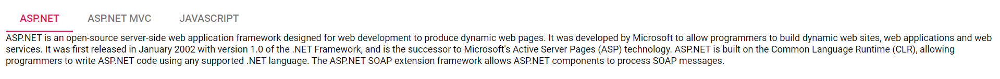

# Getting Started with the Vue Tab Component in Vue 3

This article provides a step-by-step guide for setting up a [Vite](https://vitejs.dev/) project with a JavaScript environment and integrating the Syncfusion<sup style="font-size:70%">&reg;</sup> Vue Tab component using the [Composition API](https://vuejs.org/guide/introduction.html#composition-api) / [Options API](https://vuejs.org/guide/introduction.html#options-api).

The `Composition API` is a new feature introduced in Vue.js 3 that provides an alternative way to organize and reuse component logic. It allows developers to write components as functions that use smaller, reusable functions called composition functions to manage their properties and behavior.

The `Options API` is the traditional way of writing Vue.js components, where the component logic is organized into a series of options that define the component's properties and behavior. These options include data, methods, computed properties, watchers, lifecycle hooks, and more.

## Prerequisites

[System requirements for Syncfusion<sup style="font-size:70%">&reg;</sup> Vue UI components](https://ej2.syncfusion.com/vue/documentation/system-requirements)

## Setup for local development

Easily set up a Vue 3 application using [Vite](https://vitejs.dev), which provides a faster development environment, smaller bundle sizes, and optimized builds compared to traditional tools. For detailed steps, refer to the Vite [installation instructions](https://vitejs.dev/guide). Vite sets up your environment using JavaScript and optimizes your application for production.

> **Note:** To create a Vue application using `create-vue`, refer to this [documentation](https://ej2.syncfusion.com/vue/documentation/getting-started) for more details.

To create a new Vue 3 application, run one of the following commands based on your preferred language:

***Vue with JavaScript***

```bash
npm create vite@latest my-app -- --template vue
```

***Vue with TypeScript***

```bash
npm create vite@latest my-app -- --template vue-ts
```

During the setup process, the CLI will prompt you for a few configuration options. Select the following:

- **Which linter to use?** → **Default ([Vue 3] babel, eslint)**
- **Install with npm and start now?** → **Yes**

Selecting **Yes** automatically installs the project dependencies and starts the development server.

After verifying that the application starts successfully, terminate the development server in the terminal and proceed to the next step.

Then, navigate to the project directory:

```bash
cd my-app
```

## Add Vue Tab packages

To install the Tab packages, use the following command:

```bash
npm install @syncfusion/ej2-vue-navigations
```

or

```bash
yarn add @syncfusion/ej2-vue-navigations
```

## Adding CSS reference

Themes for Syncfusion<sup style="font-size:70%">&reg;</sup> components can be applied using CSS files provided through [npm theme packages](https://www.npmjs.com/package/@syncfusion/ej2-material3-theme). For available themes, refer to the [Themes](https://ej2.syncfusion.com/vue/documentation/appearance/theme) documentation.
 
Install the **Material 3** theme package using the following command:



 
npm install @syncfusion/ej2-material3-theme --save
 


 
Then add the following CSS reference to the **src/App.vue** file:




<style>
    @import "../node_modules/@syncfusion/ej2-material3-theme/styles/tab/index.css";
</style>




## Adding Vue Tab component

The Tab code should be added in the **src/App.vue** file.




<template>
  <ejs-tab id="tab">
    <e-tabitems>
      <e-tabitem :header="headerText0" :content="content0"></e-tabitem>
      <e-tabitem :header="headerText1" :content="content1"></e-tabitem>
      <e-tabitem :header="headerText2" :content="content2"></e-tabitem>
    </e-tabitems>
  </ejs-tab>
</template>

<script setup>
import {
  TabComponent as EjsTab, TabItemsDirective as ETabitems, TabItemDirective as ETabitem
} from "@syncfusion/ej2-vue-navigations";

const headerText0 = { text: "ASP.NET" };
const headerText1 = { text: "ASP.NET MVC" };
const headerText2 = { text: "JavaScript" };
const content0 =
  "ASP.NET is an open-source server-side web application framework designed for web development to produce " +
  "dynamic web pages. It was developed by Microsoft to allow programmers to build dynamic web sites, web applications " +
  "and web services. It was first released in January 2002 with version 1.0 of the .NET Framework, and is the successor " +
  "to Microsoft's Active Server Pages (ASP) technology. ASP.NET is built on the Common Language Runtime (CLR), allowing " +
  "programmers to write ASP.NET code using any supported .NET language. The ASP.NET SOAP extension framework allows " +
  "ASP.NET components to process SOAP messages.";

const content1 =
  "The ASP.NET MVC is a web application framework developed by Microsoft, which implements the " +
  "model–view–controller (MVC) pattern. It is open-source software, apart from the ASP.NET Web Forms component which is " +
  "proprietary. In the later versions of ASP.NET, ASP.NET MVC, ASP.NET Web API, and ASP.NET Web Pages (a platform using " +
  "only Razor pages) will merge into a unified MVC 6.The project is called ASP.NET vNext.";

const content2 =
  "JavaScript (JS) is an interpreted computer programming language. It was originally implemented as " +
  "part of web browsers so that client-side scripts could interact with the user, control the browser, communicate " +
  "asynchronously, and alter the document content that was displayed.[5] More recently, however, it has become common in " +
  "both game development and the creation of desktop applications.";
</script>

<style>
    @import "../node_modules/@syncfusion/ej2-material3-theme/styles/tab/index.css";
</style>




<template>
  <div id="app">
    <ejs-tab id='element'>
      <e-tabitems>
        <e-tabitem :header='headerText0' :content="content0"></e-tabitem>
        <e-tabitem :header='headerText1' :content="content1"></e-tabitem>
        <e-tabitem :header='headerText2' :content="content2"></e-tabitem>
      </e-tabitems>
    </ejs-tab>
  </div>
</template>

<script>
import { TabComponent, TabItemDirective, TabItemsDirective } from '@syncfusion/ej2-vue-navigations';

export default {
  name: "App",
  components: {
    'ejs-tab': TabComponent,
    'e-tabitem': TabItemDirective,
    'e-tabitems': TabItemsDirective
  },
  data: function () {
    return {

      headerText0: { text: 'ASP.NET' },
      headerText1: { text: 'ASP.NET MVC' },
      headerText2: { text: 'JavaScript' },

      content0: 'ASP.NET is an open-source server-side web application framework designed for web development to produce ' +
        'dynamic web pages. It was developed by Microsoft to allow programmers to build dynamic web sites, web applications ' +
        'and web services. It was first released in January 2002 with version 1.0 of the .NET Framework, and is the successor ' +
        'to Microsoft\'s Active Server Pages (ASP) technology. ASP.NET is built on the Common Language Runtime (CLR), allowing ' +
        'programmers to write ASP.NET code using any supported .NET language. The ASP.NET SOAP extension framework allows ' +
        'ASP.NET components to process SOAP messages.',

      content1: 'The ASP.NET MVC is a web application framework developed by Microsoft, which implements the ' +
        'model–view–controller (MVC) pattern. It is open-source software, apart from the ASP.NET Web Forms component which is ' +
        'proprietary. In the later versions of ASP.NET, ASP.NET MVC, ASP.NET Web API, and ASP.NET Web Pages (a platform using ' +
        'only Razor pages) will merge into a unified MVC 6.The project is called ASP.NET vNext.',

      content2: 'JavaScript (JS) is an interpreted computer programming language. It was originally implemented as ' +
        'part of web browsers so that client-side scripts could interact with the user, control the browser, communicate ' +
        'asynchronously, and alter the document content that was displayed.[5] More recently, however, it has become common in ' +
        'both game development and the creation of desktop applications.',

    }
  }
}
</script>

<style>
@import "../node_modules/@syncfusion/ej2-material3-theme/styles/tab/index.css";
</style>




## Run the project

To run the project, use the following command:

```bash
npm run dev
```

or

```bash
yarn run dev
```



Refer the sample [Vue 3 using Composition API Tab getting started](https://github.com/SyncfusionExamples/vue3-tab-getting-started)

## See also

* [Getting Started with Vue UI Components using Composition API and TypeScript](https://ej2.syncfusion.com/vue/documentation/getting-started/vue-3-ts-composition)
* [Getting Started with Vue UI Components using Options API and TypeScript](https://ej2.syncfusion.com/vue/documentation/getting-started/vue-3-ts-options)