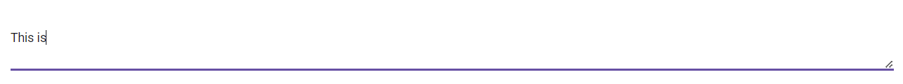

# Getting Started with the Vue TextArea Component in Vue 3

This article provides a step-by-step guide for setting up a [Vite](https://vitejs.dev/) project with a JavaScript environment and integrating the Syncfusion Vue TextArea component using the [Composition API](https://vuejs.org/guide/introduction.html#composition-api) / [Options API](https://vuejs.org/guide/introduction.html#options-api).

The `Composition API` is a new feature introduced in Vue.js 3 that provides an alternative way to organize and reuse component logic. It allows developers to write components as functions that use smaller, reusable functions called composition functions to manage their properties and behavior.

The `Options API` is the traditional way of writing Vue.js components, where the component logic is organized into a series of options that define the component's properties and behavior. These options include data, methods, computed properties, watchers, lifecycle hooks, and more.

## Prerequisites

[System requirements for Syncfusion Vue UI components](https://ej2.syncfusion.com/vue/documentation/system-requirements/)

## Set up the vite project

A recommended approach for beginning with Vue is to scaffold a project using [Vite](https://vitejs.dev/). To create a new Vite project, use one of the commands that are specific to either NPM or Yarn.

```bash
npm create vite@latest
```

or

```bash
yarn create vite
```

Using one of the above commands will lead you to set up additional configurations for the project as below:

1.Define the project name: We can specify the name of the project directly. Let's specify the name of the project as `my-project` for this article.

```bash
? Project name: » my-project
```

2.Select `Vue` as the framework. It will create a Vue 3 project.

```bash
? Select a framework: » - Use arrow-keys. Return to submit.
Vanilla
> Vue
  React
  Preact
  Lit
  Svelte
  Others
```

3.Choose `JavaScript` as the framework variant to build this Vite project using JavaScript and Vue.

```bash
? Select a variant: » - Use arrow-keys. Return to submit.
> JavaScript
  TypeScript
  Customize with create-vue ↗
  Nuxt ↗
```

4.Upon completing the aforementioned steps to create the `my-project`, run the following command to install its dependencies:

```bash
cd my-project
npm install
```

or

```bash
cd my-project
yarn install
```

Now that `my-project` is ready to run with default settings, let's add Syncfusion components to the project.

## Add syncfusion vue packages

Syncfusion Vue component packages are available at [npmjs.com](https://www.npmjs.com/search?q=ej2-vue). To use Syncfusion Vue components in the project, install the corresponding npm package.

This article uses the [Vue TextArea component](https://www.syncfusion.com/vue-components/vue-textarea) as an example. To use the Vue TextArea component in the project, the `@syncfusion/ej2-vue-inputs` package needs to be installed using the following command:

```bash
npm install @syncfusion/ej2-vue-inputs --save
```

or

```bash
yarn add @syncfusion/ej2-vue-inputs
```

## Import syncfusion css styles

You can import themes for the Syncfusion Vue component in various ways, such as using CSS or SASS styles from npm packages, CDN, [CRG](https://ej2.syncfusion.com/javascript/documentation/common/custom-resource-generator/) and [Theme Studio](https://ej2.syncfusion.com/vue/documentation/appearance/theme-studio/). Refer to [themes topic](https://ej2.syncfusion.com/vue/documentation/appearance/theme/) to know more about built-in themes and different ways to refer to themes in a Vue project.

In this article, `Material` theme is applied using CSS styles, which are available in installed packages. The necessary `Material` CSS styles for the TextArea component and its dependents were imported into the `<style>` section of **src/App.vue** file.




<style>
  @import "../node_modules/@syncfusion/ej2-base/styles/material.css";
  @import "../node_modules/@syncfusion/ej2-vue-inputs/styles/material.css";
</style>




> The order of importing CSS styles should be in line with its dependency graph.

## Add syncfusion vue component

Follow the below steps to add the Vue TextArea component using `Composition API` or `Options API`:

Import and register the TextArea component in the `script` section of the **src/App.vue** file. If you are using the `Composition API`, you should add the `setup` attribute to the `script` tag to indicate that Vue will be using the `Composition API`.




<script setup>
  import { TextAreaComponent as EjsTextArea } from "@syncfusion/ej2-vue-inputs";
</script>





<script setup>
  import { TextAreaComponent as EjsTextArea } from "@syncfusion/ej2-vue-inputs";
</script>





<script>
import { TextAreaComponent } from "@syncfusion/ej2-vue-inputs";
//Component registeration
export default {
name: "App",
components: {
"ejs-textarea'":TextareaComponent
}
}
</script>



   
In the `template` section, define the TextArea component.




<template>
    <div class='wrap'>
        <ejs-textarea id="default"></ejs-textarea>
    </div>
</template>




## Run the project

To run the project, use the following command:

```bash
npm run dev
```

or

```bash
yarn run dev
```

Here is the summarized code for the above steps in the **src/App.vue** file:




<template>
    <div class ='wrap'>
        <div id ='input-container'>
            <ejs-textarea id='default'></ejs-textarea>
        </div>
    </div>
</template>

<script setup>
import { TextAreaComponent as EjsTextArea } from '@syncfusion/ej2-vue-inputs';
</script>

<style>
  @import "../node_modules/@syncfusion/ej2-base/styles/material.css";
  @import "../node_modules/@syncfusion/ej2-vue-inputs/styles/material.css";

  .wrap {
    box-sizing: border-box;
    margin: 0 auto;
    padding: 20px 10px;
    width: 340px;
  }
</style>





<template>
  <div class ='wrap'>
    <div id ='input-container'>
      <ejs-textarea id='default'></ejs-textarea>
    </div>
  </div>
</template>
<script setup>
import { TextAreaComponent as EjsTextArea } from '@syncfusion/ej2-vue-inputs';
</script>
<style>
  @import "../node_modules/@syncfusion/ej2-base/styles/material.css";
  @import "../node_modules/@syncfusion/ej2-vue-inputs/styles/material.css";
  .wrap {
    box-sizing: border-box;
    margin: 0 auto;
    padding: 20px 10px;
    width: 340px;
  }
</style>





<template>
  <div class ='wrap'>
    <div id ='input-container'>
      <ejs-textarea id='default'></ejs-textarea>
    </div>
  </div>
</template>
<script>
import { TextAreaComponent } from '@syncfusion/ej2-vue-inputs';
export default {
name: "App",
components: {
"ejs-textarea":TextAreaComponent
},
  data: function() {
      return { }
  }
}
</script>
<style>
  @import "../node_modules/@syncfusion/ej2-base/styles/material.css";
  @import "../node_modules/@syncfusion/ej2-vue-inputs/styles/material.css";
  .wrap {
    box-sizing: border-box;
    margin: 0 auto;
    padding: 20px 10px;
    width: 340px;
  }
</style>




The output will appear as follows:



## Getting and setting values

To set the initial value of the TextArea component, you can utilize the [`value`](https://ej2.syncfusion.com/vue/documentation/api/textarea/#value) property. Here's how you can achieve it:





<template>
    <div class='wrap'>
        <ejs-textarea id="default" value="comments"></ejs-textarea>
    </div>
</template>

<script setup>

import { TextAreaComponent as EjsTextArea} from "@syncfusion/ej2-vue-inputs";

</script>

<style>
@import '../node_modules/@syncfusion/ej2-base/styles/material.css';
@import '../node_modules/@syncfusion/ej2-inputs/styles/material.css';

.wrap {
  margin: 50px auto;
  text-align: center;
}

</style>





<template>
    <div class='wrap'>
        <ejs-textarea id="default" value="comments"></ejs-textarea>
    </div>
</template>

<script>

import { TextAreaComponent  } from "@syncfusion/ej2-vue-inputs";

export default {
name: "App",
components: {
"ejs-textarea":TextAreaComponent
},
data: function() {
  return { }
}
}
</script>

<style>
@import '../node_modules/@syncfusion/ej2-base/styles/material.css';
@import '../node_modules/@syncfusion/ej2-inputs/styles/material.css';

.wrap {
  margin: 50px auto;
  text-align: center;
}

</style>




* Alternatively, you can set the value of the TextArea using v-model.





<template>
    <div class='wrap'>
        <ejs-textarea id="default" v-model="value"></ejs-textarea>
    </div>
</template>

<script setup>

import { TextAreaComponent as EjsTextArea } from "@syncfusion/ej2-vue-inputs";

const  value = 'Comments';
  
</script>

<style>
@import '../node_modules/@syncfusion/ej2-base/styles/material.css';
@import '../node_modules/@syncfusion/ej2-inputs/styles/material.css';

.wrap {
  margin: 50px auto;
  text-align: center;
}

</style>





<template>
    <div class='wrap'>
        <ejs-textarea id="default" v-model="value"></ejs-textarea>
    </div>
</template>

<script>

import { TextAreaComponent  } from "@syncfusion/ej2-vue-inputs";

export default {
name: "App",
components: {
"ejs-textarea":TextAreaComponent
},
  data: function() {
    return {
      value: 'Comments'
    }
  }
}
</script>

<style>
@import '../node_modules/@syncfusion/ej2-base/styles/material.css';
@import '../node_modules/@syncfusion/ej2-inputs/styles/material.css';

.wrap {
  margin: 50px auto;
  text-align: center;
}

</style>




* You can dynamically retrieve the value of the TextArea component using the state variable assigned to the `value` property of the TextArea component.





<template>
    <div class='wrap'>
        <ejs-textarea id="default" v-model="value"></ejs-textarea>
        <button id="valuebtn" @click="onButtonClick">Get Value</button>
    </div>
</template>

<script setup>

import { TextAreaComponent as EjsTextArea } from "@syncfusion/ej2-vue-inputs";

const  value = 'Comments';

const onButtonClick = () => {
    // Retrieve the value from the textarea
    const textareaValue = this.value;
    console.log(textareaValue);
}

</script>

<style>
@import '../node_modules/@syncfusion/ej2-base/styles/material.css';
@import '../node_modules/@syncfusion/ej2-inputs/styles/material.css';

.wrap {
  margin: 50px auto;
  text-align: center;
}
</style>




<template>
    <div class='wrap'>
        <ejs-textarea id="default" v-model="value"></ejs-textarea>
        <button id="valuebtn" @click="onButtonClick">Get Value</button>
    </div>
</template>

<script>

import { TextAreaComponent  } from "@syncfusion/ej2-vue-inputs";

export default {
name: "App",
components: {
"ejs-textarea":TextAreaComponent
},
data() {
    return {
        value: 'Comments'
    }
},
methods: {
    onButtonClick() {
        // Retrieve the value from the textarea
        const textareaValue = this.value;
        console.log(textareaValue);
    }
}
}
</script>

<style>
@import '../node_modules/@syncfusion/ej2-base/styles/material.css';
@import '../node_modules/@syncfusion/ej2-inputs/styles/material.css';

.wrap {
  margin: 50px auto;
  text-align: center;
}
</style>




* You can retrieve the value of the TextArea by accessing it as an argument from the [`change`](https://ej2.syncfusion.com/vue/documentation/api/textarea/#change) event.




<template>
    <div class='wrap'>
        <ejs-textarea id="default" v-model="value" :change="onChange"></ejs-textarea>
    </div>
</template>

<script setup>

import { TextAreaComponent as EjsTextArea } from "@syncfusion/ej2-vue-inputs";

const  value = 'Comments';

const onButtonClick = () => {
    // Retrieve the value from the textarea
    const textareaValue = this.value;
    console.log(textareaValue);
}
</script>

<style>
@import '../node_modules/@syncfusion/ej2-base/styles/material.css';
@import '../node_modules/@syncfusion/ej2-inputs/styles/material.css';

.wrap {
  margin: 50px auto;
  text-align: center;
}
</style>




<template>
    <div class='wrap'>
        <ejs-textarea id="default" v-model="value" :change="onChange"></ejs-textarea>
    </div>
</template>

<script>

import { TextAreaComponent  } from "@syncfusion/ej2-vue-inputs";

export default {
name: "App",
components: {
"ejs-textarea":TextareaComponent
},
data() {
    return {
        value: 'Comments'
    }
},
methods: {
    onChange: function(args) {
      let textareaValue = args.value;
    }
}
}
</script>

<style>
@import '../node_modules/@syncfusion/ej2-base/styles/material.css';
@import '../node_modules/@syncfusion/ej2-inputs/styles/material.css';

.wrap {
  margin: 50px auto;
  text-align: center;
}
</style>


