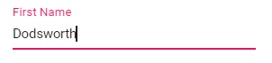

# Getting Started with the Vue TextBox Component in Vue 3

This article provides a step-by-step guide for setting up a [Vite](https://vitejs.dev/) project with a JavaScript environment and integrating the Syncfusion<sup style="font-size:70%">&reg;</sup> Vue TextBox component using the [Composition API](https://vuejs.org/guide/introduction.html#composition-api) / [Options API](https://vuejs.org/guide/introduction.html#options-api).

The `Composition API` is a new feature introduced in Vue.js 3 that provides an alternative way to organize and reuse component logic. It allows developers to write components as functions that use smaller, reusable functions called composition functions to manage their properties and behavior.

The `Options API` is the traditional way of writing Vue.js components, where the component logic is organized into a series of options that define the component's properties and behavior. These options include data, methods, computed properties, watchers, life-cycle hooks, and more.

## Prerequisites

[System requirements for Syncfusion<sup style="font-size:70%">&reg;</sup> Vue UI components](https://ej2.syncfusion.com/vue/documentation/system-requirements)

## Set up the Vite project

A recommended approach for beginning with Vue is to scaffold a project using [Vite](https://vitejs.dev/). To create a new Vite project, use one of the commands that are specific to either NPM or Yarn.

```bash
npm create vite@latest
```

or

```bash
yarn create vite
```

Using one of the above commands will lead you to set up additional configurations for the project as below:

1.Define the project name: We can specify the name of the project directly. Let's specify the name of the project as `my-project` for this article.

```bash
? Project name: » my-project
```

2.Select `Vue` as the framework. It will create a Vue 3 project.

```bash
? Select a framework: » - Use arrow-keys. Return to submit.
Vanilla
> Vue
  React
  Preact
  Lit
  Svelte
  Others
```

3.Choose `JavaScript` as the framework variant to build this Vite project using JavaScript and Vue.

```bash
? Select a variant: » - Use arrow-keys. Return to submit.
> JavaScript
  TypeScript
  Customize with create-vue ↗
  Nuxt ↗
```

4.Roll-down is Vite's new experimental faster bundler (rust-based, replacing roll-up). Choose `No` uses the stable, proven roll-up-based Vite (recommended for most users)

```bash
Use rolldown-vite (Experimental)? No
```

5.Install dependencies and start the dev server.

```bash
Install with npm and start now?: Yes
```

Since you selected `Yes`, the development server should start automatically. If you selected `No`, please follow these steps to set up and start the project manually:

```bash
cd my-project
npm install
```

or

```bash
cd my-project
yarn install
```

Now that `my-project` is ready to run with default settings, let's add Syncfusion<sup style="font-size:70%">&reg;</sup> components to the project.

## Add Syncfusion<sup style="font-size:70%">&reg;</sup> Vue packages

Syncfusion<sup style="font-size:70%">&reg;</sup> Vue component packages are available at [npmjs.com](https://www.npmjs.com/search?q=ej2-vue). To use Syncfusion<sup style="font-size:70%">&reg;</sup> Vue components in the project, install the corresponding npm package.

This article uses the [Vue TextBox component](https://www.syncfusion.com/vue-components/vue-textbox) as an example. To use the Vue TextBox component in the project, the `@syncfusion/ej2-vue-inputs` package needs to be installed using the following command:

```bash
npm install @syncfusion/ej2-vue-inputs --save
```

or

```bash
yarn add @syncfusion/ej2-vue-inputs
```

## Import Syncfusion<sup style="font-size:70%">&reg;</sup> CSS styles

Syncfusion<sup style="font-size:70%">&reg;</sup> components require CSS stylesheets to display correctly. You can import themes in various ways, such as using CSS or SASS styles from npm packages, CDN, CRG, and [Theme Studio](https://ej2.syncfusion.com/vue/documentation/appearance/theme-studio). Refer to [themes topic](https://ej2.syncfusion.com/vue/documentation/appearance/theme) to learn more about built-in themes and different ways to reference themes in a Vue project.

In this article, `Material3` theme is applied using CSS styles, which are available in installed packages. The necessary `Material3` CSS styles for the TextBox component and its dependents were imported into the `<style>` section of **src/App.vue** file.




<style>
  @import "../node_modules/@syncfusion/ej2-base/styles/material.css";
  @import "../node_modules/@syncfusion/ej2-vue-inputs/styles/material.css";
</style>




> The order of CSS imports matters. Import base styles first, then component-specific styles. Missing CSS imports can result in misaligned layouts, buttons without styling, or missing visual elements in popups and dialogs.

## Add Syncfusion<sup style="font-size:70%">&reg;</sup> Vue component

Follow the below steps to add the Vue TextBox component using `Composition API` or `Options API`:

  1.First, import and register the TextBox component in the `script` section of the **src/App.vue** file. If you are using the `Composition API`, you should add the `setup` attribute to the `script` tag to indicate that Vue will be using the `Composition API`.





<script setup>
  import { TextBoxComponent as EjsTextbox } from "@syncfusion/ej2-vue-inputs";
</script>
</script>





<script>
import { TextBoxComponent } from "@syncfusion/ej2-vue-inputs";
//Component registeration
export default {
name: "App",
components: {
"ejs-textbox'":TextBoxComponent
}
}
</script>



   
2.In the `template` section, define the TextBox component with the [dataSource](https://ej2.syncfusion.com/vue/documentation/api/textbox/#datasource) property and column definitions.




<template>
    <div id ='wrap'>
        <div id ='input-container'>
            <div>
                <!--element which is going to render the TextBox-->
                <input class="e-input" type="text" placeholder="Enter Date" />
            </div>
        </div>
    </div>
</template>




Here is the summarized code for the above steps in the **src/App.vue** file:





<template>
    <div id ='wrap'>
        <div id ='input-container'>
            <div>
                <!--element which is going to render the TextBox-->
                <input class="e-input" type="text" placeholder="Enter Date" />
            </div>
        </div>
    </div>
</template>
<script setup>

</script>
<style>
    @import "../node_modules/@syncfusion/ej2-base/styles/material.css";
    @import "../node_modules/@syncfusion/ej2-vue-inputs/styles/material.css";
    .wrap {
        box-sizing: border-box;
        margin: 0 auto;
        padding: 20px 10px;
        width: 340px;
    }
</style>





<template>
    <div id ='wrap'>
        <div id ='input-container'>
            <div>
                <!--element which is going to render the TextBox-->
                <input class="e-input" type="text" placeholder="Enter Date" />
            </div>
        </div>
    </div>
</template>
<script>
export default {
name: 'App',
}
</script>
<style>
    @import "../node_modules/@syncfusion/ej2-base/styles/material.css";
    @import "../node_modules/@syncfusion/ej2-vue-inputs/styles/material.css";
    .wrap {
        box-sizing: border-box;
        margin: 0 auto;
        padding: 20px 10px;
        width: 340px;
    }
</style>




## Adding icons to the TextBox

You can create a TextBox with icon as a group by creating the parent div element with the class `e-input-group` and add the icon element as span with the class `e-input-group-icon`. For detailed information, refer to the [Groups](./groups) section.




<!--element which is going to render the TextBox with date icon-->
<div class="e-input-group">
    <input class="e-input" name='input' type="text" placeholder="Enter Date"/>
    <span class="e-input-group-icon e-input-popup-date"></span>
</div>







.e-input-group-icon.e-input-popup-date:before {
  content: "\e901";
}




## Run the project

To run the project, use the following command:

```bash
npm run dev
```

or

```bash
yarn run dev
```

## Floating label

The floating label TextBox floats the label above the TextBox after focusing, or filled with value in the TextBox.
You can create the floating label TextBox by using `floatLabelType` API.





<template>
    <div class ='wrap'>
        <div id ='input-container'>
            <ejs-textbox id='textbox' floatLabelType="Auto" placeholder="First Name"></ejs-textbox>
        </div>
    </div>
</template>

<script setup>
import { TextBoxComponent as EjsTextbox } from "@syncfusion/ej2-vue-inputs";
  const data = [];
</script>

<style>
    @import "../node_modules/@syncfusion/ej2-base/styles/material.css";
    @import "../node_modules/@syncfusion/ej2-vue-inputs/styles/material.css";

    .wrap {
        box-sizing: border-box;
        margin: 0 auto;
        padding: 20px 10px;
        width: 340px;
    }
</style>





<template>
    <div class ='wrap'>
        <div id ='input-container'>
            <ejs-textbox id='textbox' floatLabelType="Auto" placeholder="First Name"></ejs-textbox>
        </div>
    </div>
</template>

<script>
import { TextBoxComponent } from "@syncfusion/ej2-vue-inputs";
export default {
name: "App",
components: {
"ejs-textbox":TextBoxComponent
},
data: function () {
    return {}
},
}
</script>

<style>
    @import "../node_modules/@syncfusion/ej2-base/styles/material.css";
    @import "../node_modules/@syncfusion/ej2-vue-inputs/styles/material.css";
    .wrap {
        box-sizing: border-box;
        margin: 0 auto;
        padding: 20px 10px;
        width: 340px;
    }
</style>




The output will appear as follows:



## See Also

* [How to render TextBox programmatically](./how-to/add-textbox-programmatically)
* [How to add floating label to TextBox programmatically](./how-to/add-floating-label-to-textbox-programmatically)