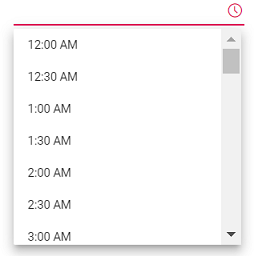
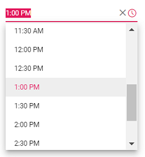
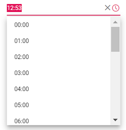

# Getting Started with Vue 3 TimePicker

This article provides a step-by-step guide for setting up a [Vite](https://vitejs.dev/) project with a JavaScript environment and integrating the Syncfusion<sup style="font-size:70%">&reg;</sup> Vue TimePicker component using the [Composition API](https://vuejs.org/guide/introduction.html#composition-api) / [Options API](https://vuejs.org/guide/introduction.html#options-api).

The `Composition API` is a new feature introduced in Vue.js 3 that provides an alternative way to organize and reuse component logic. It allows developers to write components as functions that use smaller, reusable functions called composition functions to manage their properties and behavior.

The `Options API` is the traditional way of writing Vue.js components, where the component logic is organized into a series of options that define the component's properties and behavior. These options include data, methods, computed properties, watchers, lifecycle hooks, and more.

## Prerequisites

[System requirements for Syncfusion<sup style="font-size:70%">&reg;</sup> Vue UI components](https://ej2.syncfusion.com/vue/documentation/system-requirements)

## Setup for local development

Easily set up a Vue 3 application using [Vite](https://vitejs.dev), which provides a faster development environment, smaller bundle sizes, and optimized builds compared to traditional tools. For detailed steps, refer to the Vite [installation instructions](https://vitejs.dev/guide). Vite sets up your environment using JavaScript and optimizes your application for production.

> **Note:** To create a Vue application using `create-vue`, refer to this [documentation](https://ej2.syncfusion.com/vue/documentation/getting-started) for more details.

To create a new Vue 3 application, run one of the following commands based on your preferred language:

***Vue with JavaScript***

```bash
npm create vite@latest my-app -- --template vue
```

***Vue with TypeScript***

```bash
npm create vite@latest my-app -- --template vue-ts
```

During the setup process, the CLI will prompt you for a few configuration options. Select the following:

- **Which linter to use?** → **Default ([Vue 3] babel, eslint)**
- **Install with npm and start now?** → **Yes**

Selecting **Yes** automatically installs the project dependencies and starts the development server.

After verifying that the application starts successfully, terminate the development server in the terminal and proceed to the next step.

Then, navigate to the project directory:

```bash
cd my-app
```

## Add Vue TimePicker packages

To install the TimePicker packages, use the following command:

```bash
npm install @syncfusion/ej2-vue-calendars
```

or

```bash
yarn add @syncfusion/ej2-vue-calendars
```

## Adding CSS reference

Themes for Syncfusion<sup style="font-size:70%">&reg;</sup> components can be applied using CSS files provided through [npm theme packages](https://www.npmjs.com/package/@syncfusion/ej2-material3-theme). For available themes, refer to the [Themes](https://ej2.syncfusion.com/vue/documentation/appearance/theme) documentation.
 
Install the **Material 3** theme package using the following command:



 
npm install @syncfusion/ej2-material3-theme --save
 


 
Then add the following CSS reference to the **src/App.vue** file:




<style>
    @import "../node_modules/@syncfusion/ej2-material3-theme/styles/timepicker/index.css";
</style>




## Adding Vue TimePicker component

The TimePicker code should be added in the **src/App.vue** file.




<template>
    <div class="control_wrapper">
        <ejs-timepicker></ejs-timepicker>
    </div>
</template>

<script setup>
  import { TimePickerComponent as EjsDatepicker } from '@syncfusion/ej2-vue-calendars';
</script>

<style>
    @import "../node_modules/@syncfusion/ej2-material3-theme/styles/timepicker/index.css";
</style>




<template>
    <div class="control_wrapper">
        <ejs-timepicker></ejs-timepicker>
    </div>
</template>

<script>
import { TimePickerComponent } from "@syncfusion/ej2-vue-calendars";
//Component registeration
export default {
    name: 'App',
    components: {
        "ejs-timepicker": TimePickerComponent
    }
}
</script>

<style>
    @import "../node_modules/@syncfusion/ej2-material3-theme/styles/timepicker/index.css";
</style>




## Run the project

To run the project, use the following command:

```bash
npm run dev
```

or

```bash
yarn run dev
```



## Setting the value, min, and max time

The following example demonstrates how to set the value, min, and max time on initializing the TimePicker. The TimePicker allows you to select the time value within a range from `7:00 AM` to `4:00 PM`.




<template>
    <div id="app">
        <div class='wrapper'>
            <ejs-timepicker :min="data[0].minDate" :max="data[0].maxDate" :value="data[0].dateVal" ></ejs-timepicker>
        </div>
  </div>
</template>

<script setup>
import { TimePickerComponent as EjsTimePicker } from "@syncfusion/ej2-vue-calendars";
    const data = [{ minDate : new Date("05/07/2017 7:00 AM"),
                  maxDate : new Date("05/07/2017 4:00 PM"),
                  timeVal : new Date("05/27/2017 1:00 PM") }]
</script>

<style>
    @import "../node_modules/@syncfusion/ej2-material3-theme/styles/timepicker/index.css";
</style>




<template>
    <div id="app">
        <div class='wrapper'>
            <ejs-timepicker :min="minDate" :max="maxDate" :value="dateVal" ></ejs-timepicker>
        </div>
  </div>
</template>

<script>
import { TimePickerComponent } from "@syncfusion/ej2-vue-calendars";
//Component registeration
export default {
    name: 'App',
    components: {
        "ejs-timepicker": TimePickerComponent
    },
    data () {
        return {
            minDate : new Date("05/09/2017"),
            maxDate : new Date("05/15/2017"),
            dateVal : new Date("05/11/2017")
        }
    }
}
</script>
<style>
    @import "../node_modules/@syncfusion/ej2-material3-theme/styles/timepicker/index.css";
</style>






## Setting the time format

Time formats is a way of representing the time value in different string format in textbox and popup list. By default, the TimePicker's format is based on the culture. You can also customize the format by using the [`format`](https://ej2.syncfusion.com/vue/documentation/api/timepicker#format) property. To know more about the time format standards, refer to the [Date and Time Format](../common/internationalization#custom-formats) section.

The following example demonstrates the TimePicker component in 24 hours format with 60 minutes interval. The time interval is set to 60 minutes by using the [`step`](https://ej2.syncfusion.com/vue/documentation/api/timepicker#step-number) property.




<template>
    <div id="app">
        <div class='wrapper'>
            <ejs-timepicker :step="data[0].timeStep" :format="data[0].timeFormat" :value="data[0].timeVal"></ejs-timepicker>
     </div>
  </div>
</template>

<script setup>
  import { TimePickerComponent as EjsTimepicker } from "@syncfusion/ej2-vue-calendars";
  const data = [{ timeStep : 60,
                  timeFormat : 'HH:mm',
                  timeVal : new Date() }]
</script>

<style>
    @import "../node_modules/@syncfusion/ej2-material3-theme/styles/timepicker/index.css";
</style>




<template>
    <div id="app">
        <div class='wrapper'>
            <ejs-timepicker :step="timeStep" :format="timeFormat" :value="timeVal"></ejs-timepicker>
     </div>
  </div>
</template>

<script>
import { TimePickerComponent } from "@syncfusion/ej2-vue-calendars";
//Component registeration
export default {
    name: 'App',
    components: {
        "ejs-timepicker": TimePickerComponent
    },
    data () {
        return {
            timeStep : 60,
            timeFormat : 'HH:mm',
            timeVal : new Date()
        }
    }
}
</script>

<style>
    @import "../node_modules/@syncfusion/ej2-material3-theme/styles/timepicker/index.css";
</style>




Output be like the below.



> Once the time format property is defined, it will be applicable to all the cultures.

## See Also

* [Render TimePicker with min and max time](./time-range)
* [How to achieve validation with TimePicker](./how-to/client-side-validation-using-form-validator)
* [Render TimePicker with specific culture](./globalization)