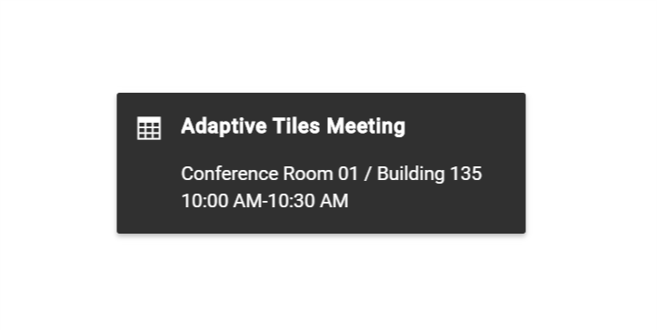

# Getting Started with the Vue Toast Component in Vue 3

This article provides a step-by-step guide for setting up a [Vite](https://vitejs.dev/) project with a JavaScript environment and integrating the Syncfusion<sup style="font-size:70%">&reg;</sup> Vue Toast component using the [Composition API](https://vuejs.org/guide/introduction.html#composition-api) / [Options API](https://vuejs.org/guide/introduction.html#options-api).

The `Composition API` is a new feature introduced in Vue.js 3 that provides an alternative way to organize and reuse component logic. It allows developers to write components as functions that use smaller, reusable functions called composition functions to manage their properties and behavior.

The `Options API` is the traditional way of writing Vue.js components, where the component logic is organized into a series of options that define the component's properties and behavior. These options include data, methods, computed properties, watchers, life-cycle hooks, and more.

## Prerequisites

[System requirements for Syncfusion<sup style="font-size:70%">&reg;</sup> Vue UI components](https://ej2.syncfusion.com/vue/documentation/system-requirements)

## Setup for local development

Easily set up a Vue 3 application using [Vite](https://vitejs.dev), which provides a faster development environment, smaller bundle sizes, and optimized builds compared to traditional tools. For detailed steps, refer to the Vite [installation instructions](https://vitejs.dev/guide). Vite sets up your environment using JavaScript and optimizes your application for production.

> **Note:** To create a Vue application using `create-vue`, refer to this [documentation](https://ej2.syncfusion.com/vue/documentation/getting-started) for more details.

To create a new Vue 3 application, run one of the following commands based on your preferred language:

***Vue with JavaScript***

```bash
npm create vite@latest my-app -- --template vue
```

***Vue with TypeScript***

```bash
npm create vite@latest my-app -- --template vue-ts
```

During the setup process, the CLI will prompt you for a few configuration options. Select the following:

- **Install with npm and start now?** → **Yes**

Selecting **Yes** automatically installs the project dependencies and starts the development server.

After verifying that the application starts successfully, terminate the development server in the terminal and proceed to the next step.

Then, navigate to the project directory:

```bash
cd my-app
```

## Add Vue Toast packages

To install the Toast packages, use the following command:

```bash
npm install @syncfusion/ej2-vue-notifications
```

or

```bash
yarn add @syncfusion/ej2-vue-notifications
```

## Adding CSS reference

Themes for Syncfusion<sup style="font-size:70%">&reg;</sup> components can be applied using CSS files provided through [npm theme packages](https://www.npmjs.com/package/@syncfusion/ej2-material3-theme). For available themes, refer to the [Themes](https://ej2.syncfusion.com/vue/documentation/appearance/theme) documentation.

Install the **Material 3** theme package using the following command:




npm install @syncfusion/ej2-material3-theme --save
 


 
Then add the following CSS reference to the **src/App.vue** file:




<style>
@import "@syncfusion/ej2-material3-theme/styles/toast/index.css";
</style>




## Adding Vue Toast component

The Toast code should be added in the **src/App.vue** file.




<template>
  <div id="app">
    <ejs-toast
      id="toast_default"
      ref="defaultRef"
      title="Adaptive Tiles Meeting"
      timeOut="0"
      icon="e-meeting"
      content="Conference Room 01 / Building 135 10:00 AM-10:30 AM"
    ></ejs-toast>
  </div>
</template>
<script setup>
  import { ToastComponent } from "@syncfusion/ej2-vue-notifications";
  export default {
      name: "App",
      components: {
        "ejs-toast": ToastComponent,
      },
      mounted: function () {
        this.$refs.defaultRef.show();
      },
      data: function () {
        return {};
      },
  };
</script>
<style>
  @import "@syncfusion/ej2-material3-theme/styles/toast/index.css";
  #toast_default .e-meeting::before {
    content: "\e705";
    font-size: 17px;
  }
  .bootstrap4 #toast_default .e-meeting::before {
    content: "\e763";
    font-size: 20px;
  }
</style>




<template>
  <div id="app">
    <ejs-toast
      id="toast_default"
      ref="defaultRef"
      title="Adaptive Tiles Meeting"
      timeOut="0"
      icon="e-meeting"
      content="Conference Room 01 / Building 135 10:00 AM-10:30 AM"
    ></ejs-toast>
  </div>
</template>
<script>
  import { ToastComponent } from "@syncfusion/ej2-vue-notifications";
  export default {
name: "App",
components: {
"ejs-toast":ToastComponent},
      name: "App",
      components: {
        "ejs-toast": ToastComponent,
      },
      mounted: function () {
        this.$refs.defaultRef.show();
      },
      data: function () {
        return {};
      },
  };
</script>
<style>
  @import "../node_modules/@syncfusion/ej2-material3-theme/styles/toast/index.css";
  #toast_default .e-meeting::before {
    content: "\e705";
    font-size: 17px;
  }
  .bootstrap4 #toast_default .e-meeting::before {
    content: "\e763";
    font-size: 20px;
  }
</style>




The output will appear as follows:



## Run the application

To run the project, use the following command:

```bash
npm run dev
```

or

```bash
yarn run dev
```

## See also

* [Getting Started with Vue UI Components with the Nuxt Framework](https://ej2.syncfusion.com/vue/documentation/getting-started/nuxt-3)

* [Getting Started with Vue UI Components with Vite and PNPM](https://ej2.syncfusion.com/vue/documentation/getting-started/pnpm)

* [Getting started with testing Vue UI components in the Vitest project](https://ej2.syncfusion.com/vue/documentation/getting-started/vitest)

* [Getting Started with Syncfusion<sup style="font-size:70%">&reg;</sup> Vue UI Components using direct scripts](https://ej2.syncfusion.com/vue/documentation/getting-started/direct-scripts)