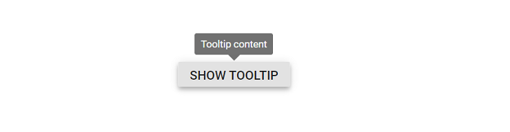

# Getting Started with Syncfusion Tooltip Component in Vue 3

This section explains how to use Tooltip component in Vue 3 application.

## Prerequisites

[System requirements for Syncfusion Vue UI components](https://ej2.syncfusion.com/vue/documentation/system-requirements/)

## Creating Vue application using Vue CLI

The easiest way to create a Vue application is to use the [`Vue CLI`](https://github.com/vuejs/vue-cli). Vue CLI versions above [`4.5.0`](https://v3.vuejs.org/guide/migration/introduction.html#vue-cli) are mandatory for creating applications using Vue 3. Use the following command to uninstall older versions of the Vue CLI.

```bash
npm uninstall vue-cli -g
```

Use the following commands to install the latest version of Vue CLI.

```bash
npm install -g @vue/cli
npm install -g @vue/cli-init
```

Create a new project using the command below.

```bash
vue create quickstart

```

Initiating a new project prompts us to choose the type of project to be used for the current application. Select the option `Default (Vue 3 Preview)` from the menu.


## Adding Syncfusion Tooltip package in the application

Syncfusion Vue packages are maintained in the [`npmjs.com`](https://www.npmjs.com/~syncfusionorg) registry. The Tooltip component will be used in this example. To install it use the following command.

```bash
npm install @syncfusion/ej2-vue-popups --save
```

## Adding CSS reference for Syncfusion Vue Tooltip component

Import the needed CSS styles for the Tooltip component along with dependency styles in the `<style>` section of the `src/App.vue` file as follows.

```
<style>
@import "../node_modules/@syncfusion/ej2-base/styles/material.css";
@import "../node_modules/@syncfusion/ej2-vue-popups/styles/material.css";
</style>
```

## Adding Syncfusion Vue Tooltip component in the application

You have completed all the necessary configurations needed for rendering the Syncfusion Vue component. Now, you are going to add the Tooltip component using following steps.

  1. Import the Tooltip component in the `<script>` section of the `src/App.vue` file.

     ```
      <script>
      import { TooltipComponent } from '@syncfusion/ej2-vue-popups';
      </script>
     ```
  2. Register the Tooltip component in `src/App.vue` file which are used in this example.

     ```js
      import { TooltipComponent } from '@syncfusion/ej2-vue-popups';
        //Component registeration
      export default {
          name: "App",
          components: {
            'ejs-tooltip' : TooltipComponent
          }
      }
     ```

     In the above code snippet, you have registered Tooltip component.
  3. Add the component definition in template section.

     ```
      <template>
          <ejs-tooltip content='Tooltip content' >
              <span>Show Tooltip</span>
          </ejs-tooltip>
      </template>
     ```

  4. Summarizing the above steps, update the `src/App.vue` file with following code.

     ```
      <template>
        <div id="app">
          <ejs-tooltip content='Tooltip content' target="#target">
              <div style="display: inline-block; position: relative; left: 50%;top: 100px;transform: translateX(-50%);">
                <button id='target' class="e-control e-btn e-lib">Show Tooltip</button>
            </div>
          </ejs-tooltip>
        </div>
      </template>
      <script>
      import { TooltipComponent } from '@syncfusion/ej2-vue-popups';

      export default {
        name: 'App',
        components: {
          'ejs-tooltip' : TooltipComponent
        },
        data() {
          return {
          };
        },
      };
      </script>
      <style>
        @import "../node_modules/@syncfusion/ej2-base/styles/material.css";
        @import "../node_modules/@syncfusion/ej2-buttons/styles/material.css";
        @import "../node_modules/@syncfusion/ej2-vue-popups/styles/material.css";
      </style>
     ```

## Running the application

Run the application using the following command.

```bash
npm run serve
```

Web server will be initiated, Open the quick start app in the browser at port [`localhost:8080`](http://localhost:8080/).



## Tooltip Positioning

Tooltips can be attached to 12 static locations around the target.
On initializing the Tooltip, you can set the position property with any one of the following values:

* `TopLeft`
* `TopCenter`
* `TopRight`
* `BottomLeft`
* `BottomCenter`
* `BottomRight`
* `LeftTop`
* `LeftCenter`
* `LeftBottom`
* `RightTop`
* `RightCenter`
* `RightBottom`

> By default, Tooltip is placed at the `TopCenter` of the target element.

In the following example, the `position` property set as `BottomCenter`.

```
  <template>
    <div id="app">
      <ejs-tooltip content="Tooltip content" :position='position' target="#tooltip">
        <div id='container'>
            <ejs-button id="tooltip">Show tooltip</ejs-button>
        </div>
      </ejs-tooltip>
    </div>
  </template>
  <script>
  import { TooltipComponent } from '@syncfusion/ej2-vue-popups';
  import { ButtonComponent } from '@syncfusion/ej2-vue-buttons';

  export default {
    name: 'App',
    components: {
      'ejs-tooltip' : TooltipComponent,
      'ejs-button' : ButtonComponent
    },
    data() {
      return {
        position: 'BottomCenter'
      };
    },
  };
  </script>
  <style>
    @import "../node_modules/@syncfusion/ej2-base/styles/material.css";
    @import "../node_modules/@syncfusion/ej2-buttons/styles/material.css";
    @import "../node_modules/@syncfusion/ej2-vue-popups/styles/material.css";
    #container {
      display: inline-block;
      position: relative;
      left: 50%;
      margin-top: 100px;
      transform: translateX(-50%);
      height: 200px;
    }

    #tooltip {
      display: inline-block;
      margin: 30px 130px 30px 50px;
    }
  </style>
  ```

You can get the following output while using above code blocks in Tooltip component.


