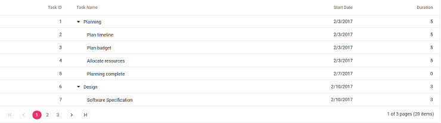
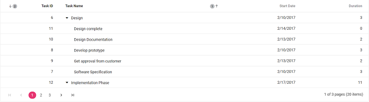
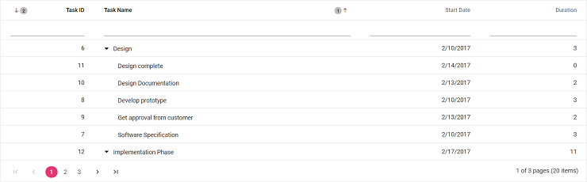

# Getting Started

This section explains how to use Tree Grid component in Vue 3 application.

## Prerequisites

[System requirements for Syncfusion Vue UI components](https://ej2.syncfusion.com/vue/documentation/system-requirements/)

## Creating Vue application using Vue CLI

The easiest way to create a Vue application is to use the [`Vue CLI`](https://github.com/vuejs/vue-cli). Vue CLI versions above [`4.5.0`](https://v3.vuejs.org/guide/migration/introduction.html#vue-cli) are mandatory for creating applications using Vue 3. Use the following command to uninstall older versions of the Vue CLI.

```bash
npm uninstall vue-cli -g

```

Use the following commands to install the latest version of Vue CLI.

```bash
npm install -g @vue/cli
npm install -g @vue/cli-init
```

Create a new project using the command below.

```bash
vue create quickstart

```

Initiating a new project prompts us to choose the type of project to be used for the current application. Select the option `Default (Vue 3)` from the menu.


## Adding Syncfusion Tree Grid package in the application

Syncfusion Vue packages are maintained in the [`npmjs.com`](https://www.npmjs.com/~syncfusionorg) registry.

To install Tree Grid component, use the following command

```bash
npm install @syncfusion/ej2-vue-treegrid --save
```

> The **--save** will instruct NPM to include the Tree Grid package inside of the `dependencies` section of the `package.json`.

## Adding CSS reference for Syncfusion Vue Tree Grid component

The Tree Grid has different themes. They are:
* Material
* Fabric
* Bootstrap
* High Contrast

Import the needed css styles for the Tree Grid component along with dependency styles in the `<style>` section of the `src/App.vue` file as follows.

```
<style>
<!-- Material theme used for this sample -->
@import "../node_modules/@syncfusion/ej2-base/styles/material.css";
@import "../node_modules/@syncfusion/ej2-buttons/styles/material.css";
@import "../node_modules/@syncfusion/ej2-calendars/styles/material.css";
@import "../node_modules/@syncfusion/ej2-dropdowns/styles/material.css";
@import "../node_modules/@syncfusion/ej2-inputs/styles/material.css";
@import "../node_modules/@syncfusion/ej2-navigations/styles/material.css";
@import "../node_modules/@syncfusion/ej2-popups/styles/material.css";
@import "../node_modules/@syncfusion/ej2-splitbuttons/styles/material.css";
@import "../node_modules/@syncfusion/ej2-vue-grids/styles/material.css";
@import "../node_modules/@syncfusion/ej2-vue-treegrid/styles/material.css";
</style>

```

Note: Tree Grid component use other Syncfusion components too, the dependent component's CSS references need to be added for using all the Tree Grid functionalities.

## Adding Syncfusion Vue Tree Grid component in the application

You have completed all the necessary configurations needed for rendering the Syncfusion Vue component. Now, you are going to add the Tree Grid component using following steps.

1. Import the Tree Grid component in the `<script>` section of the `src/App.vue` file.

   ```
   <script>
   import { TreeGridComponent, ColumnsDirective, ColumnDirective } from '@syncfusion/ej2-vue-treegrid';
   </script>
  
   ```

2. Register the Tree Grid component along with the required child directives which are used in this example. Find the list of child directives and the tag names that can be used in the Tree Grid component in the following table.
  
   | Directive Name   | Tag Name    |
   |------------------|-------------|
   | `ColumnsDirective` | `e-columns` |
   | `ColumnDirective`  | `e-column`  |

   ```js

   import { TreeGridComponent, ColumnsDirective, ColumnDirective } from '@syncfusion/ej2-vue-treegrid';
     //Component registeration
   export default {
       name: "App",
       components: {
         'ejs-treegrid' : TreeGridComponent,
         'e-columns' : ColumnsDirective,
         'e-column' : ColumnDirective
        }
   }

   ```

   In the above code snippet, you have registered Tree Grid and the column directives. Column directives are used to define the column definition for the Tree Grid component.

3. Add the Vue Tree Grid by using `<ejs-treegrid>` selector in `<template>` section.

   ```
   <template>
       <ejs-treegrid :dataSource='data' :treeColumnIndex='1' childMapping='subtasks'>
           <e-columns>
               <e-column field='taskID' headerText='Task ID' textAlign='Right' width=70></e-column>
               <e-column field='taskName' headerText='Task Name' textAlign='Left' width=200></e-column>
               <e-column field='startDate' headerText='Start Date' textAlign='Right' format='yMd' width=90></e-column>
               <e-column field='duration' headerText='Duration' textAlign='Right' width=80></e-column>
          </e-columns>
       </ejs-treegrid>
   </template>
  
   ```

   In the above code example for Tree Grid component definition, with `dataSource` property binding and columns definitions. In the `dataSource` property binding, we represent the hierarchical data binding in which [`chilMapping`](https://ej2.syncfusion.com/vue/documentation/api/treegrid/#chilmapping)  property denotes the hierarchy relationship; whereas in self-referencing data binding [`idMapping`](https://ej2.syncfusion.com/vue/documentation/api/treegrid/#idmapping)  and [`parentIdMapping`](https://ej2.syncfusion.com/vue/documentation/api/treegrid/#parentidmapping) denotes the hierarchy relationship.

4. Declare the bound properties in the `script` section. Declare the collection `data` which is bound for the `dataSource` property.

   ```js
   data() {
     return {
       data:  [{
            taskID: 1,
            taskName: 'Planning', startDate: new Date('02/03/2017'), endDate: new Date('02/07/2017'),      progress: 100, duration: 5, priority: 'Normal', approved: false,
            subtasks: [
                { taskID: 2, taskName: 'Plan timeline', startDate: new Date('02/03/2017'), endDate: new Date('02/07/2017'), duration: 5, progress: 100, priority: 'Normal', approved: false },
                { taskID: 3, taskName: 'Plan budget', startDate: new Date('02/03/2017'), endDate: new Date('02/07/2017'), duration: 5, progress: 100, approved: true },
                { taskID: 4, taskName: 'Allocate resources', startDate: new Date('02/03/2017'), endDate: new Date('02/07/2017'), duration: 5, progress: 100, priority: 'Critical', approved: false },
                { taskID: 5, taskName: 'Planning complete', startDate: new Date('02/07/2017'), endDate: new Date('02/07/2017'), duration: 0, progress: 0, priority: 'Low', approved: true }
            ]
        },
        {
            taskID: 6, taskName: 'Design', startDate: new Date('02/10/2017'), endDate: new Date('02/14/2017'), duration: 3, progress: 86, priority: 'High', approved: false,
            subtasks: [
                { taskID: 7, taskName: 'Software Specification', startDate: new Date('02/10/2017'), endDate: new Date('02/12/2017'), duration: 3, progress: 60, priority: 'Normal', approved: false },
                { taskID: 8, taskName: 'Develop prototype', startDate: new Date('02/10/2017'), endDate: new Date('02/12/2017'), duration: 3, progress: 100, priority: 'Critical', approved: false },
                { taskID: 9, taskName: 'Get approval from customer', startDate: new Date('02/13/2017'), endDate: new Date('02/14/2017'), duration: 2, progress: 100, approved: true },
                { taskID: 10, taskName: 'Design Documentation', startDate: new Date('02/13/2017'), endDate: new Date('02/14/2017'), duration: 2, progress: 100, approved: true },
                { taskID: 11, taskName: 'Design complete', startDate: new Date('02/14/2017'), endDate: new Date('02/14/2017'), duration: 0, progress: 0, priority: 'Normal', approved: true }
            ]
        }]
     };
   }
   ```

5. To create Tree Grid with additional features, inject the required modules. The following modules are used to extend Tree Grid's basic functionality.

    * `Page`- Inject this module to use paging feature.
    * `Sort` - Inject this module to use sorting feature.
    * `Filter` - Inject this module to use filtering feature.
    * `ExcelExport` - Inject this module to use Excel export feature.
    * `PdfExport` - Inject this module to use PDF export feature.

  Register the required array of modules under the key `treegrid` in the `provide` section.

  > Additional feature modules are available [here](./module)

## Enable Paging

The paging feature enables users to view the Tree Grid record in a paged view. It can be enabled by setting the  [`allowPaging`](https://ej2.syncfusion.com/vue/documentation/api/treegrid/#allowpaging) property to true. Also, need to inject the `Page` module in the `provide` section as follows. If the `Page` module is not injected, the pager will not be rendered in the       Tree Grid. The pager can be customized using the [`pageSettings`](https://ej2.syncfusion.com/vue/documentation/api/treegrid/pageSettings) property.

In root-level paging mode, paging is based on the root-level rows only i.e., it ignores the child rows count and it can be enabled by using the [`pageSettings.pageSizeMode`](https://ej2.syncfusion.com/vue/documentation/api/treegrid/pageSettingsModel/#pagesizemode) property.

```
<template>
    <ejs-treegrid :dataSource='data' :treeColumnIndex='1' childMapping='subtasks' :allowPaging="true" :pageSettings='pageSettings'>
        <e-columns>
            <e-column field='taskID' headerText='Task ID' textAlign='Right' width=70></e-column>
            <e-column field='taskName' headerText='Task Name' textAlign='Left' width=200></e-column>
            <e-column field='startDate' headerText='Start Date' textAlign='Right' format='yMd' width=90></e-column>
            <e-column field='duration' headerText='Duration' textAlign='Right' width=80></e-column>
        </e-columns>
    </ejs-treegrid>
</template>
<script>
import { TreeGridComponent, ColumnsDirective, ColumnDirective, Page } from '@syncfusion/ej2-vue-treegrid';

let dataSource = [{
            taskID: 1, taskName: 'Planning', startDate: new Date('02/03/2017'), endDate: new Date('02/07/2017'), progress: 100, duration: 5, priority: 'Normal', approved: false,
            subtasks: [
                { taskID: 2, taskName: 'Plan timeline', startDate: new Date('02/03/2017'), endDate: new Date('02/07/2017'), duration: 5, progress: 100, priority: 'Normal', approved: false },
                { taskID: 3, taskName: 'Plan budget', startDate: new Date('02/03/2017'), endDate: new Date('02/07/2017'), duration: 5, progress: 100, approved: true },
                { taskID: 4, taskName: 'Allocate resources', startDate: new Date('02/03/2017'), endDate: new Date('02/07/2017'), duration: 5, progress: 100, priority: 'Critical', approved: false },
                { taskID: 5, taskName: 'Planning complete', startDate: new Date('02/07/2017'), endDate: new Date('02/07/2017'), duration: 0, progress: 0, priority: 'Low', approved: true }
            ]
        },
        {
            taskID: 6, taskName: 'Design', startDate: new Date('02/10/2017'), endDate: new Date('02/14/2017'), duration: 3, progress: 86, priority: 'High', approved: false,
            subtasks: [
                { taskID: 7, taskName: 'Software Specification', startDate: new Date('02/10/2017'), endDate: new Date('02/12/2017'), duration: 3, progress: 60, priority: 'Normal', approved: false },
                { taskID: 8, taskName: 'Develop prototype', startDate: new Date('02/10/2017'), endDate: new Date('02/12/2017'), duration: 3, progress: 100, priority: 'Critical', approved: false },
                { taskID: 9, taskName: 'Get approval from customer', startDate: new Date('02/13/2017'), endDate: new Date('02/14/2017'), duration: 2, progress: 100, approved: true },
                { taskID: 10, taskName: 'Design Documentation', startDate: new Date('02/13/2017'), endDate: new Date('02/14/2017'), duration: 2, progress: 100, approved: true },
                { taskID: 11, taskName: 'Design complete', startDate: new Date('02/14/2017'), endDate: new Date('02/14/2017'), duration: 0, progress: 0, priority: 'Normal', approved: true }
            ]
        },
        {
            taskID: 12, taskName: 'Implementation Phase', startDate: new Date('02/17/2017'), endDate: new Date('02/27/2017'), priority: 'Normal', approved: false, duration: 11,
            subtasks: [
                {
                    taskID: 13, taskName: 'Phase 1', startDate: new Date('02/17/2017'), endDate: new Date('02/27/2017'), priority: 'High', approved: false, duration: 11,
                    subtasks: [{
                            taskID: 14, taskName: 'Implementation Module 1', startDate: new Date('02/17/2017'), endDate: new Date('02/27/2017'), priority: 'Normal', duration: 11, approved: false,
                            subtasks: [
                                { taskID: 15, taskName: 'Development Task 1', startDate: new Date('02/17/2017'), endDate: new Date('02/19/2017'), duration: 3, progress: '50', priority: 'High', approved: false },
                                { taskID: 16, taskName: 'Development Task 2', startDate: new Date('02/17/2017'), endDate: new Date('02/19/2017'), duration: 3, progress: '50', priority: 'Low', approved: true },
                                { taskID: 17, taskName: 'Testing', startDate: new Date('02/20/2017'), endDate: new Date('02/21/2017'), duration: 2, progress: '0', priority: 'Normal', approved: true },
                                { taskID: 18, taskName: 'Bug fix', startDate: new Date('02/24/2017'), endDate: new Date('02/25/2017'), duration: 2, progress: '0', priority: 'Critical', approved: false },
                                { taskID: 19, taskName: 'Customer review meeting', startDate: new Date('02/26/2017'), endDate: new Date('02/27/2017'), duration: 2, progress: '0', priority: 'High', approved: false },
                                { taskID: 20, taskName: 'Phase 1 complete', startDate: new Date('02/27/2017'), endDate: new Date('02/27/2017'), duration: 0, priority: 'Low', approved: true }
                            ]
                        }]
                }]
        }];

export default {
  name: "App",
  // Declaring component and its directives
    components: {
      'ejs-treegrid' : TreeGridComponent,
      "e-columns": ColumnsDirective,
      "e-column": ColumnDirective,
    },
  // Bound properties declaration
  data() {
    return {
      data: dataSource,
      pageSettings: { pageSize: 7 }
    };
  },
  provide: {
    treegrid: [Page]
  }
};
</script>
<style>
  @import "../node_modules/@syncfusion/ej2-base/styles/material.css";
  @import "../node_modules/@syncfusion/ej2-buttons/styles/material.css";
  @import "../node_modules/@syncfusion/ej2-calendars/styles/material.css";
  @import "../node_modules/@syncfusion/ej2-dropdowns/styles/material.css";
  @import "../node_modules/@syncfusion/ej2-inputs/styles/material.css";
  @import "../node_modules/@syncfusion/ej2-navigations/styles/material.css";
  @import "../node_modules/@syncfusion/ej2-popups/styles/material.css";
  @import "../node_modules/@syncfusion/ej2-splitbuttons/styles/material.css";
  @import "../node_modules/@syncfusion/ej2-vue-grids/styles/material.css";
  @import "../node_modules/@syncfusion/ej2-vue-treegrid/styles/material.css";
</style>
```



## Enable Sorting

The sorting feature enables the user to order the records. It can be enabled by setting [`allowSorting`](https://ej2.syncfusion.com/vue/documentation/api/treegrid/#allowsorting) property to true. Also, need to inject the `Sort` module in the `provide` section as follow. If we didn't inject the `Sort` module, then user not able to sort when click on headers. Sorting feature can be customized using [`sortSettings`](https://ej2.syncfusion.com/vue/documentation/api/treegrid/sortSettings) property.

```
<template>
    <ejs-treegrid :dataSource='data' :treeColumnIndex='1' childMapping='subtasks' :allowPaging="true" :pageSettings='pageSettings' :allowSorting='true' :sortSettings='sortSettings'>
        <e-columns>
            <e-column field='taskID' headerText='Task ID' textAlign='Right' width=70></e-column>
            <e-column field='taskName' headerText='Task Name' textAlign='Left' width=200></e-column>
            <e-column field='startDate' headerText='Start Date' textAlign='Right' format='yMd' width=90></e-column>
            <e-column field='duration' headerText='Duration' textAlign='Right' width=80></e-column>
        </e-columns>
    </ejs-treegrid>
</template>
<script>
import { TreeGridComponent, ColumnsDirective, ColumnDirective, Page, Sort } from '@syncfusion/ej2-vue-treegrid';

let dataSource = [{
            taskID: 1, taskName: 'Planning', startDate: new Date('02/03/2017'), endDate: new Date('02/07/2017'), progress: 100, duration: 5, priority: 'Normal', approved: false,
            subtasks: [
                { taskID: 2, taskName: 'Plan timeline', startDate: new Date('02/03/2017'), endDate: new Date('02/07/2017'), duration: 5, progress: 100, priority: 'Normal', approved: false },
                { taskID: 3, taskName: 'Plan budget', startDate: new Date('02/03/2017'), endDate: new Date('02/07/2017'), duration: 5, progress: 100, approved: true },
                { taskID: 4, taskName: 'Allocate resources', startDate: new Date('02/03/2017'), endDate: new Date('02/07/2017'), duration: 5, progress: 100, priority: 'Critical', approved: false },
                { taskID: 5, taskName: 'Planning complete', startDate: new Date('02/07/2017'), endDate: new Date('02/07/2017'), duration: 0, progress: 0, priority: 'Low', approved: true }
            ]
        },
        {
            taskID: 6, taskName: 'Design', startDate: new Date('02/10/2017'), endDate: new Date('02/14/2017'), duration: 3, progress: 86, priority: 'High', approved: false,
            subtasks: [
                { taskID: 7, taskName: 'Software Specification', startDate: new Date('02/10/2017'), endDate: new Date('02/12/2017'), duration: 3, progress: 60, priority: 'Normal', approved: false },
                { taskID: 8, taskName: 'Develop prototype', startDate: new Date('02/10/2017'), endDate: new Date('02/12/2017'), duration: 3, progress: 100, priority: 'Critical', approved: false },
                { taskID: 9, taskName: 'Get approval from customer', startDate: new Date('02/13/2017'), endDate: new Date('02/14/2017'), duration: 2, progress: 100, approved: true },
                { taskID: 10, taskName: 'Design Documentation', startDate: new Date('02/13/2017'), endDate: new Date('02/14/2017'), duration: 2, progress: 100, approved: true },
                { taskID: 11, taskName: 'Design complete', startDate: new Date('02/14/2017'), endDate: new Date('02/14/2017'), duration: 0, progress: 0, priority: 'Normal', approved: true }
            ]
        },
        {
            taskID: 12, taskName: 'Implementation Phase', startDate: new Date('02/17/2017'), endDate: new Date('02/27/2017'), priority: 'Normal', approved: false, duration: 11,
            subtasks: [
                {
                    taskID: 13, taskName: 'Phase 1', startDate: new Date('02/17/2017'), endDate: new Date('02/27/2017'), priority: 'High', approved: false, duration: 11,
                    subtasks: [{
                            taskID: 14, taskName: 'Implementation Module 1', startDate: new Date('02/17/2017'), endDate: new Date('02/27/2017'), priority: 'Normal', duration: 11, approved: false,
                            subtasks: [
                                { taskID: 15, taskName: 'Development Task 1', startDate: new Date('02/17/2017'), endDate: new Date('02/19/2017'), duration: 3, progress: '50', priority: 'High', approved: false },
                                { taskID: 16, taskName: 'Development Task 2', startDate: new Date('02/17/2017'), endDate: new Date('02/19/2017'), duration: 3, progress: '50', priority: 'Low', approved: true },
                                { taskID: 17, taskName: 'Testing', startDate: new Date('02/20/2017'), endDate: new Date('02/21/2017'), duration: 2, progress: '0', priority: 'Normal', approved: true },
                                { taskID: 18, taskName: 'Bug fix', startDate: new Date('02/24/2017'), endDate: new Date('02/25/2017'), duration: 2, progress: '0', priority: 'Critical', approved: false },
                                { taskID: 19, taskName: 'Customer review meeting', startDate: new Date('02/26/2017'), endDate: new Date('02/27/2017'), duration: 2, progress: '0', priority: 'High', approved: false },
                                { taskID: 20, taskName: 'Phase 1 complete', startDate: new Date('02/27/2017'), endDate: new Date('02/27/2017'), duration: 0, priority: 'Low', approved: true }
                            ]
                        }]
                }]
        }];

export default {
  name: "App",
  // Declaring component and its directives
    components: {
      'ejs-treegrid' : TreeGridComponent,
      "e-columns": ColumnsDirective,
      "e-column": ColumnDirective,
    },
  // Bound properties declaration
  data() {
    return {
      data: dataSource,
      sortSettings: { columns: [{ field: 'taskName', direction: 'Ascending' }, { field: 'taskID', direction: 'Descending' }]  },
      pageSettings: { pageSize: 7 }
    };
  },
  provide: {
    treegrid: [Page, Sort]
  }
};
</script>
<style>
  @import "../node_modules/@syncfusion/ej2-base/styles/material.css";
  @import "../node_modules/@syncfusion/ej2-buttons/styles/material.css";
  @import "../node_modules/@syncfusion/ej2-calendars/styles/material.css";
  @import "../node_modules/@syncfusion/ej2-dropdowns/styles/material.css";
  @import "../node_modules/@syncfusion/ej2-inputs/styles/material.css";
  @import "../node_modules/@syncfusion/ej2-navigations/styles/material.css";
  @import "../node_modules/@syncfusion/ej2-popups/styles/material.css";
  @import "../node_modules/@syncfusion/ej2-splitbuttons/styles/material.css";
  @import "../node_modules/@syncfusion/ej2-vue-grids/styles/material.css";
  @import "../node_modules/@syncfusion/ej2-vue-treegrid/styles/material.css";
</style>

```



## Enable Filtering

The filtering feature enables you to view the reduced amount of records based on the filter criteria. It can be enabled by setting the [`allowFiltering`](https://ej2.syncfusion.com/vue/documentation/api/treegrid/#allowfiltering) property to true.  Also, need to inject the `Filter` module in the `provide` section as follow. If `Filter` module is not injected, filter bar will not be rendered in Tree Grid. Filtering feature can be customized using the [`filterSettings`](https://ej2.syncfusion.com/vue/documentation/api/treegrid/#filterSettings) property.

By default, filtered records are shown along with its parent records. This behavior can be changed by using the [`filterSettings-hierarchyMode`](https://ej2.syncfusion.com/vue/documentation/api/treegrid/filterSettings/#hierarchymode) property.

```
<template>
    <ejs-treegrid :dataSource='data' :treeColumnIndex='1' :allowFiltering='true'
          :sortSettings='sortSettings'
          :allowSorting='true' childMapping='subtasks' :allowPaging="true" :pageSettings='pageSettings'>
        <e-columns>
            <e-column field='taskID' headerText='Task ID' textAlign='Right' width=70></e-column>
            <e-column field='taskName' headerText='Task Name' textAlign='Left' width=200></e-column>
            <e-column field='startDate' headerText='Start Date' textAlign='Right' format='yMd' width=90></e-column>
            <e-column field='duration' headerText='Duration' textAlign='Right' width=80></e-column>
        </e-columns>
    </ejs-treegrid>
</template>
<script>
import { TreeGridComponent, ColumnsDirective, ColumnDirective, Page, Sort, Filter } from '@syncfusion/ej2-vue-treegrid';

let dataSource = [{
            taskID: 1,
            taskName: 'Planning', startDate: new Date('02/03/2017'), endDate: new Date('02/07/2017'),      progress: 100, duration: 5, priority: 'Normal', approved: false,
            subtasks: [
                { taskID: 2, taskName: 'Plan timeline', startDate: new Date('02/03/2017'), endDate: new Date('02/07/2017'), duration: 5, progress: 100, priority: 'Normal', approved: false },
                { taskID: 3, taskName: 'Plan budget', startDate: new Date('02/03/2017'), endDate: new Date('02/07/2017'), duration: 5, progress: 100, approved: true },
                { taskID: 4, taskName: 'Allocate resources', startDate: new Date('02/03/2017'), endDate: new Date('02/07/2017'), duration: 5, progress: 100, priority: 'Critical', approved: false },
                { taskID: 5, taskName: 'Planning complete', startDate: new Date('02/07/2017'), endDate: new Date('02/07/2017'), duration: 0, progress: 0, priority: 'Low', approved: true }
            ]
        },
        {
            taskID: 6, taskName: 'Design', startDate: new Date('02/10/2017'), endDate: new Date('02/14/2017'), duration: 3, progress: 86, priority: 'High', approved: false,
            subtasks: [
                { taskID: 7, taskName: 'Software Specification', startDate: new Date('02/10/2017'), endDate: new Date('02/12/2017'), duration: 3, progress: 60, priority: 'Normal', approved: false },
                { taskID: 8, taskName: 'Develop prototype', startDate: new Date('02/10/2017'), endDate: new Date('02/12/2017'), duration: 3, progress: 100, priority: 'Critical', approved: false },
                { taskID: 9, taskName: 'Get approval from customer', startDate: new Date('02/13/2017'), endDate: new Date('02/14/2017'), duration: 2, progress: 100, approved: true },
                { taskID: 10, taskName: 'Design Documentation', startDate: new Date('02/13/2017'), endDate: new Date('02/14/2017'), duration: 2, progress: 100, approved: true },
                { taskID: 11, taskName: 'Design complete', startDate: new Date('02/14/2017'), endDate: new Date('02/14/2017'), duration: 0, progress: 0, priority: 'Normal', approved: true }
            ]
        },
        {
            taskID: 12, taskName: 'Implementation Phase', startDate: new Date('02/17/2017'), endDate: new Date('02/27/2017'), priority: 'Normal', approved: false, duration: 11,
            subtasks: [
                {
                    taskID: 13, taskName: 'Phase 1', startDate: new Date('02/17/2017'), endDate: new Date('02/27/2017'), priority: 'High', approved: false, duration: 11,
                    subtasks: [{
                            taskID: 14, taskName: 'Implementation Module 1',  startDate: new Date('02/17/2017'), endDate: new Date('02/27/2017'), priority: 'Normal', duration: 11, approved: false,
                            subtasks: [
                                { taskID: 15, taskName: 'Development Task 1', startDate: new Date('02/17/2017'), endDate: new Date('02/19/2017'), duration: 3, progress: '50', priority: 'High', approved: false },
                                { taskID: 16, taskName: 'Development Task 2', startDate: new Date('02/17/2017'), endDate: new Date('02/19/2017'), duration: 3, progress: '50', priority: 'Low', approved: true },
                                { taskID: 17, taskName: 'Testing', startDate: new Date('02/20/2017'), endDate: new Date('02/21/2017'), duration: 2, progress: '0', priority: 'Normal', approved: true },
                                { taskID: 18, taskName: 'Bug fix', startDate: new Date('02/24/2017'), endDate: new Date('02/25/2017'), duration: 2, progress: '0', priority: 'Critical', approved: false },
                                { taskID: 19, taskName: 'Customer review meeting', startDate: new Date('02/26/2017'), endDate: new Date('02/27/2017'), duration: 2, progress: '0', priority: 'High', approved: false },
                                { taskID: 20, taskName: 'Phase 1 complete', startDate: new Date('02/27/2017'), endDate: new Date('02/27/2017'), duration: 0, priority: 'Low', approved: true }
                            ]
                        }]
                }]
        }];

export default {
  name: "App",
  // Declaring component and its directives
    components: {
      'ejs-treegrid' : TreeGridComponent,
      "e-columns": ColumnsDirective,
      "e-column": ColumnDirective,
    },
  // Bound properties declaration
  data() {
    return {
      data: dataSource,
      sortSettings: { columns: [{ field: 'taskName', direction: 'Ascending' }, { field: 'taskID', direction: 'Descending' }]  },
      pageSettings: { pageSize: 7 }
    };
  },
  provide: {
    treegrid: [Page, Sort, Filter]
  }
};
</script>
<style>
  @import "../node_modules/@syncfusion/ej2-base/styles/material.css";
  @import "../node_modules/@syncfusion/ej2-buttons/styles/material.css";
  @import "../node_modules/@syncfusion/ej2-calendars/styles/material.css";
  @import "../node_modules/@syncfusion/ej2-dropdowns/styles/material.css";
  @import "../node_modules/@syncfusion/ej2-inputs/styles/material.css";
  @import "../node_modules/@syncfusion/ej2-navigations/styles/material.css";
  @import "../node_modules/@syncfusion/ej2-popups/styles/material.css";
  @import "../node_modules/@syncfusion/ej2-splitbuttons/styles/material.css";
  @import "../node_modules/@syncfusion/ej2-vue-grids/styles/material.css";
  @import "../node_modules/@syncfusion/ej2-vue-treegrid/styles/material.css";
</style>

```



## Running the application

Run the application using the following command.

```bash
npm run serve
```

Web server will be initiated, Open the quick start app in the browser at port [`localhost:8080`](http://localhost:8080/).
