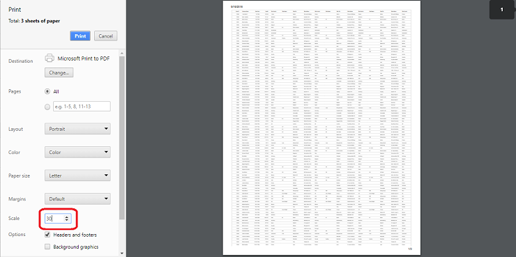

# Print in Vue Treegrid component

To print the TreeGrid, use the [`print`](https://ej2.syncfusion.com/vue/documentation/api/treegrid/#print) method from treegrid instance. The print option can be displayed on the [`toolbar`](https://ej2.syncfusion.com/vue/documentation/api/treegrid/#toolbar) by adding the `print` toolbar item.









        


## Page setup

Some of the print options cannot be configured through JavaScript code. So, you have to customize the layout, paper size, and margin options using the browser page setup dialog. Please refer to the following links to know more about the browser page setup:

* [`Chrome`](https://support.google.com/chrome/answer/1069693?hl=en&visit_id=1-636335333734668335-3165046395&rd=1)
* [`Firefox`](https://support.mozilla.org/en-US/kb/how-print-web-pages-firefox)
* [`Safari`](http://www.mintprintables.com/print-tips/adjust-margins-osx/)
* [`IE`](http://www.helpteaching.com/help/print/index.htm)

## Print using an external button

To print the treegrid from an external button, invoke the [`print`](https://ej2.syncfusion.com/vue/documentation/api/treegrid/#print) method.









        


## Print visible Page

By default, the grid prints all the pages. To print the current page alone, set the [`printMode`](https://ej2.syncfusion.com/vue/documentation/api/grid/#printmode) to `CurrentPage`.









        


## Print large number of columns

By default, the browser uses A4 as page size option to print pages and to adapt the size of the page the browser print preview will auto-hide the overflowed contents. Hence treegrid with large number of columns will cut off to adapt the print page.

To show large number of columns when printing, adjust the scale option from print option panel based on your content size.

## Show or Hide columns while Printing

You can show a hidden column or hide a visible column while printing the treegrid using [`toolbarClick`](https://ej2.syncfusion.com/vue/documentation/api/treegrid/#toolbarclick) and [`printComplete`](https://ej2.syncfusion.com/vue/documentation/api/treegrid/#printcomplete) events.

In the `toolbarClick` event, based on `args.item.text` as `Print`. We can show or hide columns by setting `column.visible` property to `true` or `false` respectively.

In the printComplete event, We have reversed the state back to the previous state.

In the below example, we have `Duration` as a hidden column in the treegrid. While printing, we have changed `Duration` to visible column and `StartDate` as hidden column.









        


## Limitations of Printing Large Data

When treegrid contains large number of data, printing all the data at once is not a best option for the browser performance. Because to render all the DOM elements in one page will produce performance issues in the browser. It leads to browser slow down or browser hang.

If printing of all the data is still needed, we suggest to Export the treegrid to `Excel` or `CSV` or `Pdf` and then print it from another non-web based application.