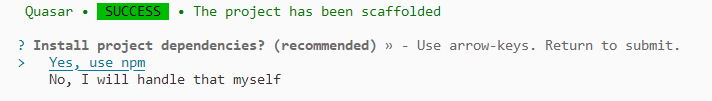
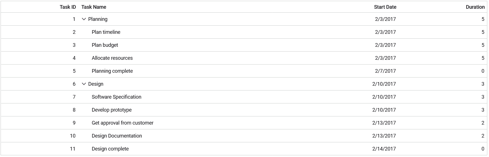

# Getting Started with the Vue Tree Grid Component in the Quasar Framework

This article provides a step-by-step guide for setting up a [Quasar](https://quasar.dev/) project and integrating the Syncfusion Vue Tree Grid component using the [Composition API](https://vuejs.org/guide/introduction.html#composition-api).

The `Quasar` Framework is a Vue.js-based open-source framework that empowers developers to create high-performance and responsive applications across various platforms, such as web, mobile, and desktop.

## Prerequisites

[System requirements for Syncfusion Vue UI components](../system-requirements)

## Set up the Quasar project

To initiate the creation of a new [Quasar](https://quasar.dev/start/quick-start/) project, use the following commands:

```bash
npm init quasar
```

This command prompts additional configurations. Follow the steps outlined in the images below:


This generates the necessary files and prompts for project dependency installation. Respond with 'yes' to proceed with npm install, as shown in the image below:



Navigate to your project directory:

```bash
cd quasar-project
```

Now that `quasar-project` is ready to run with default settings, let's add Syncfusion components to the project.

## Add the Syncfusion Vue packages

Syncfusion Vue component packages are available at [npmjs.com](https://www.npmjs.com/search?q=ej2-vue). To use Syncfusion Vue components in the project, install the corresponding npm package.

This article uses the [Vue Grid component](https://www.syncfusion.com/vue-components/vue-tree-grid) as an example. To use the Vue Tree Grid component in the project, the `@syncfusion/ej2-vue-treegrid` package needs to be installed using the following command:

```bash
npm install @syncfusion/ej2-vue-treegrid --save
```

## Import Syncfusion CSS styles

You can import themes for the Syncfusion Vue component in various ways, such as using CSS or SASS styles from npm packages, CDN, CRG and [Theme Studio](https://ej2.syncfusion.com/vue/documentation/appearance/theme-studio/). Refer to the [themes topic](https://ej2.syncfusion.com/vue/documentation/appearance/theme/) to learn more about built-in themes and different ways to refer to themes in a Vue project.

In this article, the `Material 3` theme is applied using CSS styles, which are available in installed packages. The necessary `Material 3` CSS styles for the Tree Grid component and its dependents were imported into the `<style>` section of the **src/app.vue** file.




<style>
@import "../node_modules/@syncfusion/ej2-base/styles/material3.css";
@import "../node_modules/@syncfusion/ej2-buttons/styles/material3.css";
@import "../node_modules/@syncfusion/ej2-calendars/styles/material3.css";
@import "../node_modules/@syncfusion/ej2-dropdowns/styles/material3.css";
@import "../node_modules/@syncfusion/ej2-inputs/styles/material3.css";
@import "../node_modules/@syncfusion/ej2-navigations/styles/material3.css";
@import "../node_modules/@syncfusion/ej2-popups/styles/material3.css";
@import "../node_modules/@syncfusion/ej2-splitbuttons/styles/material3.css";
@import "../node_modules/@syncfusion/ej2-grids/styles/material3.css";
@import "../node_modules/@syncfusion/ej2-vue-treegrid/styles/material3.css";
</style>




> The order of importing CSS styles should be in line with their dependency graph.
## Add the Syncfusion Vue component

Follow the below steps to add the Vue Tree Grid component:

1\. First, add the `setup` attribute to the `script` tag to indicate that Vue will be using the `Composition API`. And import the Tree Grid component and its child directives in the `script` section of the **src/app.vue** file.




<script setup>
  import { TreeGridComponent as EjsTreegrid, ColumnsDirective as EColumns, ColumnDirective as EColumn } from '@syncfusion/ej2-vue-treegrid';
</script>




2\. Then, define the Tree Grid component in the **src/app.vue** file, as shown below:




<template>
  <ejs-treegrid :dataSource='data' :treeColumnIndex='1' childMapping='subtasks'>
      <e-columns>
          <e-column field='taskID' headerText='Task ID' textAlign='Right' width=70></e-column>
          <e-column field='taskName' headerText='Task Name' textAlign='Left' width=200></e-column>
          <e-column field='startDate' headerText='Start Date' textAlign='Right' format='yMd' width=90></e-column>
          <e-column field='duration' headerText='Duration' textAlign='Right' width=80></e-column>
      </e-columns>
  </ejs-treegrid>
</template>




3\. Declare the values for the `dataSource` property in the `script` section.




<script setup>
const data = [
  {
            taskID: 1,
            taskName: 'Planning', startDate: new Date('02/03/2017'), endDate: new Date('02/07/2017'),      progress: 100, duration: 5, priority: 'Normal', approved: false,
            subtasks: [
                { taskID: 2, taskName: 'Plan timeline', startDate: new Date('02/03/2017'), endDate: new Date('02/07/2017'), duration: 5, progress: 100, priority: 'Normal', approved: false },
                { taskID: 3, taskName: 'Plan budget', startDate: new Date('02/03/2017'), endDate: new Date('02/07/2017'), duration: 5, progress: 100, approved: true },
                { taskID: 4, taskName: 'Allocate resources', startDate: new Date('02/03/2017'), endDate: new Date('02/07/2017'), duration: 5, progress: 100, priority: 'Critical', approved: false },
                { taskID: 5, taskName: 'Planning complete', startDate: new Date('02/07/2017'), endDate: new Date('02/07/2017'), duration: 0, progress: 0, priority: 'Low', approved: true }
            ]
        },
        {
            taskID: 6, taskName: 'Design', startDate: new Date('02/10/2017'), endDate: new Date('02/14/2017'), duration: 3, progress: 86, priority: 'High', approved: false,
            subtasks: [
                { taskID: 7, taskName: 'Software Specification', startDate: new Date('02/10/2017'), endDate: new Date('02/12/2017'), duration: 3, progress: 60, priority: 'Normal', approved: false },
                { taskID: 8, taskName: 'Develop prototype', startDate: new Date('02/10/2017'), endDate: new Date('02/12/2017'), duration: 3, progress: 100, priority: 'Critical', approved: false },
                { taskID: 9, taskName: 'Get approval from customer', startDate: new Date('02/13/2017'), endDate: new Date('02/14/2017'), duration: 2, progress: 100, approved: true },
                { taskID: 10, taskName: 'Design Documentation', startDate: new Date('02/13/2017'), endDate: new Date('02/14/2017'), duration: 2, progress: 100, approved: true },
                { taskID: 11, taskName: 'Design complete', startDate: new Date('02/14/2017'), endDate: new Date('02/14/2017'), duration: 0, progress: 0, priority: 'Normal', approved: true }
            ]
        }
];
</script>




Here is the summarized code for the above steps in the **src/app.vue** file:




<template>
  <ejs-treegrid :dataSource='data' :treeColumnIndex='1' childMapping='subtasks'>
      <e-columns>
          <e-column field='taskID' headerText='Task ID' textAlign='Right' width=70></e-column>
          <e-column field='taskName' headerText='Task Name' textAlign='Left' width=200></e-column>
          <e-column field='startDate' headerText='Start Date' textAlign='Right' format='yMd' width=90></e-column>
          <e-column field='duration' headerText='Duration' textAlign='Right' width=80></e-column>
      </e-columns>
  </ejs-treegrid>
</template>

<script setup>
import { TreeGridComponent as EjsTreegrid, ColumnsDirective as EColumns, ColumnDirective as EColumn } from '@syncfusion/ej2-vue-treegrid';
const data = [
{
          taskID: 1,
          taskName: 'Planning', startDate: new Date('02/03/2017'), endDate: new Date('02/07/2017'),      progress: 100, duration: 5, priority: 'Normal', approved: false,
          subtasks: [
              { taskID: 2, taskName: 'Plan timeline', startDate: new Date('02/03/2017'), endDate: new Date('02/07/2017'), duration: 5, progress: 100, priority: 'Normal', approved: false },
              { taskID: 3, taskName: 'Plan budget', startDate: new Date('02/03/2017'), endDate: new Date('02/07/2017'), duration: 5, progress: 100, approved: true },
              { taskID: 4, taskName: 'Allocate resources', startDate: new Date('02/03/2017'), endDate: new Date('02/07/2017'), duration: 5, progress: 100, priority: 'Critical', approved: false },
              { taskID: 5, taskName: 'Planning complete', startDate: new Date('02/07/2017'), endDate: new Date('02/07/2017'), duration: 0, progress: 0, priority: 'Low', approved: true }
          ]
      },
      {
          taskID: 6, taskName: 'Design', startDate: new Date('02/10/2017'), endDate: new Date('02/14/2017'), duration: 3, progress: 86, priority: 'High', approved: false,
          subtasks: [
              { taskID: 7, taskName: 'Software Specification', startDate: new Date('02/10/2017'), endDate: new Date('02/12/2017'), duration: 3, progress: 60, priority: 'Normal', approved: false },
              { taskID: 8, taskName: 'Develop prototype', startDate: new Date('02/10/2017'), endDate: new Date('02/12/2017'), duration: 3, progress: 100, priority: 'Critical', approved: false },
              { taskID: 9, taskName: 'Get approval from customer', startDate: new Date('02/13/2017'), endDate: new Date('02/14/2017'), duration: 2, progress: 100, approved: true },
              { taskID: 10, taskName: 'Design Documentation', startDate: new Date('02/13/2017'), endDate: new Date('02/14/2017'), duration: 2, progress: 100, approved: true },
              { taskID: 11, taskName: 'Design complete', startDate: new Date('02/14/2017'), endDate: new Date('02/14/2017'), duration: 0, progress: 0, priority: 'Normal', approved: true }
          ]
      },
];
</script>

<style>
@import "../node_modules/@syncfusion/ej2-base/styles/material3.css";
@import "../node_modules/@syncfusion/ej2-buttons/styles/material3.css";
@import "../node_modules/@syncfusion/ej2-calendars/styles/material3.css";
@import "../node_modules/@syncfusion/ej2-dropdowns/styles/material3.css";
@import "../node_modules/@syncfusion/ej2-inputs/styles/material3.css";
@import "../node_modules/@syncfusion/ej2-navigations/styles/material3.css";
@import "../node_modules/@syncfusion/ej2-popups/styles/material3.css";
@import "../node_modules/@syncfusion/ej2-splitbuttons/styles/material3.css";
@import "../node_modules/@syncfusion/ej2-grids/styles/material3.css";
@import "../node_modules/@syncfusion/ej2-vue-treegrid/styles/material3.css";
</style>




## Run the project

To run the project, use the following command:

```bash
npm run dev
```

The output will appear as follows:

