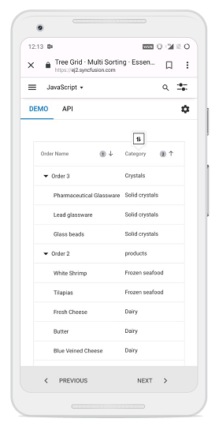

# Sorting in Vue Treegrid component

Sorting enables you to sort data in the `Ascending` or `Descending` order.
To sort a column, click the column header.

To sort multiple columns, press and hold the CTRL key and click the column header.  You can clear sorting of any one of the multi-sorted columns by pressing and holding the SHIFT key and clicking the specific column header.

To enable sorting in the TreeGrid, set the [`allowSorting`](https://ej2.syncfusion.com/vue/documentation/api/treegrid/#allowsorting) to true. Sorting options can be configured through the [`sortSettings`](https://ej2.syncfusion.com/vue/documentation/api/treegrid/sortSettings).

To sort, inject the [`Sort`](https://ej2.syncfusion.com/vue/documentation/api/treegrid/#sortmodule) module in the treegrid.






        


> * TreeGrid columns are sorted in the `Ascending` order. If you click the already sorted column, the sort direction toggles.
> * You can apply and clear sorting by invoking [`sortByColumn`](https://ej2.syncfusion.com/vue/documentation/api/treegrid/#sortbycolumn) and
[`clearSorting`](https://ej2.syncfusion.com/vue/documentation/api/treegrid/#clearsorting) methods.
> * To disable sorting for a particular column, set the [`columns.allowSorting`](https://ej2.syncfusion.com/vue/documentation/api/treegrid/column/#allowSorting) to false.

## Initial sort

To sort at initial rendering, set the [`field`](https://ej2.syncfusion.com/vue/documentation/api/treegrid/sortDescriptorModel/#field) and [`direction`](https://ej2.syncfusion.com/vue/documentation/api/treegrid/sortDescriptorModel/#direction) in the `sortSettings.columns`.






        


## Sorting events

During the sort action, the treegrid component triggers two events. The [`actionBegin`](https://ej2.syncfusion.com/vue/documentation/api/treegrid/#actionbegin) event triggers before the sort action starts, and the [`actionComplete`](https://ej2.syncfusion.com/vue/documentation/api/treegrid/#actioncomplete) event triggers after the sort action is completed. Using these events you can perform the needed actions.






        


> The `args.requestType` is the current action name. For example, in sorting the `args.requestType` value is 'sorting'.

## Touch interaction

When you tap the treegrid header on touchscreen devices, the selected column header is sorted. A popup  is displayed for multi-column sorting. To sort multiple columns, tap the popup and then tap the desired treegrid headers.

The following screenshot shows treegrid touch sorting.

