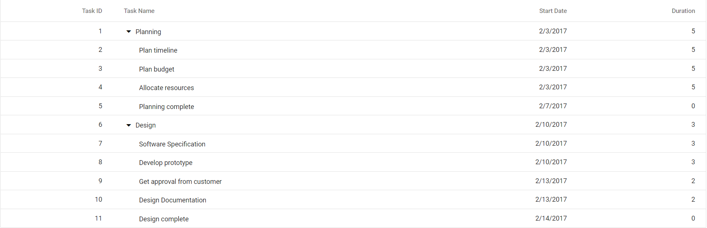

# Getting Started with the Vue Tree Grid Component in Vue 3

This article provides a step-by-step guide for setting up a [Vite](https://vitejs.dev/) project with a JavaScript environment and integrating the Syncfusion<sup style="font-size:70%">&reg;</sup> Vue Tree Grid component using the [Composition API](https://vuejs.org/guide/introduction.html#composition-api) / [Options API](https://vuejs.org/guide/introduction.html#options-api).

The `Composition API`, introduced in Vue.js 3, provides an alternative way to organize and reuse component logic.

The `Options API` is the traditional approach to writing Vue.js components, organizing component logic into a series of options that define the component's properties and behavior. These options include data, methods, computed properties, watchers, life cycle hooks, and more.

## Prerequisites

[System requirements for Syncfusion<sup style="font-size:70%">&reg;</sup> Vue UI components](https://ej2.syncfusion.com/vue/documentation/system-requirements)

## Set up the Vite project

A recommended way to get started with Vue is to scaffold a project using [Vite](https://vitejs.dev/). To create a new Vite project, execute one of the following commands that are specific to either NPM or Yarn:

```bash
npm create vite@latest
```

or

```bash
yarn create vite
```

Executing one of the above commands will prompt a series of configuration steps for the project setup:

1. Define the project name: Specify the name of the project directly. For this article, the project name is `my-project`.

```bash
? Project name: » my-project
```

2. Select `Vue` as the framework. This creates a Vue 3 project.

```bash
? Select a framework: » - Use arrow-keys. Return to submit.
Vanilla
> Vue
  React
  Preact
  Lit
  Svelte
  Others
```

3. Choose `JavaScript` as the framework variant to build this Vite project using JavaScript and Vue.

```bash
? Select a variant: » - Use arrow-keys. Return to submit.
> JavaScript
  TypeScript
  Customize with create-vue ↗
  Nuxt ↗
```

4. After completing these steps to create the `my-project`, execute the following command to install its dependencies:

```bash
cd my-project
npm install
```

or

```bash
cd my-project
yarn install
```

With `my-project` ready to run with default settings, the next step is to add Syncfusion<sup style="font-size:70%">&reg;</sup> components to the project.

## Add Syncfusion<sup style="font-size:70%">&reg;</sup> Vue packages

Syncfusion<sup style="font-size:70%">&reg;</sup> Vue component packages are available at [npmjs.com](https://www.npmjs.com/search?q=ej2-vue). To use Syncfusion<sup style="font-size:70%">&reg;</sup> Vue components in the project, install the corresponding npm package.

This article uses the [Vue Tree Grid component](https://www.syncfusion.com/vue-components/vue-tree-grid) as an example. To use the Vue Tree Grid component in the project, the `@syncfusion/ej2-vue-treegrid` package must be installed using one of the following commands:

```bash
npm install @syncfusion/ej2-vue-treegrid --save
```

or

```bash
yarn add @syncfusion/ej2-vue-treegrid
```

## Import Syncfusion<sup style="font-size:70%">&reg;</sup> CSS styles

Themes for the Syncfusion<sup style="font-size:70%">&reg;</sup> Vue component can be imported in various ways, such as using CSS or SASS styles from npm packages, CDN, [CRG](https://ej2.syncfusion.com/javascript/documentation/common/custom-resource-generator) and [Theme Studio](https://ej2.syncfusion.com/vue/documentation/appearance/theme-studio). Refer to [themes topic](https://ej2.syncfusion.com/vue/documentation/appearance/theme) to learn more about built-in themes and different ways to refer to themes in a Vue project.

In this article, the `Material` theme is applied using CSS styles, which are available in installed packages. The necessary `Material` CSS styles for the Tree Grid component and its dependents must be imported into the `<style>` section of **src/App.vue** file.




<style>
  @import "../node_modules/@syncfusion/ej2-base/styles/material.css";
  @import "../node_modules/@syncfusion/ej2-buttons/styles/material.css";
  @import "../node_modules/@syncfusion/ej2-calendars/styles/material.css";
  @import "../node_modules/@syncfusion/ej2-dropdowns/styles/material.css";
  @import "../node_modules/@syncfusion/ej2-inputs/styles/material.css";
  @import "../node_modules/@syncfusion/ej2-navigations/styles/material.css";
  @import "../node_modules/@syncfusion/ej2-popups/styles/material.css";
  @import "../node_modules/@syncfusion/ej2-splitbuttons/styles/material.css";
  @import "../node_modules/@syncfusion/ej2-vue-grids/styles/material.css";
  @import "../node_modules/@syncfusion/ej2-vue-treegrid/styles/material.css";
</style>




> The order of importing CSS styles should be in line with its dependency graph.

## Add Syncfusion<sup style="font-size:70%">&reg;</sup> Vue component

Follow the steps below to add the Vue Tree Grid component using `Composition API` or `Options API`:

  1. Import and register the Tree Grid component and its child directives in the `script` section of the **src/App.vue** file. For Composition API usage, add the `setup` attribute to the `script` tag to indicate that Vue will use the `Composition API`.




<script setup>
  import { TreeGridComponent as EjsTreegrid, ColumnsDirective as EColumns, ColumnDirective as EColumn } from '@syncfusion/ej2-vue-treegrid';
</script>




<script>
  import { TreeGridComponent, ColumnsDirective, ColumnDirective } from '@syncfusion/ej2-vue-treegrid';
//Component registration
export default {
  name: "App",
  components: {
    'ejs-treegrid' : TreeGridComponent,
    "e-columns": ColumnsDirective,
    "e-column": ColumnDirective
  }
}
</script>




2. In the `template` section, define the Tree Grid component with the [dataSource](https://ej2.syncfusion.com/vue/documentation/api/treegrid#datasource) property and column definitions.




<template>
  <ejs-treegrid :dataSource='data' :treeColumnIndex='1' childMapping='subtasks'>
      <e-columns>
          <e-column field='taskID' headerText='Task ID' textAlign='Right' width=70></e-column>
          <e-column field='taskName' headerText='Task Name' textAlign='Left' width=200></e-column>
          <e-column field='startDate' headerText='Start Date' textAlign='Right' format='yMd' width=90></e-column>
          <e-column field='duration' headerText='Duration' textAlign='Right' width=80></e-column>
      </e-columns>
  </ejs-treegrid>
</template>




3. Declare the values for the `dataSource` property in the `script` section.




<script setup>
const data = [
  {
            taskID: 1,
            taskName: 'Planning', startDate: new Date('02/03/2017'), endDate: new Date('02/07/2017'),      progress: 100, duration: 5, priority: 'Normal', approved: false,
            subtasks: [
                { taskID: 2, taskName: 'Plan timeline', startDate: new Date('02/03/2017'), endDate: new Date('02/07/2017'), duration: 5, progress: 100, priority: 'Normal', approved: false },
                { taskID: 3, taskName: 'Plan budget', startDate: new Date('02/03/2017'), endDate: new Date('02/07/2017'), duration: 5, progress: 100, approved: true },
                { taskID: 4, taskName: 'Allocate resources', startDate: new Date('02/03/2017'), endDate: new Date('02/07/2017'), duration: 5, progress: 100, priority: 'Critical', approved: false },
                { taskID: 5, taskName: 'Planning complete', startDate: new Date('02/07/2017'), endDate: new Date('02/07/2017'), duration: 0, progress: 0, priority: 'Low', approved: true }
            ]
        },
        {
            taskID: 6, taskName: 'Design', startDate: new Date('02/10/2017'), endDate: new Date('02/14/2017'), duration: 3, progress: 86, priority: 'High', approved: false,
            subtasks: [
                { taskID: 7, taskName: 'Software Specification', startDate: new Date('02/10/2017'), endDate: new Date('02/12/2017'), duration: 3, progress: 60, priority: 'Normal', approved: false },
                { taskID: 8, taskName: 'Develop prototype', startDate: new Date('02/10/2017'), endDate: new Date('02/12/2017'), duration: 3, progress: 100, priority: 'Critical', approved: false },
                { taskID: 9, taskName: 'Get approval from customer', startDate: new Date('02/13/2017'), endDate: new Date('02/14/2017'), duration: 2, progress: 100, approved: true },
                { taskID: 10, taskName: 'Design Documentation', startDate: new Date('02/13/2017'), endDate: new Date('02/14/2017'), duration: 2, progress: 100, approved: true },
                { taskID: 11, taskName: 'Design complete', startDate: new Date('02/14/2017'), endDate: new Date('02/14/2017'), duration: 0, progress: 0, priority: 'Normal', approved: true }
            ]
        }
];
</script>




<script>
data() {
  return {
    data:[
      {
            taskID: 1,
            taskName: 'Planning', startDate: new Date('02/03/2017'), endDate: new Date('02/07/2017'),      progress: 100, duration: 5, priority: 'Normal', approved: false,
            subtasks: [
                { taskID: 2, taskName: 'Plan timeline', startDate: new Date('02/03/2017'), endDate: new Date('02/07/2017'), duration: 5, progress: 100, priority: 'Normal', approved: false },
                { taskID: 3, taskName: 'Plan budget', startDate: new Date('02/03/2017'), endDate: new Date('02/07/2017'), duration: 5, progress: 100, approved: true },
                { taskID: 4, taskName: 'Allocate resources', startDate: new Date('02/03/2017'), endDate: new Date('02/07/2017'), duration: 5, progress: 100, priority: 'Critical', approved: false },
                { taskID: 5, taskName: 'Planning complete', startDate: new Date('02/07/2017'), endDate: new Date('02/07/2017'), duration: 0, progress: 0, priority: 'Low', approved: true }
            ]
        },
        {
            taskID: 6, taskName: 'Design', startDate: new Date('02/10/2017'), endDate: new Date('02/14/2017'), duration: 3, progress: 86, priority: 'High', approved: false,
            subtasks: [
                { taskID: 7, taskName: 'Software Specification', startDate: new Date('02/10/2017'), endDate: new Date('02/12/2017'), duration: 3, progress: 60, priority: 'Normal', approved: false },
                { taskID: 8, taskName: 'Develop prototype', startDate: new Date('02/10/2017'), endDate: new Date('02/12/2017'), duration: 3, progress: 100, priority: 'Critical', approved: false },
                { taskID: 9, taskName: 'Get approval from customer', startDate: new Date('02/13/2017'), endDate: new Date('02/14/2017'), duration: 2, progress: 100, approved: true },
                { taskID: 10, taskName: 'Design Documentation', startDate: new Date('02/13/2017'), endDate: new Date('02/14/2017'), duration: 2, progress: 100, approved: true },
                { taskID: 11, taskName: 'Design complete', startDate: new Date('02/14/2017'), endDate: new Date('02/14/2017'), duration: 0, progress: 0, priority: 'Normal', approved: true }
            ]
        }
    ],
  };
}
</script>




Here is the summarized code for the above steps in the **src/App.vue** file:




<template>
  <ejs-treegrid :dataSource='data' :treeColumnIndex='1' childMapping='subtasks'>
      <e-columns>
          <e-column field='taskID' headerText='Task ID' textAlign='Right' width=70></e-column>
          <e-column field='taskName' headerText='Task Name' textAlign='Left' width=200></e-column>
          <e-column field='startDate' headerText='Start Date' textAlign='Right' format='yMd' width=90></e-column>
          <e-column field='duration' headerText='Duration' textAlign='Right' width=80></e-column>
      </e-columns>
  </ejs-treegrid>
</template>

<script setup>
import { TreeGridComponent as EjsTreegrid, ColumnsDirective as EColumns, ColumnDirective as EColumn } from '@syncfusion/ej2-vue-treegrid';
const data = [
{
          taskID: 1,
          taskName: 'Planning', startDate: new Date('02/03/2017'), endDate: new Date('02/07/2017'),      progress: 100, duration: 5, priority: 'Normal', approved: false,
          subtasks: [
              { taskID: 2, taskName: 'Plan timeline', startDate: new Date('02/03/2017'), endDate: new Date('02/07/2017'), duration: 5, progress: 100, priority: 'Normal', approved: false },
              { taskID: 3, taskName: 'Plan budget', startDate: new Date('02/03/2017'), endDate: new Date('02/07/2017'), duration: 5, progress: 100, approved: true },
              { taskID: 4, taskName: 'Allocate resources', startDate: new Date('02/03/2017'), endDate: new Date('02/07/2017'), duration: 5, progress: 100, priority: 'Critical', approved: false },
              { taskID: 5, taskName: 'Planning complete', startDate: new Date('02/07/2017'), endDate: new Date('02/07/2017'), duration: 0, progress: 0, priority: 'Low', approved: true }
          ]
      },
      {
          taskID: 6, taskName: 'Design', startDate: new Date('02/10/2017'), endDate: new Date('02/14/2017'), duration: 3, progress: 86, priority: 'High', approved: false,
          subtasks: [
              { taskID: 7, taskName: 'Software Specification', startDate: new Date('02/10/2017'), endDate: new Date('02/12/2017'), duration: 3, progress: 60, priority: 'Normal', approved: false },
              { taskID: 8, taskName: 'Develop prototype', startDate: new Date('02/10/2017'), endDate: new Date('02/12/2017'), duration: 3, progress: 100, priority: 'Critical', approved: false },
              { taskID: 9, taskName: 'Get approval from customer', startDate: new Date('02/13/2017'), endDate: new Date('02/14/2017'), duration: 2, progress: 100, approved: true },
              { taskID: 10, taskName: 'Design Documentation', startDate: new Date('02/13/2017'), endDate: new Date('02/14/2017'), duration: 2, progress: 100, approved: true },
              { taskID: 11, taskName: 'Design complete', startDate: new Date('02/14/2017'), endDate: new Date('02/14/2017'), duration: 0, progress: 0, priority: 'Normal', approved: true }
          ]
      },
];
</script>

<style>
@import "../node_modules/@syncfusion/ej2-base/styles/material.css";
@import "../node_modules/@syncfusion/ej2-buttons/styles/material.css";
@import "../node_modules/@syncfusion/ej2-calendars/styles/material.css";
@import "../node_modules/@syncfusion/ej2-dropdowns/styles/material.css";
@import "../node_modules/@syncfusion/ej2-inputs/styles/material.css";
@import "../node_modules/@syncfusion/ej2-navigations/styles/material.css";
@import "../node_modules/@syncfusion/ej2-popups/styles/material.css";
@import "../node_modules/@syncfusion/ej2-splitbuttons/styles/material.css";
@import "../node_modules/@syncfusion/ej2-vue-grids/styles/material.css";
@import "../node_modules/@syncfusion/ej2-vue-treegrid/styles/material.css";
</style>




<template>
  <ejs-treegrid :dataSource='data' :treeColumnIndex='1' childMapping='subtasks'>
    <e-columns>
      <e-column field='taskID' headerText='Task ID' textAlign='Right' width=70></e-column>
      <e-column field='taskName' headerText='Task Name' textAlign='Left' width=200></e-column>
      <e-column field='startDate' headerText='Start Date' textAlign='Right' format='yMd' width=90></e-column>
      <e-column field='duration' headerText='Duration' textAlign='Right' width=80></e-column>
    </e-columns>
  </ejs-treegrid>
</template>

<script>
import { TreeGridComponent, ColumnsDirective, ColumnDirective } from '@syncfusion/ej2-vue-treegrid';

let dataSource = [{
  taskID: 1,
  taskName: 'Planning', startDate: new Date('02/03/2017'), endDate: new Date('02/07/2017'), progress: 100, duration: 5, priority: 'Normal', approved: false,
  subtasks: [
    { taskID: 2, taskName: 'Plan timeline', startDate: new Date('02/03/2017'), endDate: new Date('02/07/2017'), duration: 5, progress: 100, priority: 'Normal', approved: false },
    { taskID: 3, taskName: 'Plan budget', startDate: new Date('02/03/2017'), endDate: new Date('02/07/2017'), duration: 5, progress: 100, approved: true },
    { taskID: 4, taskName: 'Allocate resources', startDate: new Date('02/03/2017'), endDate: new Date('02/07/2017'), duration: 5, progress: 100, priority: 'Critical', approved: false },
    { taskID: 5, taskName: 'Planning complete', startDate: new Date('02/07/2017'), endDate: new Date('02/07/2017'), duration: 0, progress: 0, priority: 'Low', approved: true }
  ]
},
{
  taskID: 6, taskName: 'Design', startDate: new Date('02/10/2017'), endDate: new Date('02/14/2017'), duration: 3, progress: 86, priority: 'High', approved: false,
  subtasks: [
    { taskID: 7, taskName: 'Software Specification', startDate: new Date('02/10/2017'), endDate: new Date('02/12/2017'), duration: 3, progress: 60, priority: 'Normal', approved: false },
    { taskID: 8, taskName: 'Develop prototype', startDate: new Date('02/10/2017'), endDate: new Date('02/12/2017'), duration: 3, progress: 100, priority: 'Critical', approved: false },
    { taskID: 9, taskName: 'Get approval from customer', startDate: new Date('02/13/2017'), endDate: new Date('02/14/2017'), duration: 2, progress: 100, approved: true },
    { taskID: 10, taskName: 'Design Documentation', startDate: new Date('02/13/2017'), endDate: new Date('02/14/2017'), duration: 2, progress: 100, approved: true },
    { taskID: 11, taskName: 'Design complete', startDate: new Date('02/14/2017'), endDate: new Date('02/14/2017'), duration: 0, progress: 0, priority: 'Normal', approved: true }
  ]
},
];

export default {
  // Component registration
  name: "App",
  // Declaring component and its directives
  components: {
    'ejs-treegrid': TreeGridComponent,
    "e-columns": ColumnsDirective,
    "e-column": ColumnDirective,
  },
  // Bound properties declaration
  data() {
    return {
      data: dataSource
    };
  },
  provide: {
    treegrid: []
  }
};
</script>
<style>
@import "../node_modules/@syncfusion/ej2-base/styles/material.css";
@import "../node_modules/@syncfusion/ej2-buttons/styles/material.css";
@import "../node_modules/@syncfusion/ej2-calendars/styles/material.css";
@import "../node_modules/@syncfusion/ej2-dropdowns/styles/material.css";
@import "../node_modules/@syncfusion/ej2-inputs/styles/material.css";
@import "../node_modules/@syncfusion/ej2-navigations/styles/material.css";
@import "../node_modules/@syncfusion/ej2-popups/styles/material.css";
@import "../node_modules/@syncfusion/ej2-splitbuttons/styles/material.css";
@import "../node_modules/@syncfusion/ej2-vue-grids/styles/material.css";
@import "../node_modules/@syncfusion/ej2-vue-treegrid/styles/material.css";
</style>




## Run the project

Execute the following command to run the project:

```bash
npm run dev
```

or

```bash
yarn run dev
```

The output will appear as follows:



## See also

* [Getting Started with Vue UI Components using Composition API and TypeScript](../getting-started/vue-3-ts-composition.md)
* [Getting Started with Vue UI Components using Options API and TypeScript](../getting-started/vue-3-ts-options.md)
