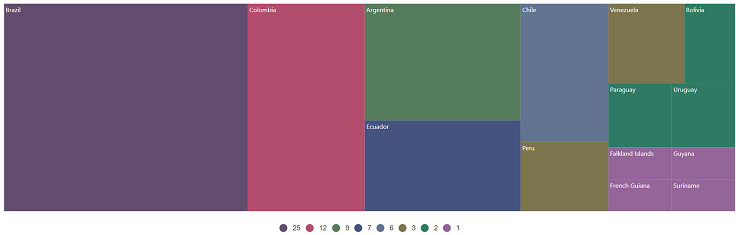

# Getting Started with the Vue TreeMap Component in Vue 3

This guide demonstrates how to set up the Syncfusion<sup style="font-size:70%">&reg;</sup> Vue TreeMap component in a Vue 3 project using [Vite](https://vitejs.dev) as the build tool, alongside either the [Composition API](https://vuejs.org/guide/introduction.html#composition-api) or [Options API](https://vuejs.org/guide/introduction.html#options-api) for component logic management.

## Composition API vs Options API

Vue 3 supports two approaches for writing components:

* **Composition API**: Introduced in Vue 3, this approach organizes component logic as reusable functions called composition functions. It provides greater flexibility for code organization and reuse, making it ideal for complex components or shared logic patterns.

* **Options API**: The traditional Vue approach where component logic is organized into defined options (data, methods, computed properties, watchers, and life cycle hooks). This approach remains fully supported and is familiar to Vue 2 developers.

## Prerequisites

[System requirements for Syncfusion<sup style="font-size:70%">&reg;</sup> Vue UI components](https://ej2.syncfusion.com/vue/documentation/system-requirements)

## Set up the Vite project

A recommended approach for beginning with Vue is to scaffold a project using [Vite](https://vitejs.dev). To create a new Vite project, use one of the commands that are specific to either NPM or Yarn.

```bash
npm create vite@latest
```

or

```bash
yarn create vite
```

Using one of the above commands will lead to a series of configuration prompts. Follow these steps to complete the setup:

1. **Define the project name**: Specify the project name directly. For this guide, the project is named `my-project`.

```bash
? Project name: » my-project
```

2. **Select the framework**: Choose `Vue` from the available framework options to create a Vue 3 project.

```bash
? Select a framework: » - Use arrow-keys. Return to submit.
Vanilla
> Vue
  React
  Preact
  Lit
  Svelte
  Others
```

3. **Select the variant**: Choose `JavaScript` to build the Vite project using JavaScript and Vue.

```bash
? Select a variant: » - Use arrow-keys. Return to submit.
> JavaScript
  TypeScript
  Customize with create-vue ↗
  Nuxt ↗
```

4. **Install dependencies**: After completing the above steps to create the `my-project`, run the following command to install its dependencies:

```bash
cd my-project
npm install
```

or

```bash
cd my-project
yarn install
```

Now that `my-project` is ready to run with default settings, let's add Syncfusion<sup style="font-size:70%">&reg;</sup> components to the project.

## Add Syncfusion<sup style="font-size:70%">&reg;</sup> Vue packages

Syncfusion<sup style="font-size:70%">&reg;</sup> Vue component packages are available at [npmjs.com](https://www.npmjs.com/search?q=ej2-vue). To use Syncfusion<sup style="font-size:70%">&reg;</sup> Vue components in the project, install the corresponding npm package.

This article uses the [Vue TreeMap component](https://www.syncfusion.com/vue-components/vue-treemap) as an example. To use the Vue TreeMap component in the project, the `@syncfusion/ej2-vue-treemap` package needs to be installed using the following command:

```bash
npm install @syncfusion/ej2-vue-treemap --save
```

or

```bash
yarn add @syncfusion/ej2-vue-treemap
```

## Add Syncfusion<sup style="font-size:70%">&reg;</sup> Vue TreeMap Component

Follow these steps to add the Vue TreeMap component using either the Composition API or Options API:

1. Import and register the TreeMap component and required modules in the `script` section of the **src/App.vue** file. For the Composition API, add the `setup` attribute to the `script` tag.




<script setup>
import { TreeMapComponent as EjsTreemap, TreeMapLegend } from "@syncfusion/ej2-vue-treemap";
import { TreeMap } from '@syncfusion/ej2-treemap';
TreeMap.Inject(TreeMapLegend);
</script>




<script>
import { TreeMapComponent, TreeMapLegend } from "@syncfusion/ej2-vue-treemap";
//Component registration
export default {
  name: "App",
  components: {
      'ejs-treemap': TreeMapComponent
  }
}
</script>




2. In the `template` section, define the TreeMap component with properties such as [dataSource](https://ej2.syncfusion.com/vue/documentation/api/treemap#datasource), [weightValuePath](https://ej2.syncfusion.com/vue/documentation/api/treemap#weightvaluepath), [leafItemSettings](https://ej2.syncfusion.com/vue/documentation/api/treemap#leafitemsettings), and [legendSettings](https://ej2.syncfusion.com/vue/documentation/api/treemap#legendsettings).




<template>
  <ejs-treemap id="treemap" :dataSource="dataSource" :weightValuePath="weightValuePath" :leafItemSettings="leafItemSettings" :equalColorValuePath="equalColorValuePath" :legendSettings="legendSettings"></ejs-treemap>
</template>




3. In the `script` section, declare the values for the properties defined in the `template` section.




<script setup>
    const dataSource= [
            { Title: 'State wise International Airport count in South America', State: "Brazil", Count: 25 },
            { Title: 'State wise International Airport count in South America', State: "Colombia", Count: 12 },
            { Title: 'State wise International Airport count in South America', State: "Argentina", Count: 9 },
            { Title: 'State wise International Airport count in South America', State: "Ecuador", Count: 7 },
            { Title: 'State wise International Airport count in South America', State: "Chile", Count: 6 },
            { Title: 'State wise International Airport count in South America', State: "Peru", Count: 3 },
            { Title: 'State wise International Airport count in South America', State: "Venezuela", Count: 3 },
            { Title: 'State wise International Airport count in South America', State: "Bolivia", Count: 2 },
            { Title: 'State wise International Airport count in South America', State: "Paraguay", Count: 2 },
            { Title: 'State wise International Airport count in South America', State: "Uruguay", Count: 2 },
            { Title: 'State wise International Airport count in South America', State: "Falkland Islands",Count: 1 },
            { Title: 'State wise International Airport count in South America', State: "French Guiana", Count:1 },
            { Title: 'State wise International Airport count in South America', State: "Guyana", Count: 1 },
            { Title: 'State wise International Airport count in South America', State: "Suriname", Count: 1 }
    ];
    const weightValuePath = 'Count';
    const equalColorValuePath = "Count";
    const leafItemSettings = {
          labelPath: "State",
          colorMapping: [
              { value: "25", color: "#634D6F" },
              { value: "12", color: "#B34D6D" },
              { value: "9", color: "#557C5C" },
              { value: "7", color: "#44537F" },
              { value: "6", color: "#637392" },
              { value: "3", color: "#7C754D" },
              { value: "2", color: "#2E7A64" },
              { value: "1", color: "#95659A" }
            ]
          };
    const legendSettings = {
            visible: true
    };
</script>




<script>
data() {
  return {
    dataSource: [
      { Title: 'State wise International Airport count in South America', State: "Brazil", Count: 25 },
      { Title: 'State wise International Airport count in South America', State: "Colombia", Count: 12 },
      { Title: 'State wise International Airport count in South America', State: "Argentina", Count: 9 },
      { Title: 'State wise International Airport count in South America', State: "Ecuador", Count: 7 },
      { Title: 'State wise International Airport count in South America', State: "Chile", Count: 6 },
      { Title: 'State wise International Airport count in South America', State: "Peru", Count: 3 },
      { Title: 'State wise International Airport count in South America', State: "Venezuela", Count: 3 },
      { Title: 'State wise International Airport count in South America', State: "Bolivia", Count: 2 },
      { Title: 'State wise International Airport count in South America', State: "Paraguay", Count: 2 },
      { Title: 'State wise International Airport count in South America', State: "Uruguay", Count: 2 },
      { Title: 'State wise International Airport count in South America', State: "Falkland Islands",Count: 1 },
      { Title: 'State wise International Airport count in South America', State: "French Guiana", Count:1 },
      { Title: 'State wise International Airport count in South America', State: "Guyana", Count: 1 },
      { Title: 'State wise International Airport count in South America', State: "Suriname", Count: 1 }
    ],
    weightValuePath: 'Count',
    equalColorValuePath: "Count",
    leafItemSettings: {
      labelPath: "State",
      colorMapping: [
        { value: "25", color: "#634D6F" },
        { value: "12", color: "#B34D6D" },
        { value: "9", color: "#557C5C" },
        { value: "7", color: "#44537F" },
        { value: "6", color: "#637392" },
        { value: "3", color: "#7C754D" },
        { value: "2", color: "#2E7A64" },
        { value: "1", color: "#95659A" }
      ]
    },
    legendSettings: {
      visible: true
    }
  };
}
</script>




Here is the summarized code for the above steps in the **src/App.vue** file:




<template>
     <ejs-treemap id="treemap" :dataSource="dataSource" :weightValuePath="weightValuePath" :leafItemSettings="leafItemSettings" :equalColorValuePath="equalColorValuePath" :legendSettings="legendSettings"></ejs-treemap>
</template>

<script setup>
import { TreeMapComponent as EjsTreemap, TreeMapLegend } from "@syncfusion/ej2-vue-treemap";
import { TreeMap } from '@syncfusion/ej2-treemap';
TreeMap.Inject(TreeMapLegend);
const dataSource= [
            { Title: 'State wise International Airport count in South America', State: "Brazil", Count: 25 },
            { Title: 'State wise International Airport count in South America', State: "Colombia", Count: 12 },
            { Title: 'State wise International Airport count in South America', State: "Argentina", Count: 9 },
            { Title: 'State wise International Airport count in South America', State: "Ecuador", Count: 7 },
            { Title: 'State wise International Airport count in South America', State: "Chile", Count: 6 },
            { Title: 'State wise International Airport count in South America', State: "Peru", Count: 3 },
            { Title: 'State wise International Airport count in South America', State: "Venezuela", Count: 3 },
            { Title: 'State wise International Airport count in South America', State: "Bolivia", Count: 2 },
            { Title: 'State wise International Airport count in South America', State: "Paraguay", Count: 2 },
            { Title: 'State wise International Airport count in South America', State: "Uruguay", Count: 2 },
            { Title: 'State wise International Airport count in South America', State: "Falkland Islands",Count: 1 },
            { Title: 'State wise International Airport count in South America', State: "French Guiana", Count:1 },
            { Title: 'State wise International Airport count in South America', State: "Guyana", Count: 1 },
            { Title: 'State wise International Airport count in South America', State: "Suriname", Count: 1 }
  ];
  const weightValuePath = 'Count';
  const equalColorValuePath = "Count";
  const leafItemSettings = {
        labelPath: "State",
        colorMapping: [
            { value: "25", color: "#634D6F" },
            { value: "12", color: "#B34D6D" },
            { value: "9", color: "#557C5C" },
            { value: "7", color: "#44537F" },
            { value: "6", color: "#637392" },
            { value: "3", color: "#7C754D" },
            { value: "2", color: "#2E7A64" },
            { value: "1", color: "#95659A" }
          ]
        };
  const legendSettings = {
          visible: true
  };
</script>




<template>
     <ejs-treemap id="treemap" :dataSource="dataSource" :weightValuePath="weightValuePath" :leafItemSettings="leafItemSettings" :equalColorValuePath="equalColorValuePath" :legendSettings="legendSettings"></ejs-treemap>
</template>

<script>
  import { TreeMapComponent, TreeMapLegend } from "@syncfusion/ej2-vue-treemap";
  // Component registration
  export default {
    name: "App",
    // Declaring component and its directives
    components: {
        'ejs-treemap': TreeMapComponent
    },
    // Bound properties declarations
    data() {
      return {
        dataSource: [
            { Title: 'State wise International Airport count in South America', State: "Brazil", Count: 25 },
            { Title: 'State wise International Airport count in South America', State: "Colombia", Count: 12 },
            { Title: 'State wise International Airport count in South America', State: "Argentina", Count: 9 },
            { Title: 'State wise International Airport count in South America', State: "Ecuador", Count: 7 },
            { Title: 'State wise International Airport count in South America', State: "Chile", Count: 6 },
            { Title: 'State wise International Airport count in South America', State: "Peru", Count: 3 },
            { Title: 'State wise International Airport count in South America', State: "Venezuela", Count: 3 },
            { Title: 'State wise International Airport count in South America', State: "Bolivia", Count: 2 },
            { Title: 'State wise International Airport count in South America', State: "Paraguay", Count: 2 },
            { Title: 'State wise International Airport count in South America', State: "Uruguay", Count: 2 },
            { Title: 'State wise International Airport count in South America', State: "Falkland Islands",Count: 1 },
            { Title: 'State wise International Airport count in South America', State: "French Guiana", Count:1 },
            { Title: 'State wise International Airport count in South America', State: "Guyana", Count: 1 },
            { Title: 'State wise International Airport count in South America', State: "Suriname", Count: 1 }
          ],
          weightValuePath: 'Count',
          equalColorValuePath: "Count",
          leafItemSettings: {
            labelPath: "State",
            colorMapping: [
              { value: "25", color: "#634D6F" },
              { value: "12", color: "#B34D6D" },
              { value: "9", color: "#557C5C" },
              { value: "7", color: "#44537F" },
              { value: "6", color: "#637392" },
              { value: "3", color: "#7C754D" },
              { value: "2", color: "#2E7A64" },
              { value: "1", color: "#95659A" }
            ]
          },
          legendSettings: {
            visible: true
          }
      };
    },
    provide: {
      treemap:[TreeMapLegend]
    }
  };
</script>




## Run the project

To run the project, use the following command:

```bash
npm run dev
```

or

```bash
yarn run dev
```

The output will appear as follows:



> **Sample**: [vue3-treemap-getting-started](https://github.com/SyncfusionExamples/vue3-treemap-getting-started).


## See also

* [Getting Started with Vue UI Components using Composition API and TypeScript](../getting-started/vue-3-ts-composition)
* [Getting Started with Vue UI Components using Options API and TypeScript](../getting-started/vue-3-ts-options)
