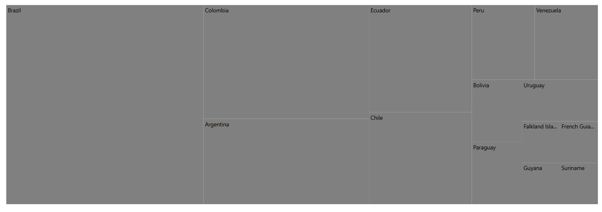

# Getting Started with the Vue TreeMap Component in Vue 3

This article provides a step-by-step guide to creating a [Vite](https://vite.dev/) JavaScript project and integrating the Syncfusion<sup style="font-size:70%">&reg;</sup> Vue TreeMap component using either the [Composition API](https://vuejs.org/guide/introduction.html#composition-api) or the [Options API](https://vuejs.org/guide/introduction.html#options-api).

The TreeMap visualizes flat or hierarchical data as nested rectangles. Each rectangle is sized by a numeric weight and can be colored by a category or numeric range. The example in this guide binds airport-count data, applies equal color mapping, and displays a legend.

## Prerequisites

Ensure that the development environment meets the [system requirements for Syncfusion<sup style="font-size:70%">&reg;</sup> Vue UI components](https://ej2.syncfusion.com/vue/documentation/system-requirements).

Use a release of `@syncfusion/ej2-vue-treemap` that supports Vue 3 and the Node.js version used by the project. Check the [Vue system requirements](https://ej2.syncfusion.com/vue/documentation/system-requirements) and package release notes before upgrading.

## Set Up the Vite Project

Create a Vite project using either npm or yarn.

**npm**

```bash
npm create vite@latest my-app -- --template vue
```

**yarn**

```bash
yarn create vite my-app --template vue
```

If Vite prompts you to install dependencies and start the project immediately, select **No**. The project dependencies and Syncfusion package are installed in the following steps.

Navigate to the project directory:

```bash
cd my-app
```

Install the project dependencies.

**npm**

```bash
npm install
```

**yarn**

```bash
yarn install
```

> **Note:** To create a TypeScript project, use the `vue-ts` template instead of `vue`.

## Add the Syncfusion<sup style="font-size:70%">&reg;</sup> Vue TreeMap Package

Syncfusion<sup style="font-size:70%">&reg;</sup> Vue packages are published on [npm](https://www.npmjs.com/search?q=ej2-vue).

Install the `@syncfusion/ej2-vue-treemap` package using either npm or yarn.

**npm**

```bash
npm install @syncfusion/ej2-vue-treemap
```

**yarn**

```bash
yarn add @syncfusion/ej2-vue-treemap
```

The package manager reports an error if installation fails. You can also confirm that `@syncfusion/ej2-vue-treemap` appears in `package.json` and the package manager's lock file.

> **Note:** The TreeMap renders its visualization with SVG. This example does not require a separate TreeMap theme stylesheet. Import a Syncfusion theme only when other controls in the application require one.

## Add the Syncfusion<sup style="font-size:70%">&reg;</sup> Vue TreeMap Component

Follow these steps to initialize the TreeMap. The code fragments in this section accumulate into the complete examples that follow.

**Step 1:** Import and Register the Component

Import the TreeMap component in **src/App.vue**.

In the Composition API example, use the `<script setup>` syntax. Imported components are available to the template without a `components` option.




<script setup>
import {
  TreeMapComponent as EjsTreemap
} from '@syncfusion/ej2-vue-treemap';

</script>




<script>
import { TreeMapComponent } from '@syncfusion/ej2-vue-treemap';

export default {
  name: 'App',
  components: {
    'ejs-treemap': TreeMapComponent
  }
};
</script>




**Step 2:** Declare the TreeMap Data and Settings

Add the following values to the existing `<script setup>` block for the Composition API or to `data()` inside the existing `export default` object for the Options API.




<script setup>
const dataSource = [
        { state: 'Brazil', count: 25 },
        { state: 'Colombia', count: 12 },
        { state: 'Argentina', count: 9 },
        { state: 'Ecuador', count: 7 },
        { state: 'Chile', count: 6 },
        { state: 'Peru', count: 3 },
        { state: 'Venezuela', count: 3 },
        { state: 'Bolivia', count: 2 },
        { state: 'Paraguay', count: 2 },
        { state: 'Uruguay', count: 2 },
        { state: 'Falkland Islands', count: 1 },
        { state: 'French Guiana', count: 1 },
        { state: 'Guyana', count: 1 },
        { state: 'Suriname', count: 1 }
];

const weightValuePath = 'count';
const leafItemSettings = {
  labelPath: 'state'
};
</script>




<script>
export default {
  data() {
    return {
      dataSource: [
        { state: 'Brazil', count: 25 },
        { state: 'Colombia', count: 12 },
        { state: 'Argentina', count: 9 },
        { state: 'Ecuador', count: 7 },
        { state: 'Chile', count: 6 },
        { state: 'Peru', count: 3 },
        { state: 'Venezuela', count: 3 },
        { state: 'Bolivia', count: 2 },
        { state: 'Paraguay', count: 2 },
        { state: 'Uruguay', count: 2 },
        { state: 'Falkland Islands', count: 1 },
        { state: 'French Guiana', count: 1 },
        { state: 'Guyana', count: 1 },
        { state: 'Suriname', count: 1 }
      ],
      weightValuePath: 'count',
      leafItemSettings: {
        labelPath: 'state'
      }
    };
  }
};
</script>




**Step 3:** Define the TreeMap in the Template

Add the TreeMap to the `template` section of **src/App.vue**.

The example uses the following properties:

- [`dataSource`](https://ej2.syncfusion.com/vue/documentation/api/treemap/index-default#datasource) specifies the data objects.
- [`weightValuePath`](https://ej2.syncfusion.com/vue/documentation/api/treemap/index-default#weightvaluepath) specifies the numeric field that determines rectangle size.
- [`leafItemSettings`](https://ej2.syncfusion.com/vue/documentation/api/treemap/index-default#leafitemsettings) configures leaf labels and color mapping.




<template>
  <div id="app">
    <ejs-treemap
      id="treemap"
      :dataSource="dataSource"
      :weightValuePath="weightValuePath"
      :leafItemSettings="leafItemSettings"
    ></ejs-treemap>
  </div>
</template>




Here is the summarized code for the above steps. Replace the contents of **src/App.vue** with either the Composition API or Options API example.




<template>
  <div id="app">
    <ejs-treemap id="treemap" :dataSource="dataSource" :weightValuePath="weightValuePath" :leafItemSettings="leafItemSettings">
    </ejs-treemap>
  </div>
</template>

<script setup>
import { TreeMapComponent as EjsTreemap } from '@syncfusion/ej2-vue-treemap';

const dataSource = [
    { state: 'Brazil', count: 25 },
    { state: 'Colombia', count: 12 },
    { state: 'Argentina', count: 9 },
    { state: 'Ecuador', count: 7 },
    { state: 'Chile', count: 6 },
    { state: 'Peru', count: 3 },
    { state: 'Venezuela', count: 3 },
    { state: 'Bolivia', count: 2 },
    { state: 'Paraguay', count: 2 },
    { state: 'Uruguay', count: 2 },
    { state: 'Falkland Islands', count: 1 },
    { state: 'French Guiana', count: 1 },
    { state: 'Guyana', count: 1 },
    { state: 'Suriname', count: 1 }
];

const weightValuePath = 'count';
const leafItemSettings = {
  labelPath: 'state'
};
</script>




<template>
  <div id="app">
    <ejs-treemap id="treemap" :dataSource="dataSource" :weightValuePath="weightValuePath" :leafItemSettings="leafItemSettings">
    </ejs-treemap>
  </div>
</template>

<script>
import { TreeMapComponent } from '@syncfusion/ej2-vue-treemap';

export default {
  name: 'App',
  components: {
    'ejs-treemap': TreeMapComponent
  },
  data() {
    return {
      dataSource: [
        { state: 'Brazil', count: 25 },
        { state: 'Colombia', count: 12 },
        { state: 'Argentina', count: 9 },
        { state: 'Ecuador', count: 7 },
        { state: 'Chile', count: 6 },
        { state: 'Peru', count: 3 },
        { state: 'Venezuela', count: 3 },
        { state: 'Bolivia', count: 2 },
        { state: 'Paraguay', count: 2 },
        { state: 'Uruguay', count: 2 },
        { state: 'Falkland Islands', count: 1 },
        { state: 'French Guiana', count: 1 },
        { state: 'Guyana', count: 1 },
        { state: 'Suriname', count: 1 }
      ],
      weightValuePath: 'count',
      leafItemSettings: {
        labelPath: 'state',
      }
    };
  }
};
</script>




## Run the Project

Save **src/App.vue**, and then start the development server.

**npm**

```bash
npm run dev
```

**yarn**

```bash
yarn run dev
```

Open the URL displayed in the terminal, commonly `http://localhost:5173`, and verify that the TreeMap is displayed correctly.



> **Sample:** The older [vue3-treemap-getting-started sample](https://github.com/SyncfusionExamples/vue3-treemap-getting-started) uses Vue CLI. Use the code in this guide for the Vite-based setup.

## Troubleshooting

- **The TreeMap is not rendered.** Verify that `TreeMapComponent` is imported or registered correctly, the data source contains records, and the browser console contains no package or runtime errors.
- **The TreeMap is blank.** Verify that `weightValuePath` matches a numeric field in every data object.
- **Labels are not displayed.** Verify that `leafItemSettings.labelPath` matches a field in every data object.
- **A module-not-found error occurs.** Verify that `@syncfusion/ej2-vue-treemap` appears in `package.json`, reinstall dependencies, and restart the development server.
- **A package or Vue version error occurs.** Confirm that the installed package release supports Vue 3 and the project's Node.js version.

For additional assistance, refer to the [Vue TreeMap API documentation](https://ej2.syncfusion.com/vue/documentation/api/treemap).

## See Also

- [Vue TreeMap color mapping](https://ej2.syncfusion.com/vue/documentation/treemap/color-mapping)
- [Vue TreeMap legend](https://ej2.syncfusion.com/vue/documentation/treemap/legend)
- [Vue TreeMap examples](https://ej2.syncfusion.com/vue/demos/#/material3/treemap/default.html)
- [Composition API with TypeScript](https://ej2.syncfusion.com/vue/documentation/getting-started/vue-3-ts-composition)
- [Options API with TypeScript](https://ej2.syncfusion.com/vue/documentation/getting-started/vue-3-ts-options)
