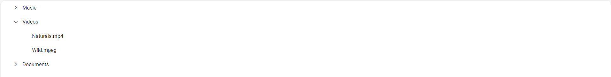

# Getting Started with the TreeView Component in the Quasar Framework

This article provides a step-by-step guide for setting up a [Quasar](https://quasar.dev/) project and integrating the Syncfusion Vue TreeView component using the [Composition API](https://vuejs.org/guide/introduction.html#composition-api).

The `Quasar` Framework is a Vue.js-based open-source framework that empowers developers to create high-performance and responsive applications across various platforms, such as web, mobile, and desktop.

## Prerequisites

[System requirements for Syncfusion Vue UI components](../system-requirements)

## Set up the Quasar project

To initiate the creation of a new [Quasar](https://quasar.dev/start/quick-start/) project, use the following commands:

```bash
npm init quasar
```

This command prompts additional configurations. Follow the steps outlined in the images below:


This generates the necessary files and prompts for project dependency installation. Respond with 'yes' to proceed with npm install, as shown in the image below:


Navigate to your project directory:

```bash
cd quasar-project
```

Now that `quasar-project` is ready to run with default settings, let's add Syncfusion components to the project.

## Add the Syncfusion Vue packages

Syncfusion Vue component packages are available at [npmjs.com](https://www.npmjs.com/search?q=ej2-vue). To use Syncfusion Vue components in the project, install the corresponding npm package.

This article uses the [Vue TreeView component](https://www.syncfusion.com/vue-components/vue-treeview) as an example. To use the Vue TreeView component in the project, the `@syncfusion/ej2-vue-navigations` package needs to be installed using the following command:

```bash
npm install @syncfusion/ej2-vue-navigations --save
```

## Import Syncfusion CSS styles

You can import themes for the Syncfusion Vue component in various ways, such as using CSS or SASS styles from npm packages, CDN, CRG and [Theme Studio](https://ej2.syncfusion.com/vue/documentation/appearance/theme-studio/). Refer to the [themes topic](https://ej2.syncfusion.com/vue/documentation/appearance/theme/) to learn more about built-in themes and different ways to refer to themes in a Vue project.

In this article, the `Material 3` theme is applied using CSS styles, which are available in installed packages. The necessary `Material 3` CSS styles for the TreeView component and its dependents were imported into the `<style>` section of the **src/app.vue** file.




<style>
@import "../node_modules/@syncfusion/ej2-base/styles/material3.css";
@import "../node_modules/@syncfusion/ej2-vue-navigations/styles/material3.css";
@import "../node_modules/@syncfusion/ej2-inputs/styles/material3.css";
@import "../node_modules/@syncfusion/ej2-buttons/styles/material3.css";
</style>




> The order of importing CSS styles should be in line with their dependency graph.

## Add the Syncfusion Vue component

Follow the below steps to add the Vue TreeView component:

1\. First, add the `setup` attribute to the `script` tag to indicate that Vue will be using the `Composition API`. And import the TreeView component and its child directives in the `script` section of the **src/app.vue** file.




<script setup>
  import { TreeViewComponent as EjsTreeview } from "@syncfusion/ej2-vue-navigations";
</script>



   
2\. Then, define the TreeView component in the **src/app.vue** file, as shown below:




<template>
  <ejs-treeview id='treeview' :fields='fields'></ejs-treeview>
</template>




3\. Declare the values for the `dataSource` property in the `script` section.




<script setup>
const data =  [
  {
      nodeId: '01', nodeText: 'Music',
      nodeChild: [
          { nodeId: '01-01', nodeText: 'Gouttes.mp3' }
      ]
  },
  {
      nodeId: '02', nodeText: 'Videos', expanded: true,
      nodeChild: [
          { nodeId: '02-01', nodeText: 'Naturals.mp4' },
          { nodeId: '02-02', nodeText: 'Wild.mpeg' },
      ]
  },
  {
      nodeId: '03', nodeText: 'Documents',
      nodeChild: [
          { nodeId: '03-01', nodeText: 'Environment Pollution.docx' },
          { nodeId: '03-02', nodeText: 'Global Water, Sanitation, & Hygiene.docx' },
          { nodeId: '03-03', nodeText: 'Global Warming.ppt' },
          { nodeId: '03-04', nodeText: 'Social Network.pdf' },
          { nodeId: '03-05', nodeText: 'Youth Empowerment.pdf' },
      ]
  },
];
const fields = { dataSource: data, id: "nodeId", text: "nodeText", child: "nodeChild" };
</script>




Here is the summarized code for the above steps in the **src/app.vue** file:




<template>
  <ejs-treeview id='treeview' :fields='fields'></ejs-treeview>
</template>

<script setup>
import { TreeViewComponent as EjsTreeview } from "@syncfusion/ej2-vue-navigations";
const data =  [
  {
      nodeId: '01', nodeText: 'Music',
      nodeChild: [
          { nodeId: '01-01', nodeText: 'Gouttes.mp3' }
      ]
  },
  {
      nodeId: '02', nodeText: 'Videos', expanded: true,
      nodeChild: [
          { nodeId: '02-01', nodeText: 'Naturals.mp4' },
          { nodeId: '02-02', nodeText: 'Wild.mpeg' },
      ]
  },
  {
      nodeId: '03', nodeText: 'Documents',
      nodeChild: [
          { nodeId: '03-01', nodeText: 'Environment Pollution.docx' },
          { nodeId: '03-02', nodeText: 'Global Water, Sanitation, & Hygiene.docx' },
          { nodeId: '03-03', nodeText: 'Global Warming.ppt' },
          { nodeId: '03-04', nodeText: 'Social Network.pdf' },
          { nodeId: '03-05', nodeText: 'Youth Empowerment.pdf' },
      ]
  },
];
const fields = { dataSource: data, id: "nodeId", text: "nodeText", child: "nodeChild" };
</script>

<style>
@import "../node_modules/@syncfusion/ej2-base/styles/material.css";
@import "../node_modules/@syncfusion/ej2-vue-navigations/styles/material.css";
@import "../node_modules/@syncfusion/ej2-inputs/styles/material.css";
@import "../node_modules/@syncfusion/ej2-buttons/styles/material.css";
</style>




## Run the project

To run the project, use the following command:

```bash
npm run dev
```

The output will appear as follows:

