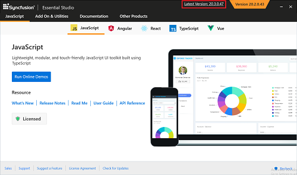

# Upgrading Syncfusion&reg; JavaScript (Essential&reg; JS2)

Syncfusion&reg; releases new volumes once every three months with exciting new features. There is one Service Pack release for each volume release. Service Pack releases provide major bug fixes for volume releases.

You can upgrade to the latest version from any installed Syncfusion&reg; version.

Refer to the **[Upgrade Guide](https://help.syncfusion.com/upgrade-guide/vue-ui-components)** for JavaScript – EJ2 to learn more about the "Breaking Changes, Bug Fixes, Features, and Known Issues" between your current version and the latest version you are upgrading to.

## Upgrading to the latest version

The most recent version of Syncfusion&reg; JavaScript – EJ2 can be downloaded and installed by clicking the "Latest Version: {Version}" link at the top of the Syncfusion&reg; JavaScript – EJ2 Control Panel.

You can also upgrade to the latest version by downloading and installing the required products from [this link](https://www.syncfusion.com/account/downloads). It is not necessary to uninstall existing installed versions.

Installing the Volume release before installing the Service Pack release is not required. Volume and Service Pack releases work independently, so you can install the latest version with major bug fixes directly.

## Upgrade from trial version to license version

To upgrade from the trial version, uninstall the trial version and install the fully licensed installer from the [License and Downloads](https://www.syncfusion.com/account/downloads) section of the website.

> Note: License key registration is not required for JavaScript if you are using scripts (.js) and CSS files.