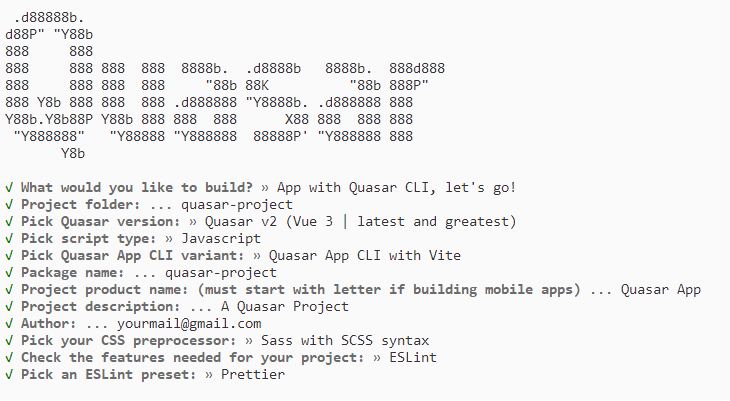

# Getting Started with the Vue Uploader Component in the Quasar Framework

This article provides a step-by-step guide for setting up a [Quasar](https://quasar.dev/) project and integrating the Syncfusion<sup style="font-size:70%">&reg;</sup> Vue Uploader component using the [Composition API](https://vuejs.org/guide/introduction.html#composition-api).

The `Quasar` Framework is a Vue.js-based open-source framework that empowers developers to create high-performance and responsive applications across various platforms, such as web, mobile, and desktop.

## Prerequisites

[System requirements for Syncfusion<sup style="font-size:70%">&reg;</sup> Vue UI components](../system-requirements)

## Set up the Quasar project

To initiate the creation of a new [Quasar](https://quasar.dev/start/quick-start/) project, use the following commands:

```bash
npm init quasar
```

This command prompts additional configurations. Follow the steps outlined in the images below:



This generates the necessary files and prompts for project dependency installation. Respond with 'yes' to proceed with npm install, as shown in the image below:


Navigate to your project directory:

```bash
cd quasar-project
```

Now that `quasar-project` is ready to run with default settings, let's add Syncfusion<sup style="font-size:70%">&reg;</sup> components to the project.

## Add the Syncfusion<sup style="font-size:70%">&reg;</sup> Vue packages

Syncfusion<sup style="font-size:70%">&reg;</sup> Vue component packages are available at [npmjs.com](https://www.npmjs.com/search?q=ej2-vue). To use Syncfusion<sup style="font-size:70%">&reg;</sup> Vue components in the project, install the corresponding npm package.

This article uses the [Vue Uploader component](https://www.syncfusion.com/vue-components/vue-file-upload) as an example. To use the Vue Uploader component in the project, the `@syncfusion/ej2-vue-inputs` package needs to be installed using the following command:

```bash
npm install @syncfusion/ej2-vue-inputs --save
```

## Import Syncfusion<sup style="font-size:70%">&reg;</sup> CSS styles

You can import themes for the Syncfusion<sup style="font-size:70%">&reg;</sup> Vue component in various ways, such as using CSS or SASS styles from npm packages, CDN, CRG and [Theme Studio](https://ej2.syncfusion.com/vue/documentation/appearance/theme-studio/). Refer to the [themes topic](https://ej2.syncfusion.com/vue/documentation/appearance/theme/) to learn more about built-in themes and different ways to refer to themes in a Vue project.

In this article, the `Material 3` theme is applied using CSS styles, which are available in installed packages. The necessary `Material 3` CSS styles for the Uploader component and its dependents were imported into the `<style>` section of the **src/app.vue** file.




<style>
@import "../node_modules/@syncfusion/ej2-base/styles/material3.css";
@import "../node_modules/@syncfusion/ej2-buttons/styles/material3.css";
@import "../node_modules/@syncfusion/ej2-vue-inputs/styles/material3.css";
</style>




> The order of importing CSS styles should be in line with their dependency graph.

## Add the Syncfusion<sup style="font-size:70%">&reg;</sup> Vue component

Follow the below steps to add the Vue Uploader component:

1\. First, add the `setup` attribute to the `script` tag to indicate that Vue will be using the `Composition API`. And import the Uploader component and its child directives in the `script` section of the **src/app.vue** file.




<script setup>
  import { UploaderComponent as EjsUploader } from "@syncfusion/ej2-vue-inputs";
</script>



   
2\. Then, define the Uploader component in the **src/app.vue** file, as shown below:




<template>
    <div id="app">
        <div id="modalTarget" class="control-section; position:relative" style="height:350px;">
            <ejs-uploader ref="uploadObj" id='defaultfileupload' name="UploadFiles"></ejs-uploader>
        </div>
    </div>
</template>




Here is the summarized code for the above steps in the **src/app.vue** file:



<template>
    <div id="app">
        <div id="modalTarget" class="control-section; position:relative" style="height:350px;">
            <ejs-uploader ref="uploadObj" id='defaultfileupload' name="UploadFiles"></ejs-uploader>
        </div>
    </div>
</template>
<script setup>
import { UploaderComponent as EjsUploader } from "@syncfusion/ej2-vue-inputs";
</script>
<style>
@import "../node_modules/@syncfusion/ej2-base/styles/material3.css";
@import "../node_modules/@syncfusion/ej2-buttons/styles/material3.css";
@import "../node_modules/@syncfusion/ej2-vue-inputs/styles/material3.css";
#app {
    color: #008cff;
    height: 40px;
    left: 45%;
    position: absolute;
    top: 45%;
    width: 30%;
}
.control-section {
    height: 100%;
    min-height: 200px;
}
</style>




## Run the project

To run the project, use the following command:

```bash
npm run dev
```

The output will appear as follows:

