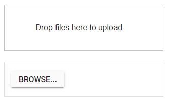
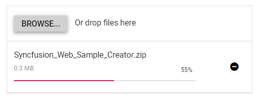
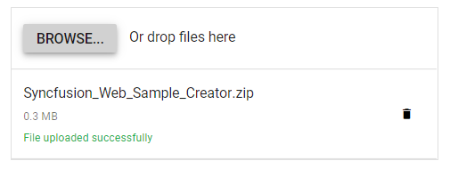

# Getting Started with the Vue Uploader Component in Vue 3

This article provides a step-by-step guide for setting up a [Vite](https://vitejs.dev/) project with a JavaScript environment and integrating the Syncfusion Vue Uploader component using the [Composition API](https://vuejs.org/guide/introduction.html#composition-api) / [Options API](https://vuejs.org/guide/introduction.html#options-api).

The `Composition API` is a new feature introduced in Vue.js 3 that provides an alternative way to organize and reuse component logic. It allows developers to write components as functions that use smaller, reusable functions called composition functions to manage their properties and behavior.

The `Options API` is the traditional way of writing Vue.js components, where the component logic is organized into a series of options that define the component's properties and behavior. These options include data, methods, computed properties, watchers, lifecycle hooks, and more.

## Prerequisites

[System requirements for Syncfusion Vue UI components](https://ej2.syncfusion.com/vue/documentation/system-requirements/)

## Set up the Vite project

A recommended approach for beginning with Vue is to scaffold a project using [Vite](https://vitejs.dev/). To create a new Vite project, use one of the commands that are specific to either NPM or Yarn.

```bash
npm create vite@latest
```

or

```bash
yarn create vite
```

Using one of the above commands will lead you to set up additional configurations for the project as below:

1.Define the project name: We can specify the name of the project directly. Let's specify the name of the project as `my-project` for this article.

```bash
? Project name: » my-project
```

2.Select `Vue` as the framework. It will create a Vue 3 project.

```bash
? Select a framework: » - Use arrow-keys. Return to submit.
Vanilla
> Vue
  React
  Preact
  Lit
  Svelte
  Others
```

3.Choose `JavaScript` as the framework variant to build this Vite project using JavaScript and Vue.

```bash
? Select a variant: » - Use arrow-keys. Return to submit.
> JavaScript
  TypeScript
  Customize with create-vue ↗
  Nuxt ↗
```

4.Upon completing the aforementioned steps to create the `my-project`, run the following command to install its dependencies:

```bash
cd my-project
npm install
```

or

```bash
cd my-project
yarn install
```

Now that `my-project` is ready to run with default settings, let's add Syncfusion components to the project.

## Add Syncfusion Vue packages

Syncfusion Vue component packages are available at [npmjs.com](https://www.npmjs.com/search?q=ej2-vue). To use Syncfusion Vue components in the project, install the corresponding npm package.

This article uses the [Vue Uploader component](https://www.syncfusion.com/vue-components/vue-file-upload) as an example. To use the Vue Uploader component in the project, the `@syncfusion/ej2-vue-inputs` package needs to be installed using the following command:

```bash
npm install @syncfusion/ej2-vue-inputs --save
```

or

```bash
yarn add @syncfusion/ej2-vue-inputs
```

## Import Syncfusion CSS styles

You can import themes for the Syncfusion Vue component in various ways, such as using CSS or SASS styles from npm packages, CDN, [CRG](https://ej2.syncfusion.com/javascript/documentation/common/custom-resource-generator/) and [Theme Studio](https://ej2.syncfusion.com/vue/documentation/appearance/theme-studio/). Refer to [themes topic](https://ej2.syncfusion.com/vue/documentation/appearance/theme/) to know more about built-in themes and different ways to refer to themes in a Vue project.

In this article, `Material` theme is applied using CSS styles, which are available in installed packages. The necessary `Material` CSS styles for the Uploader component and its dependents were imported into the `<style>` section of **src/App.vue** file.




<style>
  @import "../node_modules/@syncfusion/ej2-base/styles/material.css";
  @import "../node_modules/@syncfusion/ej2-buttons/styles/material.css";
  @import "../node_modules/@syncfusion/ej2-vue-inputs/styles/material.css";
</style>




> The order of importing CSS styles should be in line with its dependency graph.

## Add Syncfusion Vue component

Follow the below steps to add the Vue Uploader component using `Composition API` or `Options API`:

  1.First, import and register the Uploader component in the `script` section of the **src/App.vue** file. If you are using the `Composition API`, you should add the `setup` attribute to the `script` tag to indicate that Vue will be using the `Composition API`.





<script setup>
  import { UploaderComponent as EjsUploader } from "@syncfusion/ej2-vue-inputs";
</script>





<script>
import { UploaderComponent } from "@syncfusion/ej2-vue-inputs";
//Component registeration
export default {
name: "App",
components: {
"ejs-uploader'":UploaderComponent
}
}
</script>



   
2.In the `template` section, define the Uploader component with the [dataSource](https://ej2.syncfusion.com/vue/documentation/api/uploader/#datasource) property and column definitions.




<template>
  <div>
    <div id="modalTarget" class="control-section; position:relative" style="height:350px;">
        <ejs-uploader ref="uploadObj" id='defaultfileupload' name="UploadFiles"></ejs-uploader>
    </div>
  </div>
</template>




Here is the summarized code for the above steps in the **src/App.vue** file:





<template>
  <div>
    <div id="modalTarget" class="control-section; position:relative" style="height:350px;">
        <ejs-uploader ref="uploadObj" id='defaultfileupload' name="UploadFiles"></ejs-uploader>
    </div>
  </div>
</template>

<script setup>
import { UploaderComponent as EjsUploader } from "@syncfusion/ej2-vue-inputs";
  const data = [];
</script>

<style>
    @import "../node_modules/@syncfusion/ej2-base/styles/material.css";
    @import "../node_modules/@syncfusion/ej2-buttons/styles/material.css";
    @import "../node_modules/@syncfusion/ej2-vue-inputs/styles/material.css";
    #app {
        color: #008cff;
        height: 40px;
        left: 45%;
        position: absolute;
        top: 45%;
        width: 20%;
    }
    .control-section {
        height: 100%;
        min-height: 200px;
    }
</style>





<template>
  <div>
    <div id="modalTarget" class="control-section; position:relative" style="height:350px;">
        <ejs-uploader ref="uploadObj" id='defaultfileupload' name="UploadFiles"></ejs-uploader>
    </div>
  </div>
</template>
<script>
import { UploaderComponent } from "@syncfusion/ej2-vue-inputs";
//Component registeration
export default {
name: "App",
components: {
"ejs-uploader":UploaderComponent
},
data: function() {
    return {  }
}
}
</script>
<style>
    @import "../node_modules/@syncfusion/ej2-base/styles/material.css";
    @import "../node_modules/@syncfusion/ej2-buttons/styles/material.css";
    @import "../node_modules/@syncfusion/ej2-vue-inputs/styles/material.css";
    #app {
        color: #008cff;
        height: 40px;
        left: 45%;
        position: absolute;
        top: 45%;
        width: 20%;
    }
    .control-section {
        height: 100%;
        min-height: 200px;
    }
</style>




## Run the project

To run the project, use the following command:

```bash
npm run dev
```

or

```bash
yarn run dev
```

The output will appear as follows:


## Adding drop area

By default, the uploader component allows to upload files by drag the files from file explorer, and drop into the drop area.  You can configure any other external element as drop target using dropArea property.

In the following sample, drop target is configured.





<template>
  <div>
    <div id='droparea'>Drop files here to upload</div>
    <ejs-uploader ref="uploadObj" id='defaultfileupload' name="UploadFiles"  :dropArea = "dropElement"></ejs-uploader>
  </div>
</template>
<script setup>
import { UploaderComponent  as EjsUploader } from "@syncfusion/ej2-vue-inputs";
  const data = [{dropElement: '#dropArea'}]
</script>
<style>
    @import "../node_modules/@syncfusion/ej2-base/styles/material.css";
    @import "../node_modules/@syncfusion/ej2-buttons/styles/material.css";
    @import "../node_modules/@syncfusion/ej2-vue-inputs/styles/material.css";
    #container {
        visibility: hidden;
        padding-left: 5%;
        width: 100%;
    }
    #loader {
        color: #008cff;
        font-family: 'Helvetica Neue','calibiri';
        font-size: 14px;
        height: 40px;
        left: 45%;
        position: absolute;
        top: 45%;
        width: 30%;
    }
    .fileupload {
        margin: 20px auto;
        width: 400px;
    }
    #droparea {
        padding: 50px 25px;
        margin: 30px auto;
        border: 1px solid #c3c3c3;
        text-align: center;
        width: 20%;
        display: inline-flex;
    }
    .e-file-select,
    .e-file-drop {
        display: none;
    }
    body .e-upload-drag-hover {
         outline: 2px dashed brown;
    }
    #uploadfile {
        width: 60%;
        display: inline-flex;
        margin-left: 5%;
    }
</style>





<template>
  <div>
    <div id='droparea'>Drop files here to upload</div>
    <ejs-uploader ref="uploadObj" id='defaultfileupload' name="UploadFiles"  :dropArea = "dropElement"></ejs-uploader>
  </div>
</template>
<script>
import { UploaderComponent } from "@syncfusion/ej2-vue-inputs";
//Component registeration
export default {
name: "App",
components: {
"ejs-uploader":UploaderComponent
},
data: function() {
    return {
        dropElement: '#droparea'
    }
}
}
</script>
<style>
    @import "../node_modules/@syncfusion/ej2-base/styles/material.css";
    @import "../node_modules/@syncfusion/ej2-buttons/styles/material.css";
    @import "../node_modules/@syncfusion/ej2-vue-inputs/styles/material.css";
    #container {
        visibility: hidden;
        padding-left: 5%;
        width: 100%;
    }
    #loader {
        color: #008cff;
        font-family: 'Helvetica Neue','calibiri';
        font-size: 14px;
        height: 40px;
        left: 45%;
        position: absolute;
        top: 45%;
        width: 30%;
    }
    .fileupload {
        margin: 20px auto;
        width: 400px;
    }
    #droparea {
        padding: 50px 25px;
        margin: 30px auto;
        border: 1px solid #c3c3c3;
        text-align: center;
        width: 20%;
        display: inline-flex;
    }
    .e-file-select,
    .e-file-drop {
        display: none;
    }
    body .e-upload-drag-hover {
         outline: 2px dashed brown;
    }
    #uploadfile {
        width: 60%;
        display: inline-flex;
        margin-left: 5%;
    }
</style>




The output will appear as follows:



## Configure asynchronous settings

The uploader component process the files to upload in Asynchronous mode by default. Define the properties [saveUrl](https://ej2.syncfusion.com/vue/documentation/api/uploader/asyncSettings/#saveurl) and [removeUrl](https://ej2.syncfusion.com/vue/documentation/api/uploader/asyncSettings/#removeurl) to handle the save and remove action as follows.





<template>
  <div>
    <ejs-uploader ref="uploadObj" id='defaultfileupload' name="UploadFiles" :asyncSettings= "path" ></ejs-uploader>
  </div>
</template>
<script setup>
import { UploaderComponent as EjsUploader } from "@syncfusion/ej2-vue-inputs";  
  const data = [{ path: { saveUrl: 'https://ej2.syncfusion.com/services/api/uploadbox/Save',
                  removeUrl: 'https://ej2.syncfusion.com/services/api/uploadbox/Remove'}}]
</script>
<style>
    @import "../node_modules/@syncfusion/ej2-base/styles/material.css";
    @import "../node_modules/@syncfusion/ej2-buttons/styles/material.css";
    @import "../node_modules/@syncfusion/ej2-vue-inputs/styles/material.css";
</style>





<template>
  <div>
    <ejs-uploader ref="uploadObj" id='defaultfileupload' name="UploadFiles" :asyncSettings= "path" ></ejs-uploader>
  </div>
</template>
<script>
import { UploaderComponent } from "@syncfusion/ej2-vue-inputs";
//Component registeration
export default {
name: "App",
components: {
"ejs-uploader":UploaderComponent
},
data: function() {
    return {
        path: {
            saveUrl: 'https://ej2.syncfusion.com/services/api/uploadbox/Save',
            removeUrl: 'https://ej2.syncfusion.com/services/api/uploadbox/Remove'
        }
    }
}
}
</script>
<style>
    @import "../node_modules/@syncfusion/ej2-base/styles/material.css";
    @import "../node_modules/@syncfusion/ej2-buttons/styles/material.css";
    @import "../node_modules/@syncfusion/ej2-vue-inputs/styles/material.css";
</style>




The output will appear as follows:



## Handle success and failed upload

You can handle the success and failure actions using the [success](https://ej2.syncfusion.com/vue/documentation/api/uploader/#success) and [failure](https://ej2.syncfusion.com/vue/documentation/api/uploader/#failure) &nbsp;events. To handle these event, define the function and assign it to corresponding event as follows.





<template>
  <div>
    <ejs-uploader ref="uploadObj" id='defaultfileupload' name="UploadFiles" :asyncSettings= "path" :success= "onUploadSuccess" :failure= "onUploadFailed" ></ejs-uploader>
  </div>
</template>
<script setup>
import { UploaderComponent as EjsUploader} from "@syncfusion/ej2-vue-inputs";
    const data = [{ path: { saveUrl: 'https://ej2.syncfusion.com/services/api/uploadbox/Save',
                  removeUrl: 'https://ej2.syncfusion.com/services/api/uploadbox/Remove'}}]
    const onUploadSuccess = () => {
      console.log('Uploaded successfully');
    };
    const onUploadFailed = () => {
      console.log('Upload fails');
    };
</script>
<style>
    @import "../node_modules/@syncfusion/ej2-base/styles/material.css";
    @import "../node_modules/@syncfusion/ej2-buttons/styles/material.css";
    @import "../node_modules/@syncfusion/ej2-vue-inputs/styles/material.css";
</style>





<template>
  <div>
    <ejs-uploader ref="uploadObj" id='defaultfileupload' name="UploadFiles" :asyncSettings= "path" :success= "onUploadSuccess" :failure= "onUploadFailed" ></ejs-uploader>
  </div>
</template>
<script>
import { UploaderComponent } from "@syncfusion/ej2-vue-inputs";
//Component registeration
export default {
name: "App",
components: {
"ejs-uploader":UploaderComponent
},
data: function() {
    return {
        path:  {
            saveUrl: 'https://ej2.syncfusion.com/services/api/uploadbox/Save',
            removeUrl: 'https://ej2.syncfusion.com/services/api/uploadbox/Remove'
        }
    }
},
methods: {
    onUploadSuccess: function () {
        console.log('Uploaded successfully');
    },
    onUploadFailed: function () {
        console.log('Upload fails');
    }
}
}
</script>
<style>
    @import "../node_modules/@syncfusion/ej2-base/styles/material.css";
    @import "../node_modules/@syncfusion/ej2-buttons/styles/material.css";
    @import "../node_modules/@syncfusion/ej2-vue-inputs/styles/material.css";
</style>




The output will appear as follows:



## See Also

* [How to add additional data on upload](./how-to/add-additional-data-on-upload)
* [Achieve file upload programmatically](./how-to/achieve-file-upload-programmatically)
* [Achieve invisible upload](./how-to/achieve-invisible-upload)