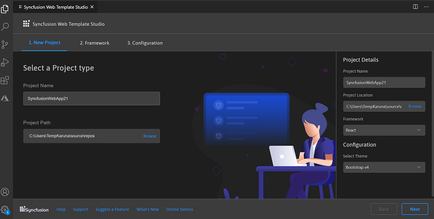
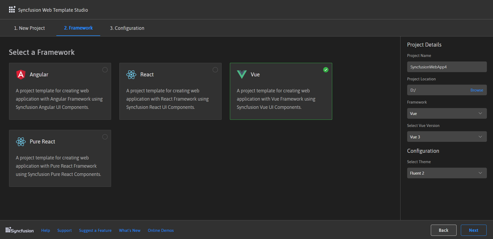
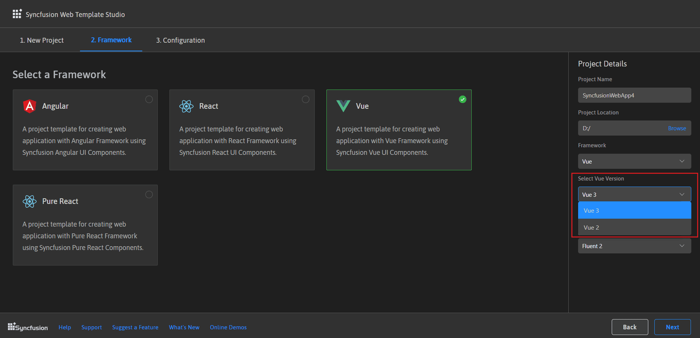
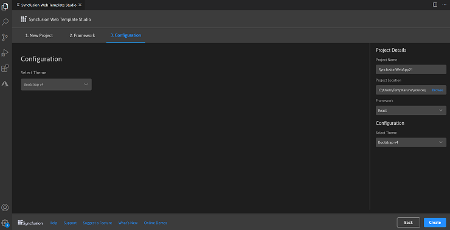
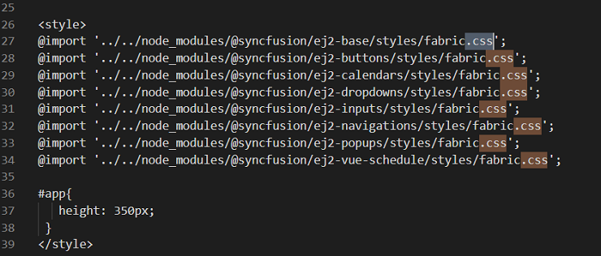
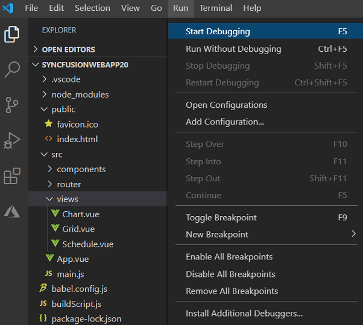
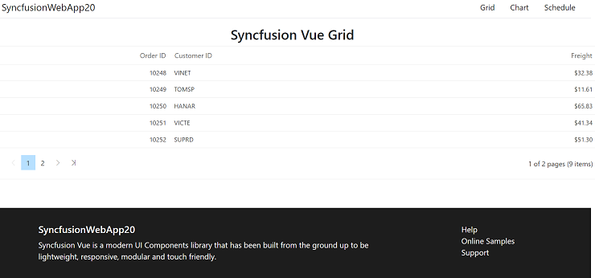

# Visual Studio Code Extensions

## Create project

Syncfusion&reg; provides project templates for Visual Studio Code to create Syncfusion&reg; web applications. The Syncfusion&reg; Web Project template creates applications with the selected framework (React, Pure React, Angular, and Vue), required Syncfusion&reg; npm packages, component render code for the Grid, Chart, and Scheduler components, and styles to simplify development with Syncfusion&reg; components.
> The Syncfusion&reg; Visual Studio Code project template is supported from v18.3.0.47.
The steps below describe how to create Syncfusion&reg; web applications using Visual Studio Code:
1. In Visual Studio Code, open the command palette by pressing Ctrl+Shift+P. The Visual Studio Code palette opens, search the word Syncfusion&reg;, so you can get the templates provided.

    

2. Select **Syncfusion&reg; Web Template Studio: Launch** and then press enter, Template Studio wizard for configuring the Syncfusion&reg; Web app will appear. Provide the require Project Name and Path to create the new Syncfusion&reg; Web application along with any one of the Framework (React, Pure React, Angular, and Vue).

    

3. Click either **Next** or **Framework** tab, and the Framework types will be appears. Choose any one of the Framework:
   * React
   * Pure React
   * Angular
   * Vue

     

    If you choose the Vue framework, the **Select Vue Version** option will appear in the **Project Details** section. You can create the Vue application using either the Vue 3 or Vue 2 versions.

    

4. Click either **Next** or the **Configuration** tab, and the Configuration section will be loaded. Choose the preferred theme and then click **Create**. The project will be created.

    

5. The created Syncfusion&reg; Web App is configured with the Syncfusion&reg; NPM packages, styles, and the component render code for the Syncfusion&reg; component added.

    

    

    

## Run the application

1. Press **F5** or navigate to **Run > Start Debugging**.
    

2. After compilation completes, open the provided localhost URL in a browser to view the application output.
    